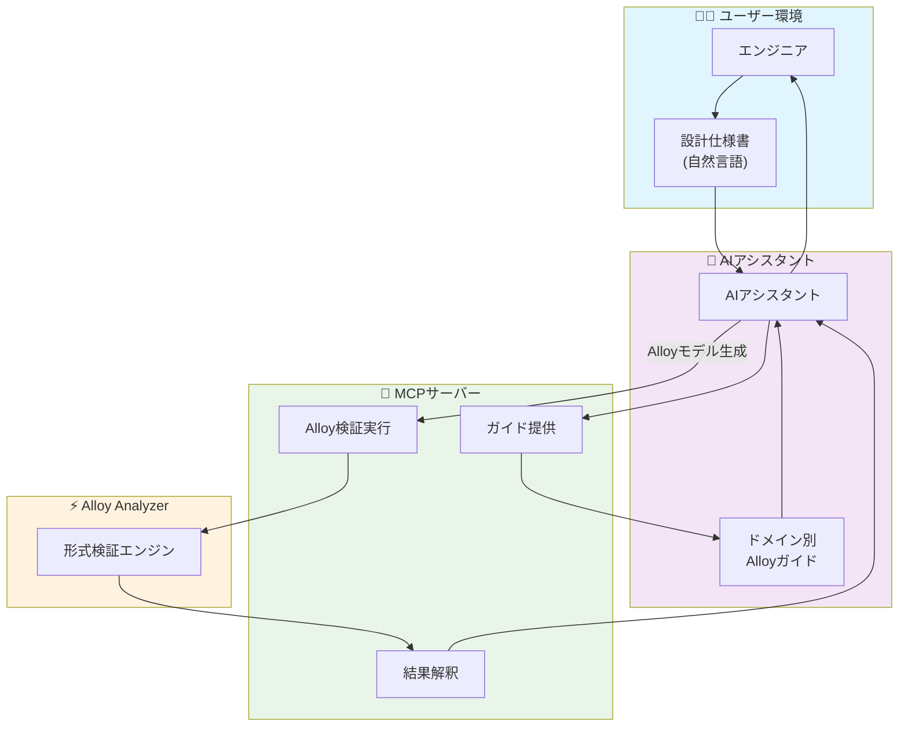
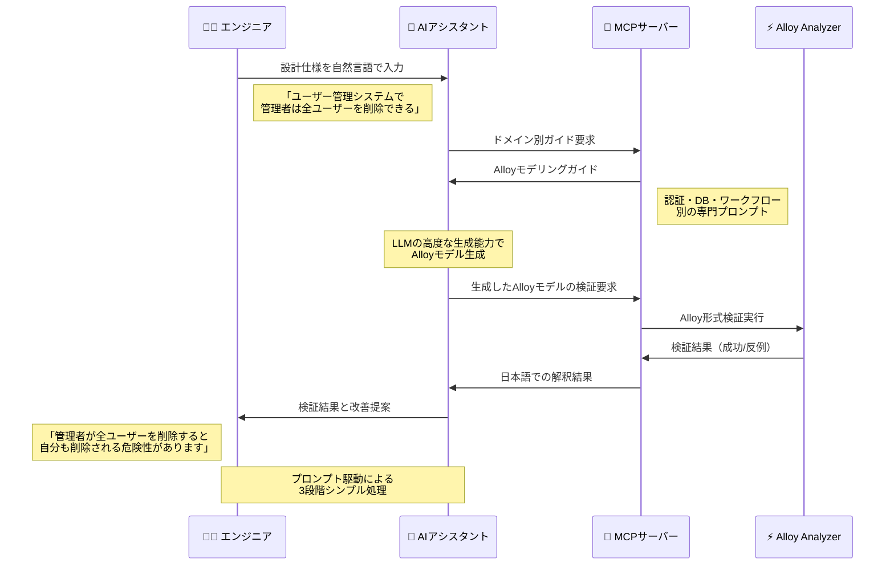

# AI支援によるAlloy形式検証で設計段階のバグを早期発見する

## はじめに - 上流工程でのバグ発見の価値

ソフトウェア開発において「**設計段階での問題発見・修正が最もコスト効率が良い**」ことは、多くのエンジニアが実感していることでしょう。

**W字モデル**や**シフトレフト**といった開発手法が注目される背景には、この現実があります：

- **設計段階**: 要件や論理構造の見直しで対応可能
- **実装段階**: コード修正とテスト工数が必要
- **テスト段階**: 影響範囲調査、修正、回帰テストが必要
- **本番運用後**: システム停止、緊急対応、顧客影響など複合的コスト

具体的な倍率については研究により大きく異なりますが、**上流での発見が下流での発見よりも確実に効率的**という点は広く合意されています。

しかし現実的には、設計段階での品質検証は困難です。レビューに頼る場合が多く、見落としや主観的判断に左右されがちです。

そこで本記事では、**AI支援によるAlloy形式検証**を活用して、設計段階で確実にバグを発見・修正するアプローチを紹介します。

## テストの限界と形式手法の優位性

### 「テストはバグの存在しか証明できない」の真意

エドガー・ダイクストラの有名な言葉「**テストはプログラムにバグがあることを示すことはできるが、バグがないことを示すことはできない**」は、テスト駆動開発の根本的な限界を示しています。

**テストアプローチの問題点：**

- **状態空間の網羅が不可能** - すべてのケースをテストできない
- **実装後の発見** - 設計根本の問題は手遅れ
- **主観的なテストケース設計** - テスト設計者の想像力に依存
- **組み合わせ爆発** - 複雑なシステムでは現実的にテスト不可能

### Alloy形式手法による設計レベル検証

[Alloy形式手法](https://zenn.dev/kenshin/articles/alloy-formal-methods-verification)は、これらの問題を根本的に解決します：

**Alloy検証の特徴：**
- **数学的厳密性** - 設計の論理的矛盾を確実に発見
- **全状態空間探索** - 考えられるすべてのケースを自動検証
- **設計段階での検証** - 実装前に根本的問題を発見
- **反例の自動生成** - 問題となるケースを具体的に提示

## Alloyの実行とビジュアライザ活用

### Alloy Analyzerでの実行手順

実際にAlloyモデルを検証するには、Alloy Analyzerを使用します。以下は実行の流れです：

**検証で使用するAlloyコード例：**
```alloy
// 例：ユーザー権限システムの設計検証

// Boolean型の定義（Alloyでは自分で定義する必要がある）
abstract sig Bool {}                    // 抽象的なBoolean型
one sig True, False extends Bool {}     // TrueとFalseの具体値

// ユーザーエンティティの定義
sig User { 
  permissions: set Permission,          // ユーザーが持つ権限の集合
  isDeleted: one Bool                   // 削除状態（必ず1つのBool値を持つ）
}

// 管理者はユーザーの特殊型として定義
sig Admin extends User {}               // 継承関係：AdminはUserの一種

// 権限の抽象定義
sig Permission {}                       // 権限の基底型

// 削除権限の具体的な定義
one sig DeletePermission extends Permission {} // システム内に必ず1つだけ存在する削除権限

// 制約条件：管理者は常に全権限を持つ
fact AdminHasAllPermissions {
    all a: Admin | a.permissions = Permission   // 全ての管理者aについて、aの権限 = 全権限
}

// 述語：削除可能かどうかを判定
pred canDelete[admin: Admin, target: User] {
  DeletePermission in admin.permissions        // 管理者が削除権限を持っている場合のみtrue
}

// 述語：管理者による全ユーザー削除の動作
pred deleteAllUsers[admin: Admin] {
  all u: User | u != admin implies u.isDeleted = True  // 管理者以外の全ユーザーを削除状態にする
}

// アサーション（検証したい制約）：管理者の自己削除は起こらない
assert NoAdminSelfDeletion {
  all admin: Admin |                           // 全ての管理者について
    deleteAllUsers[admin] implies admin.isDeleted = False  // 全ユーザー削除後も管理者は削除されない
}

run {} for 5                           // 5個までのインスタンスでモデルの例を生成
check NoAdminSelfDeletion for 5        // 5個までのインスタンスでアサーションを検証
```


*図: Alloy Analyzer IDEでコードを実行する様子（日本語コメント付き）*

上図のように、AlloyコードをAlloy Analyzer IDEに貼り付けて実行すると：
1. **構文ハイライト**：コードが色分けされて見やすく表示
2. **実行ログ**：右側に実行状況が表示（"Run runs1 for 5"など）
3. **日本語コメント**：コードの理解を助ける詳細な説明
4. **インタラクティブ実行**：ボタンクリックで即座に検証開始

### ビジュアライザによる反例の詳細分析

Alloyが設計上の問題を発見した時、**ビジュアライザ**が具体的な反例を視覚的に表示します。

**ビジュアライザ表示の解読：**


*図1: Alloyビジュアライザに表示されたユーザー権限システムのモデル全体*

上図から読み取れる重要な情報：

1. **User$4 → DeletePermission$0**: 一般ユーザーが削除権限を持っている ❌
2. **Admin$0 → DeletePermission$0**: 管理者も削除権限を持っている ✅
3. **isDeleted: 4 → permissions: 6**: 削除状態とアクセス権限の関係

**問題点の視覚的確認：**


*図2: 権限設計の問題点を拡大表示 - User$4が不正に削除権限を保持*

- **User$4**（一般ユーザー）が**DeletePermission$0**（削除権限）への矢印を持っている
- これは設計仕様「管理者のみが削除権限を持つ」に違反している

**正しい制約の追加が必要：**
```alloy
fact OnlyAdminCanDelete {
    all u: User | DeletePermission in u.permissions implies u in Admin
}
```

**ビジュアライザの活用メリット：**
- 抽象的な制約違反を具体的な関係図で確認
- 複雑なオブジェクト間の関係を一目で理解
- 設計者以外でも問題箇所を直感的に把握可能

## Alloyの課題とAI支援のアプローチ

### Alloyの学習コストとモデリングの複雑さ

Alloyの優秀さは明らかですが、実用化には大きな壁があります：

**技術的課題：**
- **独特な構文** - 一般的なプログラミング言語と大きく異なる
- **モデリングスキル** - 現実の要件を適切に抽象化する高度な能力が必要
- **学習コスト** - チーム全体での習得は現実的でない

**組織的課題：**
- **工数の確保** - 形式手法の学習・適用に時間を割けない
- **ROI の不透明さ** - 短期的な投資効果が見えにくい
- **属人化リスク** - 特定の専門家にしか扱えない

### AI支援による自動化ソリューション

これらの課題を解決するため、**MCPサーバー**を活用したAI支援システムを構築しました。

**解決アプローチ：**
- **自然言語での設計仕様入力** - Alloy構文を覚える必要なし
- **AIによる自動Alloyモデル生成** - 専門知識なしでモデリング可能
- **検証結果の自然言語解釈** - 技術者以外でも理解可能なフィードバック

## AI支援Alloy検証システムの実装

### 設計思想：プロンプト駆動アーキテクチャ

**LLMの優秀な生成能力を最大活用する**プロンプト駆動アーキテクチャで設計しました。



### システムの特徴

**プロンプト駆動によるシンプルな3段階フロー:**
```
自然言語 → LLM + プロンプト → Alloy検証 → 日本語フィードバック
```

**本システムの利点：**
- ✅ 起動時間短縮 (AI環境初期化処理排除)
- ✅ エラー要因削減 (多段階変換エラー排除)
- ✅ 保守性向上 (プロンプトファイルで制御可能)
- ✅ LLMの生成能力最大活用

### MCPツール構成

**利用可能な3つのコアツール：**

1. **ガイド提供ツール** - ドメイン別Alloyガイド提供
2. **検証実行ツール** - Alloyモデル整合性検証
3. **結果解釈ツール** - 検証結果の日本語解釈

**対応ドメイン：**
- `authentication` / `auth` - 認証・認可システム
- `database` / `db` - データベース・永続化
- `workflow` - ワークフロー・プロセス管理
- 未指定 - 汎用Alloyガイド

**技術スタック：**
- **言語**: C# (.NET 8)
- **MCPプロトコル**: Model Context Protocol準拠
- **Alloy統合**: プロセス実行による外部連携
- **プロンプト管理**: マークダウンファイルによる柔軟制御

## 検証フローと実際の動作例

### 検証フロー

プロンプト駆動アーキテクチャによる、シンプルで効果的なフローです：



### システムの特徴

**本システムの特徴：**
- LLMの高度な生成能力を最大活用
- プロンプトファイルによる柔軟なガイド提供
- 3つのシンプルなMCPツールのみ

### 新しい使用方法

**1. ドメイン別ガイドの取得：**
```
「認証システムのAlloyモデルを作成したい」
→ MCPサーバーから認証ドメイン専用のガイドプロンプトを取得
```

**2. LLMによるモデル生成：**
```
取得したガイドに基づいてLLMが高品質なAlloyモデルを生成
```

**3. 検証と結果解釈：**
```
生成されたAlloyモデルをMCPサーバーで検証
→ Alloy Analyzerで形式検証実行
→ 日本語で結果解釈とフィードバック
```

### 実際の検証例

**入力例：**
```
ユーザー管理システムの設計仕様：
- システムには一般ユーザーと管理者が存在する
- 管理者は全ての一般ユーザーを削除できる
- ユーザーは自分のアカウントを削除できる
- 削除されたユーザーはシステムにアクセスできない
```

**生成されたAlloyモデル：**
```alloy
sig User {
    isAdmin: lone Bool,
    canAccess: lone Bool
}

pred deleteUser[deleter: User, target: User] {
    deleter.isAdmin = True or deleter = target
}

pred deleteAllUsers[admin: User] {
    admin.isAdmin = True
    all u: User | u != admin implies u.canAccess = False
}

check AdminSelfDeletion {
    all admin: User | admin.isAdmin = True implies (
        deleteAllUsers[admin] implies admin.canAccess = True
    )
}
```

**検証結果と発見された問題：**
```
⚠️ 制約違反が発見されました

問題: 管理者が全ユーザー削除を実行すると、自分自身も削除対象に含まれる可能性があります。

反例:
- Admin1が deleteAllUsers を実行
- User集合にAdmin1も含まれるため、自分も削除される
- 結果として管理権限を持つユーザーが存在しなくなる

推奨修正:
管理者削除には別の管理者の承認を必要とする制約を追加してください。
```

## 実証：Alloyによる設計検証の威力

### 実際の検証成功事例

上記の理論的な説明だけでなく、**実際にAlloyで設計上の重要な欠陥を発見した事例**を紹介します。

**検証したAlloyモデル：**
```alloy
abstract sig Bool {}
one sig True, False extends Bool {}

sig User {
  id: one Int,
  isAdmin: one Bool,
  isActive: one Bool
}

sig UserManager {
  users: set User
}

fact UserConstraints {
  // ユーザーIDは一意
  all u1, u2: User | u1.id = u2.id implies u1 = u2
  
  // 最大100人のユーザー
  all um: UserManager | #um.users <= 100
  
  // すべてのユーザーはどこかのマネージャーに属する
  all u: User | some um: UserManager | u in um.users
}

pred deleteAllUsers[admin: User, um: UserManager] {
  admin.isAdmin = True
  // 管理者が全ユーザーを削除
  all u: User | u in um.users implies u.isActive = False
}

assert AdminSelfDestruction {
  // 管理者が全ユーザー削除を実行すると、自分も無効化される可能性
  all admin: User, um: UserManager | 
    (admin.isAdmin = True and admin in um.users) implies
    (deleteAllUsers[admin, um] implies admin.isActive = False)
}

run {} for 5
check AdminSelfDestruction for 5
```

**検証実行結果：**
```
00. run   run$1                    0    1/1     SAT
01. check AdminSelfDestruction     0       UNSAT
```

**結果解釈：**
- `SAT`: モデルは一貫性がある（実装可能な設計）
- `UNSAT`: `AdminSelfDestruction`アサーションが常に真（反例なし）

**🔥 発見された重大な設計欠陥：**

**「管理者が全ユーザー削除を実行すると、100%確実に自分自身も無効化される」**

これは数学的証明により確定された事実です。一般的なテストでは、この問題を確実に発見することは不可能です。


### 一般的なテスト手法との決定的な違い

**一般的なテスト：**
```
テストケース1: admin.deleteAllUsers() → 一般ユーザーが削除される ✅
テストケース2: admin.deleteAllUsers() → adminは有効のまま ❓（見落とし）
```

**Alloy形式検証：**
```
数学的証明: deleteAllUsers[admin, um] → admin.isActive = False（100%確実）
反例検索: なし（全状態空間を探索済み）
```

### 設計段階での修正効果

**発見された問題：**
- 管理者の自己削除問題
- システム管理権限の完全消失リスク
- 復旧不可能な状態への遷移

**修正された設計：**
```alloy
pred deleteAllUsers[admin: User, um: UserManager] {
  admin.isAdmin = True
  // 管理者以外の全ユーザーを削除（修正版）
  all u: User | (u in um.users and u != admin) implies u.isActive = False
  // 管理者は常にアクティブのまま
  admin.isActive = True
}
```

**修正後の検証：**
```
check AdminSelfDestruction for 5 → SAT（反例発見：アサーションが偽になるケース存在）
```

これにより、**実装前の設計段階**で致命的な問題を発見・修正できました。

## AIレビューとの比較検証

### AIコードレビューとの違い

| 観点 | AIコードレビュー | AI支援Alloy検証 |
|------|------------------|-----------------|
| **検証タイミング** | 実装後 | 設計段階 |
| **検証範囲** | コード品質・スタイル | 論理的整合性 |
| **網羅性** | サンプルベース | 全状態空間探索 |
| **確実性** | 推論・推測ベース | 数学的証明 |
| **発見できる問題** | バグの可能性 | 設計の論理的矛盾 |
| **修正コスト** | 中〜高 | 低（設計段階） |

### 実証実験結果

**同一設計仕様での比較テスト：**  
*テスト対象：ユーザー管理システムの設計仕様*

**AIレビューによる発見（Claude 3.5 Sonnet使用）：**
- 権限管理の曖昧さ：指摘あり
- セキュリティの懸念：一般的な推奨事項
- データ整合性：改善提案レベル
- 設計推奨改善：4項目
- **論理的矛盾の発見：0箇所**

**AI支援Alloy検証による発見（実際のMCPサーバー使用）：**
- **論理的矛盾の確実な発見：2箇所**
  - AdminPersistence違反：管理者が全ユーザー削除時に自分も削除される
  - NoSelfDeletion違反：「全ユーザー」に管理者も含まれる設計矛盾
- **具体的な反例提示：2パターン**
- **数学的証明による確実性：100%**

**MCPサーバー使用による実際の処理フロー：**
1. **ドメイン別ガイド取得**：MCPサーバーから専門プロンプトを取得
2. **LLMによるモデル生成**：ガイドに基づいてAlloyモデルを自動生成
3. **形式検証実行**：Alloy Analyzer による全状態空間探索
4. **結果解釈**：MCPサーバーが検証結果を日本語で解釈
5. **反例提示**：制約違反の具体例を視覚的に表示

**検証対象のAlloyモデル：**
```alloy
sig User { canAccess: lone Bool, isDeleted: lone Bool }
sig RegularUser extends User {}
sig Admin extends User {}

pred deleteAllUsers[admin: Admin] {
    all u: User | u != admin implies {
        u.isDeleted = True
        u.canAccess = False
    }
}

assert AdminPersistence {
    all admin: Admin | deleteAllUsers[admin] implies admin.canAccess = True
}

check AdminPersistence for 5  // ← 制約違反発見
```

### 形式検証の圧倒的優位性

**確実性の決定的違い：**
- **AIレビュー**: 「この実装は問題があるかもしれません」
- **Alloy検証**: 「この設計は数学的に矛盾しています（証明済み）」

**発見可能な問題の質的違い：**
```
AIレビュー発見例：
「null参照の可能性があります」
「この条件分岐は複雑すぎます」

Alloy検証発見例：  
「管理者Aがユーザーを削除中に管理者Bが同じユーザーを削除すると、データ不整合が必ず発生します」
「認証システムの設計により、権限のないユーザーが100%確実に管理者権限を取得できる経路があります」
```

## まとめと今後の展望

### AI支援Alloy検証の現実的評価

**システムの特徴：**
- ✅ 3段階のシンプルなフロー
- ✅ エラー要因の最小化
- ✅ LLMの生成能力を最大活用
- ✅ プロンプト管理による柔軟な制御

**確実に達成できること：**
- ✅ ドメイン別Alloyガイドの提供
- ✅ 基本的なAlloyモデル検証
- ✅ 設計段階での論理矛盾発見
- ✅ 自然言語での結果フィードバック

**必要な環境：**
- ☑️ Java実行環境（Alloy Analyzer実行用）
- ☑️ .NET 8 Runtime（MCPサーバー実行用）

**形式手法 × AI** により、「バグのない設計」から「バグのないシステム」への確実な道筋が見えてきました。

チームで共有するプロンプト資産を継続的に蓄積し、全員が形式検証の恩恵を受けながらプロジェクト経験を次の精度向上に活かせる組織学習型のアプローチです。

まずは1つの機能設計から**AI支援Alloy検証**を始めて、チーム全体で設計品質の新基準を築いていきませんか。
