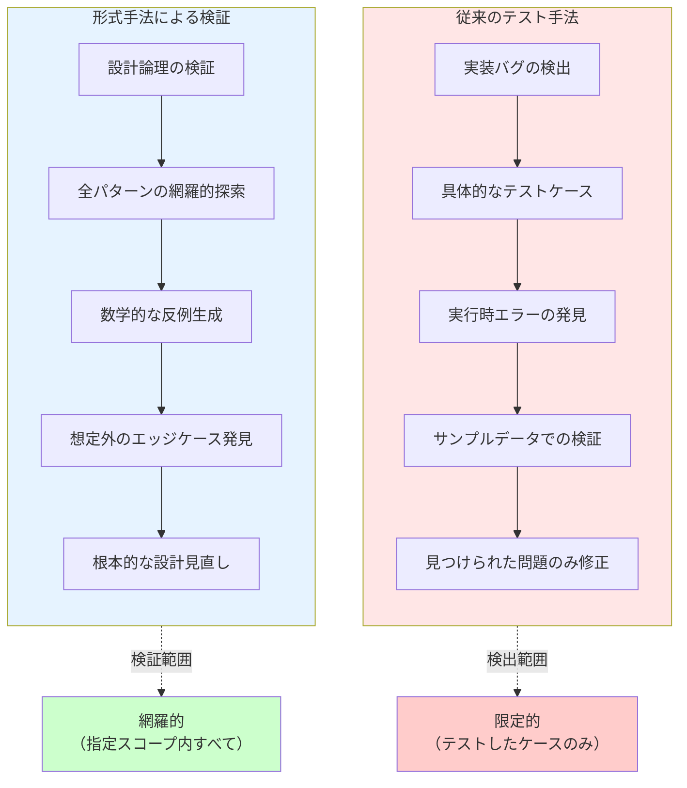
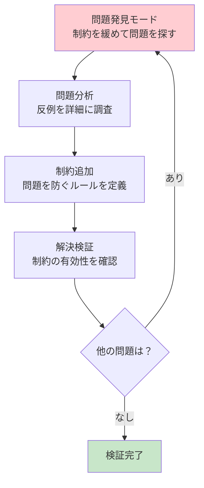

# Alloy形式手法によるシステム検証

## はじめに

ソフトウェアシステムが複雑化する中、従来のテスト手法だけでは品質保証に限界があります。特に、複雑な制約条件やビジネスルールを持つシステムでは、すべてのエッジケースを網羅することは困難です。

形式手法（Formal Methods）は、数学的基盤に基づいてシステムの仕様を厳密に記述し、その正確性を機械的に検証する手法です。本記事では、軽量形式手法の代表格である**Alloy**を用いて、飲食店の席予約システムを例にした検証手法を解説します。

## 形式手法とは

形式手法は、数学的記法を用いてシステムの仕様を記述し、その性質を厳密に証明・検証する手法です。

### 形式手法の分類

1. **モデル検査（Model Checking）**
   - 有限状態空間の網羅的探索
   - 反例の自動生成
   - Alloy、SPIN、NuSMVなど

2. **定理証明（Theorem Proving）**
   - 数学的証明による正確性保証
   - Coq、Isabelle/HOL、Leanなど

3. **型システム（Type Systems）**
   - 型による制約表現と検査
   - Liquid Haskell、Dafnyなど

### 品質保証手法の違い



## Alloyの特徴

Alloyは**軽量形式手法**として設計され、実用性と厳密性のバランスを重視しています。

**公式リソース**
- [AlloyTools GitHub](https://github.com/AlloyTools) - 最新版のダウンロードとドキュメント

### 環境設定

Alloyを使用するには以下の環境が必要です：

**必要な環境**
- **Java**: Java 8以上（JRE/JDKどちらでも可）
- **OS**: Windows、macOS、Linux対応

**インストール手順**
1. [AlloyTools GitHub](https://github.com/AlloyTools)から最新版をダウンロード
2. `alloy.jar`ファイルを取得
3. 以下のコマンドで起動：
   ```bash
   java -jar alloy.jar
   ```

**動作確認**
```alloy
// 簡単な動作確認用モデル
sig Person {
    friends: set Person
}

run {} for 4
```


*最もシンプルなAlloyモデルの実行結果。Personシグネチャが1つのノードとして表示される*

### 基本概念

:::message
**Alloyコードの読み方と実行について**

以下の各コード例は独立して実行できます。段階的に制約を追加することで、モデルがどのように変化するかを確認できます：

1. **制約なし** → あらゆる組み合わせが生成される（負の価格、空注文なども可能）
2. **基本制約** → 最低限のルール適用（正の価格など）
3. **厳密な制約** → 実用的なビジネスルール適用

**基本構文の読み方**：
- `sig A { b: B }` → 「AはBを持つ」
- `set A` → 「Aの集合（0個以上）」
- `A -> B` → 「AからBへの写像・関係」
- `all x: A | P[x]` → 「すべてのAに対してPが成り立つ」
- `some x: A | P[x]` → 「少なくとも1つのAに対してPが成り立つ」
- `run {} for N` → 「N個のオブジェクトで具体例を生成」
:::

**シグネチャ（Signature）**: データ型の定義
```alloy
// 文字列型の代替表現
abstract sig ProductName {}
one sig Pizza, Pasta, Salad, Drink extends ProductName {}

abstract sig CustomerName {}
one sig John, Mary, Alice, Bob extends CustomerName {}

abstract sig Email {}
one sig JohnEmail, MaryEmail, AliceEmail, BobEmail extends Email {}

// 実際のシグネチャ定義
sig Product {
    id: Int,
    name: ProductName,
    price: Int
}

sig Customer {
    name: CustomerName,
    email: Email
}

// 実行コマンド：基本シグネチャのインスタンスを生成
run {} for 4
```


*シグネチャのみのシンプルなモデル。CustomerNameとProductNameの列挙型が表示される*

:::message alert
**このコードの実行結果について**

この段階では制約がないため、以下のような「非現実的」なデータも生成される可能性があります：
- 商品価格が負の値（-100円など）
- 顔客名とメールアドレスが不一致（John + MaryEmail）
- IDが0や負の値

これは「制約の重要性」を示す良い例です。次のセクションで制約を追加していきます。
:::

**リレーション**: オブジェクト間の関係
```alloy
// 前のセクションのシグネチャを再定義（完全なモデル）
abstract sig ProductName {}
one sig Pizza, Pasta, Salad, Drink extends ProductName {}

abstract sig CustomerName {}
one sig John, Mary, Alice, Bob extends CustomerName {}

abstract sig Email {}
one sig JohnEmail, MaryEmail, AliceEmail, BobEmail extends Email {}

sig Product {
    id: Int,
    name: ProductName,
    price: Int
}

sig Customer {
    name: CustomerName,
    email: Email
}

// オブジェクト間の関係を表現
sig Order {
    customer: Customer,
    products: set Product,
    quantity: Product -> Int,
    timestamp: Int
}

// 基本制約
fact BasicConstraints {
    all o: Order | {
        // 注文時刻は正の値
        o.timestamp >= 0
        // 価格は正の値
        all p: Product | p.price > 0
    }
}

// 実行コマンド：注文システムの例を生成
run {} for 4
```


*Orderシグネチャが追加され、customerやtimestampの関係がエッジ（矢印）で表示される*

:::message
**リレーションの効果**

このコードでは`Order`シグネチャが追加され、オブジェクト間の関係が表現されます：
- `customer: Customer` → 注文者への参照
- `products: set Product` → 注文商品の集合
- `quantity: Product -> Int` → 商品ごとの数量マッピング

基本制約により、価格やタイムスタンプの非現実的な値が排除されますが、まだ空注文（商品なし）は可能です。
:::

**制約（Facts）**: システムが満たすべき不変条件
```alloy
// 完全なモデル定義（制約付き）
abstract sig ProductName {}
one sig Pizza, Pasta, Salad, Drink extends ProductName {}

abstract sig CustomerName {}
one sig John, Mary, Alice, Bob extends CustomerName {}

abstract sig Email {}
one sig JohnEmail, MaryEmail, AliceEmail, BobEmail extends Email {}

sig Product {
    id: Int,
    name: ProductName,
    price: Int
}

sig Customer {
    name: CustomerName,
    email: Email
}

sig Order {
    customer: Customer,
    products: set Product,
    quantity: Product -> Int,
    timestamp: Int
}

// システムが満たすべき不変条件
fact ValidOrder {
    all o: Order | {
        // 注文には少なくとも1つの商品が必要
        some o.products
        // 数量は正の値
        all p: o.products | o.quantity[p] > 0
        // 注文時刻は正の値
        o.timestamp >= 0
        // 価格は正の値
        all prod: Product | prod.price > 0
    }
}

// 実行コマンド：制約を満たす注文の例を生成
run {} for 4
```


*制約が適用された完全なモデル。左側に詳細な属性値が表示され、productsやquantityの豊富な関係が可視化される*

:::message
**制約（Facts）の効果**

`ValidOrder`制約により、以下が保証されます：
- `some o.products` → すべての注文に少なくとも1つの商品が含まれる
- `o.quantity[p] > 0` → 注文数量はすべて正の値
- 価格やタイムスタンプも正の値に限定

これでビジネスルールに沿った現実的な注文データのみが生成されます。制約の効果を実感できる例です。
:::

### Alloyの強み

1. **直感的な記法**: リレーショナルモデルによる自然な表現
2. **自動検証**: SAT solverによる高速な反例生成
3. **可視化**: グラフィカルな反例表示
4. **軽量性**: 学習コストが比較的低い

### Alloy Analyzerツール

Alloy Analyzerは、Alloyモデルの作成・検証・可視化を統合的に行うIDEです。

**主な機能**
- **構文ハイライト**: Alloy記法の色分け表示
- **自動補完**: シグネチャや述語の入力支援
- **モデル検査**: `check`コマンドによる性質検証
- **インスタンス生成**: `run`コマンドによる具体例生成
- **グラフ可視化**: モデルインスタンスの視覚的表示
- **テーマ機能**: 表示要素のカスタマイズ

**実際の使用例**
```alloy
// モデル定義後、以下のコマンドで検証
check NoDoubleBooking {
    not doubleBooking
} for 5

// 反例が見つかった場合、グラフィカルに表示される
// ノードとエッジで関係性を直感的に把握可能

// 具体例生成コマンド
run {} for 4
```

**Analyzerの利点**
- エラー箇所の即座の特定
- 複雑な関係性の視覚的理解
- 段階的なモデル構築の支援

## 他の形式手法との比較

### TLA+ との比較

**TLA+（Temporal Logic of Actions）**
- **強み**: 並行・分散システムの時相的性質を表現
- **適用例**: 分散アルゴリズム、プロトコル検証
- **vs Alloy**: より複雑な時間的振る舞いを扱えるが、学習コストが高い

### Dafny との比較

**Dafny（プログラム検証言語）**
- **強み**: 実装レベルでの契約プログラミング
- **適用例**: アルゴリズムの正確性証明
- **vs Alloy**: 実装コードの検証が可能だが、高レベル設計には不向き

### VDM との比較

**VDM（Vienna Development Method）**
- **強み**: ISO標準化された成熟した手法
- **適用例**: 大規模システムの仕様記述、安全性重要システム
- **vs Alloy**: より豊富な抽象データ型と段階的詳細化をサポート

**比較まとめ**

| 手法 | 記述スタイル | 検証手法 | 学習コスト | 適用領域 |
|------|-------------|----------|------------|----------|
| Alloy | リレーショナル | モデル検査 | 低 | 高レベル設計 |
| TLA+ | 時相論理 | モデル検査 | 高 | 並行システム |
| Dafny | 契約プログラミング | 証明支援 | 中 | 実装レベル |
| VDM | 関数型+命令型 | 型検査+証明 | 高 | 大規模仕様 |

## 飲食店席予約システムの実践例

飲食店の席予約システムを例に、Alloyによる段階的なモデル構築を見ていきます。予約システムでは時間軸と席の状態が複雑に絡み合い、特に「ダブルブッキング防止」は単純な計算では解決できない重要な制約です。

**予約システムの複雑さ**：
- 時間軸: 同じ席でも時間帯によって利用可能性が変わる
- 席の状態: 予約済み、利用中、清掃中、利用可能
- 重複防止: 同一時間帯での席の重複割り当て禁止
- 滞在時間: 予約時間と実際の利用時間の差異

### 時間重複の見落とし - よくある設計欠陥

飲食店の予約システム開発でよく発生する設計欠陥を例に、Alloyの検出能力を見てみましょう。

#### 設計欠陥の内容

開発者がよく陥る思い込み：**「同じ日の予約なら時間チェックは簡単」**

```javascript
// よくある間違った実装
function isTimeConflict(reservation1, reservation2) {
    // 単純な開始時刻比較のみ
    return reservation1.date === reservation2.date && 
           reservation1.startTime === reservation2.startTime;
}
```

**問題**: この実装では以下の重複を検出できません：
- 18:00-20:00 と 19:00-21:00 （部分重複）
- 18:00-22:00 と 19:00-20:00 （包含関係）
- 18:00-20:00, 19:30-21:30, 20:00-22:00 （連鎖重複）

#### 自然言語レビューの限界

仕様書レビューでは気づきにくい問題：
- 「予約時間の重複を防ぐ」→ 具体的な重複パターンが見えない
- 人間のレビューでは3つ以上の予約が関わる複雑なケースを見落とし
- エッジケースの組み合わせ爆発を想定できない

#### Alloyによる問題の再現と検出

Alloyではまず**問題を再現するモデル**を作成し、具体的な欠陥パターンを発見します。

:::message
📝 **学習用モデル**: 以下は概念理解のためのシンプルなモデルです
:::

```alloy
// 基本エンティティ
sig Table {
    id: Int
}

sig TimeSlot {
    startTime: Int,
    endTime: Int
}

sig Reservation {
    table: Table,
    timeSlot: TimeSlot,
    partySize: Int
}

// 基本制約
fact BasicTimeConstraints {
    // 開始時刻 < 終了時刻
    all ts: TimeSlot | ts.startTime < ts.endTime
    // パーティサイズは正の値
    all r: Reservation | r.partySize > 0
    // ID は正の値
    all t: Table | t.id > 0
}

// 時間重複の厳密な定義
pred timeSlotOverlap[ts1, ts2: TimeSlot] {
    // 数学的に正確な重複判定
    ts1.startTime < ts2.endTime and ts2.startTime < ts1.endTime
}

// ダブルブッキングの検出
pred doubleBooking {
    some disj r1, r2: Reservation | {
        r1.table = r2.table and
        timeSlotOverlap[r1.timeSlot, r2.timeSlot]
    }
}

// 複雑な連鎖重複の検出
pred chainedOverlap {
    some disj r1, r2, r3: Reservation | {
        r1.table = r2.table and r2.table = r3.table and
        timeSlotOverlap[r1.timeSlot, r2.timeSlot] and
        timeSlotOverlap[r2.timeSlot, r3.timeSlot] and
        not timeSlotOverlap[r1.timeSlot, r3.timeSlot]  // r1とr3は直接重複しない
    }
}

// 実行コマンド: 基本モデルの動作確認
run {} for 4

// 実行コマンド: ダブルブッキング問題の具体例を生成
run ShowDoubleBooking {
    doubleBooking
} for 4
```

:::message alert
**このモデルの重要なポイント**

このモデルは**意図的にダブルブッキングを許可**しています。目的は：

1. **問題の再現**: 現実に起こりうるダブルブッキングをモデル化
2. **具体例の提示**: 「18:00-20:00と19:00-21:00の重複」などを自動生成
3. **欠陥パターンの発見**: 人間が見落としがちな複雑なケースを網羅

次のステップで「ダブルブッキングを防止する制約」を追加していきます。
:::

#### 検証結果: 問題の発見

```alloy
// 検証: ダブルブッキングは発生しないか？
// → この検証は**失敗**し、反例が提示される
check NoDoubleBooking {
    not doubleBooking
} for 5

// 反例探索: 複雑な重複パターンを見つける
run ShowChainedOverlap {
    chainedOverlap
} for 4
```

**実際のAlloyアナライザ出力例**：

```
Executing "Run run$1 for 4"
   Solver=sat4j Bitwidth=4 MaxSeq=4 SkolemDepth=1 Symmetry=20
   3721 vars. 300 primary vars. 10123 clauses. 15ms.
   Instance found. Predicate is consistent. 26ms.

Executing "Check NoDoubleBooking for 5"
   Solver=sat4j Bitwidth=4 MaxSeq=5 SkolemDepth=1 Symmetry=20
   5903 vars. 395 primary vars. 16563 clauses. 12ms.
   Counterexample found. Assertion is invalid. 23ms.

Executing "Run ShowDoubleBooking for 4"
   3721 vars. 300 primary vars. 10123 clauses. 7ms.
   Instance found. Predicate is consistent. 18ms.

Executing "Run ShowChainedOverlap for 4"
   3721 vars. 300 primary vars. 10123 clauses. 6ms.
   Instance found. Predicate is consistent. 18ms.
```


*Counterexample found時のビジュアライザ表示。複数のReservationが同じTableを参照し、TimeSlotが重複している具体的なダブルブッキングの例が表示される*

:::message
**Alloyアナライザ出力の読み方**

- **`Instance found + Predicate is consistent`** → 条件を満たす具体例が生成された（成功）
- **`Counterexample found + Assertion is invalid`** → アサーションに反する反例が発見された

`check NoDoubleBooking`で`Counterexample found`が表示されたのは、**「ダブルブッキングが発生しない」という主張に反する具体例**をAlloyが発見したことを意味します。上のビジュアライザでは、実際に複数の予約が同じテーブルと重複する時間スロットを持つケースが表示されています。

これはエラーではなく、**期待された結果**です。
:::

**Alloyが発見する問題例**：
- 18:00-20:00, 19:30-21:30, 20:00-22:00の連鎖重複
- 包含関係: 18:00-22:00内の19:00-20:00
- 境界値: 20:00終了と20:00開始は重複しない

**このアプローチの価値**：
- 全ての可能な重複パターンを網羅的に発見
- 人間が見落としがちな複雑なケースを自動生成
- 数学的な厳密性で曖昧さを排除

### 制約の比較：問題版 vs 解決版

制約の有無による効果の違いを明確に比較してみましょう。

#### ❌ 問題版：制約が緩いモデル

**ダブルブッキングを許してしまうモデル**

:::message
📝 **実行方法**: 以下のコード全体を新しいAlloyファイル（例：`problem_model.als`）にコピーして実行してください
:::

```alloy
// 基本シグネチャ
sig TimeSlot {
    startTime: Int,
    endTime: Int
}

sig Table {
    id: Int,
    seats: Int
}

sig Reservation {
    id: Int,
    table: Table,
    timeSlot: TimeSlot,
    partySize: Int
}

// 時間重複の判定述語
pred timeSlotOverlap[ts1, ts2: TimeSlot] {
    ts1.startTime < ts2.endTime and ts2.startTime < ts1.endTime
}

// 基本制約のみ（ダブルブッキングは防がない）
fact BasicConstraintsOnly {
    // 時間の妥当性
    all ts: TimeSlot | ts.startTime < ts.endTime
    // テーブル席数は正の値
    all t: Table | t.seats > 0
    // パーティサイズは正の値
    all r: Reservation | r.partySize > 0
}

// 実行コマンド：ダブルブッキング例を積極的に探す
run FindDoubleBooking {
    some disj r1, r2: Reservation | {
        r1.table = r2.table and 
        timeSlotOverlap[r1.timeSlot, r2.timeSlot]
    }
} for 4

// 実行コマンド：基本的なインスタンス生成
run {} for 4

// 検証コマンド：ダブルブッキングが防がれているかチェック（失敗することを期待）
check NoDoubleBookingTest {
    not (some disj r1, r2: Reservation | {
        r1.table = r2.table and timeSlotOverlap[r1.timeSlot, r2.timeSlot]
    })
} for 4
```

**🔧 実行方法**：
上記の3つのコマンドを**順番に一つずつ**実行してください：
1. **Execute**メニュー → **Run FindDoubleBooking for 4**
2. **Execute**メニュー → **Run run$1 for 4** 
3. **Execute**メニュー → **Check NoDoubleBookingTest for 4**

**期待される結果**: 
- `run FindDoubleBooking`: `Instance found. Predicate is consistent.` - ダブルブッキング例が見つかる
- `run {}`: `Instance found. Predicate is consistent.` - 通常の予約例が生成される  
- `check NoDoubleBookingTest`: `Counterexample found` - ダブルブッキングの反例が検出される

---

#### ✅ 解決版：制約を強化したモデル

**ダブルブッキングを確実に防ぐモデル**

:::message
📝 **実行方法**: 以下のコード全体を新しいAlloyファイル（例：`solution_model.als`）にコピーして実行してください
:::

```alloy
// 基本シグネチャ（同じ）
sig TimeSlot {
    startTime: Int,
    endTime: Int
}

sig Table {
    id: Int,
    seats: Int
}

sig Reservation {
    id: Int,
    table: Table,
    timeSlot: TimeSlot,
    partySize: Int
}

// 時間重複の判定述語（同じ）
pred timeSlotOverlap[ts1, ts2: TimeSlot] {
    ts1.startTime < ts2.endTime and ts2.startTime < ts1.endTime
}

// 基本制約（同じ）
fact BasicConstraints {
    // 時間の妥当性
    all ts: TimeSlot | ts.startTime < ts.endTime
    // テーブル席数は正の値
    all t: Table | t.seats > 0
    // パーティサイズは正の値
    all r: Reservation | r.partySize > 0
}

// 🚫 ダブルブッキング防止制約（これが追加された部分！）
fact NoDoubleBooking {
    all disj r1, r2: Reservation | {
        r1.table = r2.table => not timeSlotOverlap[r1.timeSlot, r2.timeSlot]
    }
}

// 実行コマンド: 制約追加後の動作確認
run {} for 4

// 実行コマンド: ダブルブッキング例を探そうとしても見つからないことを確認
run TryFindDoubleBooking {
    some disj r1, r2: Reservation | {
        r1.table = r2.table and 
        timeSlotOverlap[r1.timeSlot, r2.timeSlot]
    }
} for 4

// 検証: ダブルブッキングが本当に防げているか？
check NoDoubleBookingVerification {
    not (some disj r1, r2: Reservation | {
        r1.table = r2.table and timeSlotOverlap[r1.timeSlot, r2.timeSlot]
    })
} for 4
```

**🔧 実行方法**：
上記の3つのコマンドを**順番に一つずつ**実行してください：
1. **Execute**メニュー → **Run run$1 for 4**
2. **Execute**メニュー → **Run TryFindDoubleBooking for 4**
3. **Execute**メニュー → **Check NoDoubleBookingVerification for 4**

**期待される結果**: 
- `run {}`: `Instance found. Predicate is consistent.` - 制約を満たす予約例が生成される
- `run TryFindDoubleBooking`: `No instance found` - ダブルブッキング例が見つからない
- `check NoDoubleBookingVerification`: `No counterexample found` - ダブルブッキングが完全に防がれている

---

#### 🔍 制約の効果を体感しよう

**体験手順**:
1. **問題版ファイル**（`problem_model.als`）で確認: 
   - `check NoDoubleBookingTest` → `Counterexample found` (問題を検出)
   - `run FindDoubleBooking` → `Instance found. Predicate is consistent.` (ダブルブッキング例を発見)
2. **解決版ファイル**（`solution_model.als`）で確認:
   - `run TryFindDoubleBooking` → `No instance found` (問題例が見つからない)
   - `check NoDoubleBookingVerification` → `No counterexample found` (問題が完全に解決)

#### 🎯 学習のポイント

**制約追加の効果**：
- `NoDoubleBooking`ファクトにより、同一テーブルの時間重複が完全に排除
- `check`コマンドで制約の有効性を数学的に証明
- 制約が強すぎると`run`で例が見つからなくなる場合もある

**検証結果の読み方**：
- `Instance found. Predicate is consistent.`: 制約を満たす例が見つかった
- `No instance found`: 制約が強すぎて例が生成できない  
- `Counterexample found`: 反例が見つかった（問題が検出された）
- `No counterexample found`: 反例が見つからない（検証成功）

## Alloy導入のベストプラクティス

### 段階的アプローチ

Alloyによる検証は以下のフローで進めます：



### 学習のポイント

**1. 段階的モデリング**
- 最初は制約を少なく、問題を見つけやすくする
- 問題発見後に適切な制約を追加
- 制約の追加で新たな問題が見えることもある

**2. 反例の活用**
- Alloyの反例は具体的で理解しやすい
- 視覚化により関係性が直感的に把握できる
- 反例から学んだパターンをテストケースに活用

**3. 検証コマンドの使い分け**
- `run`: インスタンス生成（例を見つける）
- `check`: アサーション検証（問題がないか確認）
- スコープ（`for N`）の調整で検証の範囲を制御

### 導入時の注意点

**技術的課題**
- **学習コスト**: Alloy記法と論理的思考の習得が必要
- **スコープ制限**: `for N`による有界モデル検査の限界
- **抽象化レベル**: 現実との適切なバランス調整

**実用性の確保**
- **段階的導入**: 重要な部分から始めて徐々に拡大
- **チーム共有**: モデルの意図と制約の理由を文書化
- **継続的改善**: 新しい要件に合わせてモデルを更新

## まとめ

Alloy形式手法は、従来の手動レビューやテストでは発見困難な設計欠陥を数学的に検証できる強力なツールです。

**この事例から学んだこと**：

1. **人間の限界**: 複雑な組み合わせは見落としがち
2. **形式手法の価値**: 網羅的・数学的な検証
3. **具体的な反例**: 問題の理解と修正が容易
4. **制約による解決**: 問題防止の確実な方法

飲食店の席予約システムのような身近な例でも、Alloyは隠れた設計問題を確実に発見し、解決策を提示してくれます。形式手法への第一歩として、ぜひAlloyを活用してみてください。

