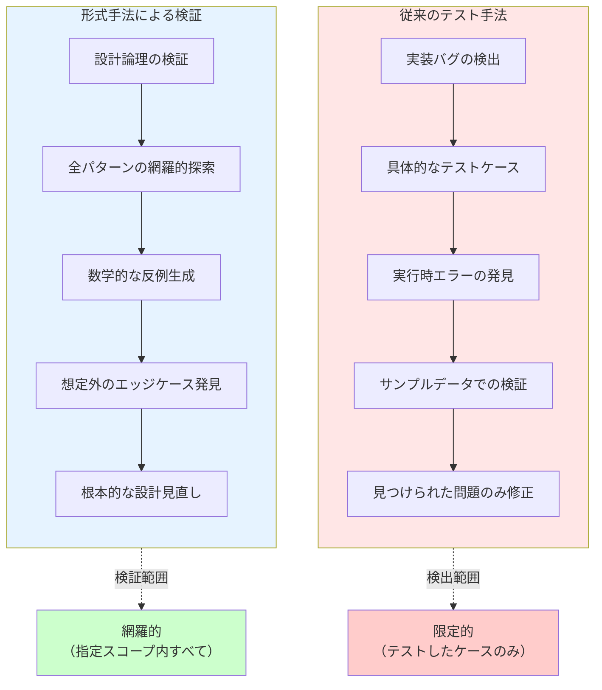
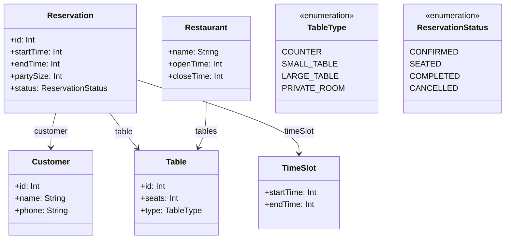
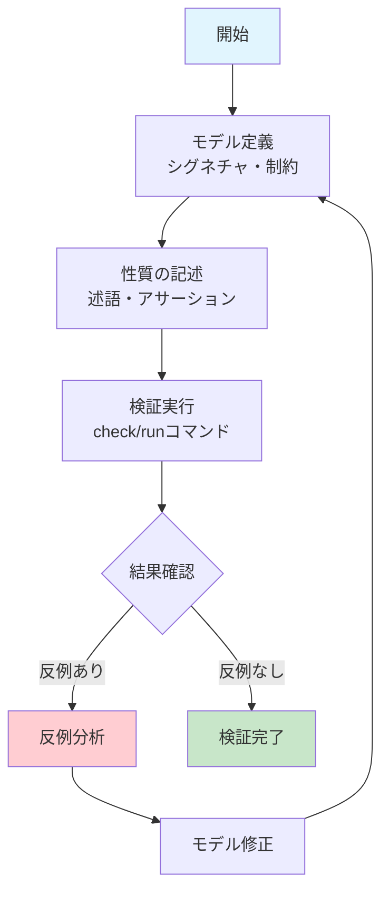

# Alloy形式手法によるシステム検証

## はじめに

ソフトウェアシステムが複雑化する中、従来のテスト手法だけでは品質保証に限界があります。特に、複雑な制約条件やビジネスルールを持つシステムでは、すべてのエッジケースを網羅することは困難です。

形式手法（Formal Methods）は、数学的基盤に基づいてシステムの仕様を厳密に記述し、その正確性を機械的に検証する手法です。本記事では、軽量形式手法の代表格である**Alloy**を用いて、受発注・在庫管理システムを例にした検証手法を解説します。

## 形式手法とは

形式手法は、数学的記法を用いてシステムの仕様を記述し、その性質を厳密に証明・検証する手法です。

### 形式手法の分類

1. **モデル検査（Model Checking）**
   - 有限状態空間の網羅的探索
   - 反例の自動生成
   - Alloy、SPIN、NuSMVなど

2. **定理証明（Theorem Proving）**
   - 数学的証明による正確性保証
   - Coq、Isabelle/HOL、Leanなど

3. **型システム（Type Systems）**
   - 型による制約表現と検査
   - Liquid Haskell、Dafnyなど

### 品質保証手法の違い



## Alloyの特徴

Alloyは**軽量形式手法**として設計され、実用性と厳密性のバランスを重視しています。

**公式リソース**
- [AlloyTools GitHub](https://github.com/AlloyTools) - 最新版のダウンロードとドキュメント

### 環境設定

Alloyを使用するには以下の環境が必要です：

**必要な環境**
- **Java**: Java 8以上（JRE/JDKどちらでも可）
- **OS**: Windows、macOS、Linux対応

**インストール手順**
1. [AlloyTools GitHub](https://github.com/AlloyTools)から最新版をダウンロード
2. `alloy.jar`ファイルを取得
3. 以下のコマンドで起動：
   ```bash
   java -jar alloy.jar
   ```

**動作確認**
```alloy
// 簡単な動作確認用モデル
sig Person {
    friends: set Person
}

run {} for 3
```

### 基本概念

**シグネチャ（Signature）**: データ型の定義
```alloy
sig Product {
    id: Int,
    name: String,
    price: Int
}

sig Customer {
    name: String,
    email: String
}
```

**リレーション**: オブジェクト間の関係
```alloy
sig Order {
    customer: Customer,
    products: set Product,
    quantity: Product -> Int,
    timestamp: Int
}
```

**制約（Facts）**: システムが満たすべき不変条件
```alloy
fact ValidOrder {
    all o: Order | {
        // 注文には少なくとも1つの商品が必要
        some o.products
        // 数量は正の値
        all p: o.products | o.quantity[p] > 0
    }
}
```

### Alloyの強み

1. **直感的な記法**: リレーショナルモデルによる自然な表現
2. **自動検証**: SAT solverによる高速な反例生成
3. **可視化**: グラフィカルな反例表示
4. **軽量性**: 学習コストが比較的低い

### Alloy Analyzerツール

Alloy Analyzerは、Alloyモデルの作成・検証・可視化を統合的に行うIDEです。

**主な機能**
- **構文ハイライト**: Alloy記法の色分け表示
- **自動補完**: シグネチャや述語の入力支援
- **モデル検査**: `check`コマンドによる性質検証
- **インスタンス生成**: `run`コマンドによる具体例生成
- **グラフ可視化**: モデルインスタンスの視覚的表示
- **テーマ機能**: 表示要素のカスタマイズ

**実際の使用例**
```alloy
// モデル定義後、以下のコマンドで検証
check InventoryConsistency for 5

// 反例が見つかった場合、グラフィカルに表示される
// ノードとエッジで関係性を直感的に把握可能
```

**Analyzerの利点**
- エラー箇所の即座の特定
- 複雑な関係性の視覚的理解
- 段階的なモデル構築の支援

## 他の形式手法との比較

### TLA+ との比較

**TLA+（Temporal Logic of Actions）**
- **強み**: 並行・分散システムの時相的性質を表現
- **適用例**: 分散アルゴリズム、プロトコル検証
- **vs Alloy**: より複雑な時間的振る舞いを扱えるが、学習コストが高い

```tla
EXTENDS Integers, Sequences

VARIABLES stock, orders

Init == stock = 100 /\ orders = <<>>

PlaceOrder(qty) == 
    /\ qty <= stock
    /\ stock' = stock - qty
    /\ orders' = Append(orders, qty)
```

### Dafny との比較

**Dafny（プログラム検証言語）**
- **強み**: 実装レベルでの契約プログラミング
- **適用例**: アルゴリズムの正確性証明
- **vs Alloy**: 実装コードの検証が可能だが、高レベル設計には不向き

```dafny
method UpdateStock(current: nat, order: nat) returns (result: nat)
    requires order <= current
    ensures result == current - order
{
    result := current - order;
}
```

### VDM との比較

**VDM（Vienna Development Method）**
- **強み**: ISO標準化された成熟した手法
- **適用例**: 大規模システムの仕様記述、安全性重要システム
- **vs Alloy**: より豊富な抽象データ型と段階的詳細化をサポート

```vdm
types
  ProductId = nat
  Stock = map ProductId to nat
  
functions
  updateStock: Stock * ProductId * nat -> Stock
  updateStock(s, pid, qty) ==
    s ++ {pid |-> s(pid) - qty}
  pre pid in set dom s and qty <= s(pid)
```

**比較まとめ**

| 手法 | 記述スタイル | 検証手法 | 学習コスト | 適用領域 |
|------|-------------|----------|------------|----------|
| Alloy | リレーショナル | モデル検査 | 低 | 高レベル設計 |
| TLA+ | 時相論理 | モデル検査 | 高 | 並行システム |
| Dafny | 契約プログラミング | 証明支援 | 中 | 実装レベル |
| VDM | 関数型+命令型 | 型検査+証明 | 高 | 大規模仕様 |

## 飲食店席予約システムの実践例

飲食店の席予約システムを例に、Alloyによる段階的なモデル構築を見ていきます。予約システムでは時間軸と席の状態が複雑に絡み合い、特に「ダブルブッキング防止」は単純な計算では解決できない重要な制約です。

**予約システムの複雑さ**：
- 時間軸: 同じ席でも時間帯によって利用可能性が変わる
- 席の状態: 予約済み、利用中、清掃中、利用可能
- 重複防止: 同一時間帯での席の重複割り当て禁止
- 滞在時間: 予約時間と実際の利用時間の差異

### Step 1: 飲食店席予約システムの基本エンティティ

席予約システムの核となるエンティティを定義します。



これをAlloyで表現すると：

```alloy
// 席の種類
enum TableType { COUNTER, SMALL_TABLE, LARGE_TABLE, PRIVATE_ROOM }

// 席の定義
sig Table {
    id: Int,
    seats: Int,      // 席数
    type: TableType
}

// 顧客の定義
sig Customer {
    id: Int,
    name: String,
    phone: String
}

// 予約状態
enum ReservationStatus { CONFIRMED, SEATED, COMPLETED, CANCELLED }

// 時間スロットの定義
sig TimeSlot {
    startTime: Int,
    endTime: Int
}

// 予約の定義
sig Reservation {
    id: Int,
    customer: Customer,
    table: Table,
    timeSlot: TimeSlot,
    partySize: Int,     // 人数
    status: ReservationStatus
}

// レストランの定義
sig Restaurant {
    name: String,
    tables: set Table,
    openTime: Int,
    closeTime: Int
}
```

### Step 2: 予約システムの基本制約

予約システム特有の制約を定義します。

```alloy
// 基本的な制約
fact BasicConstraints {
    // 席数は正の値
    all t: Table | t.seats > 0
    
    // パーティーサイズは正の値
    all r: Reservation | r.partySize > 0
    
    // 時間スロットは正しい順序
    all ts: TimeSlot | ts.startTime < ts.endTime
    
    // ID系の一意性
    all disj t1, t2: Table | t1.id != t2.id
    all disj c1, c2: Customer | c1.id != c2.id
    all disj r1, r2: Reservation | r1.id != r2.id
}

// 席と人数の適合性制約
fact TableCapacityConstraints {
    // 予約人数は席の定員以下
    all r: Reservation | r.partySize <= r.table.seats
    
    // キャンセル済み予約は制約対象外
    all r: Reservation | r.status = CANCELLED => {
        // キャンセル予約は席の利用制約に影響しない
        no other: Reservation | other != r and other.table = r.table and 
                                 other.status != CANCELLED
    }
}

// 営業時間制約
fact BusinessHoursConstraints {
    all restaurant: Restaurant, r: Reservation | {
        r.table in restaurant.tables => {
            // 予約時間は営業時間内
            r.timeSlot.startTime >= restaurant.openTime
            r.timeSlot.endTime <= restaurant.closeTime
        }
    }
}
```

### Step 3: ダブルブッキング防止の核心制約

予約システムの最重要制約であるダブルブッキング防止を定義します。

```alloy
// ダブルブッキング防止制約
fact NoDoubleBookingConstraints {
    // 同一席の時間重複防止
    all disj r1, r2: Reservation | {
        r1.table = r2.table and 
        r1.status != CANCELLED and r2.status != CANCELLED => {
            // 時間が重複しない
            timeSlotNotOverlap[r1.timeSlot, r2.timeSlot]
        }
    }
}

// 時間重複判定の述語
pred timeSlotNotOverlap[ts1, ts2: TimeSlot] {
    // ts1の終了時刻 <= ts2の開始時刻 または ts2の終了時刻 <= ts1の開始時刻
    ts1.endTime <= ts2.startTime or ts2.endTime <= ts1.startTime
}

// 時間重複判定（包含関係も考慮）
pred timeSlotOverlap[ts1, ts2: TimeSlot] {
    not timeSlotNotOverlap[ts1, ts2]
}

// 予約状態変化の制約
fact ReservationStatusConstraints {
    // 着席済み予約は確定済み予約から遷移
    all r: Reservation | r.status = SEATED => {
        // 同じ席・時間帯に他の確定予約がない
        no other: Reservation | {
            other != r and other.table = r.table and
            other.status in CONFIRMED + SEATED and
            timeSlotOverlap[r.timeSlot, other.timeSlot]
        }
    }
    
    // 完了済み予約は着席済みから遷移
    all r: Reservation | r.status = COMPLETED => {
        // 実際の利用時間は予約時間の範囲内（簡略化）
        r.timeSlot.startTime >= 0 and r.timeSlot.endTime >= r.timeSlot.startTime
    }
}
```

**ダブルブッキング防止の重要性**：
- 物理的制約: 同じ席に同時に2組の客は座れない
- 時間軸の複雑さ: 開始・終了時刻の重複パターンは複数存在
- 状態管理: キャンセル済み予約は重複チェックから除外

### Step 4: 予約操作の定義と検証

予約システムの複雑な操作を定義し、検証してみましょう。

#### 予約受付操作

```alloy
// 予約受付の操作
pred acceptReservation[r: Reservation] {
    // 事前条件
    r.status = CONFIRMED
    
    // パーティーサイズが席の定員以下
    r.partySize <= r.table.seats
    
    // 営業時間内の予約
    some restaurant: Restaurant | {
        r.table in restaurant.tables
        r.timeSlot.startTime >= restaurant.openTime
        r.timeSlot.endTime <= restaurant.closeTime
    }
    
    // ダブルブッキングしない
    no other: Reservation | {
        other != r and other.table = r.table and
        other.status != CANCELLED and
        timeSlotOverlap[r.timeSlot, other.timeSlot]
    }
}
```

#### ダブルブッキング検出

```alloy
// ダブルブッキング状況の検出
pred doubleBooking {
    some disj r1, r2: Reservation | {
        // 同じ席で時間が重複
        r1.table = r2.table and
        r1.status != CANCELLED and r2.status != CANCELLED and
        timeSlotOverlap[r1.timeSlot, r2.timeSlot]
    }
}

// 複雑な時間重複パターン
pred complexTimeOverlap {
    some disj r1, r2, r3: Reservation | {
        r1.table = r2.table and r2.table = r3.table and
        r1.status != CANCELLED and r2.status != CANCELLED and r3.status != CANCELLED and
        
        // 3つの予約が連鎖的に重複
        timeSlotOverlap[r1.timeSlot, r2.timeSlot] and
        timeSlotOverlap[r2.timeSlot, r3.timeSlot] and
        not timeSlotOverlap[r1.timeSlot, r3.timeSlot]
    }
}
```

#### 重要な性質の検証

```alloy
// 検証1: 予約受付後にダブルブッキングは発生しない
check NoDoubleBookingAfterAcceptance {
    all r: Reservation | acceptReservation[r] => not doubleBooking
} for 6

// 検証2: ダブルブッキング制約の一貫性
check DoubleBookingConsistency {
    not doubleBooking
} for 5

// 検証3: 時間重複判定の正確性
check TimeOverlapCorrectness {
    all disj ts1, ts2: TimeSlot | {
        timeSlotOverlap[ts1, ts2] <=> 
        (ts1.startTime < ts2.endTime and ts2.startTime < ts1.endTime)
    }
} for 5

// 検証4: 複雑な重複パターンも防止される
check ComplexOverlapPrevention {
    not complexTimeOverlap
} for 6
```

**重要な検証項目**：
- 予約受付時のダブルブッキング防止
- 時間重複判定ロジックの正確性
- 複数予約の連鎖的重複防止
- キャンセル処理時の整合性維持

### Step 5: 高度なシナリオ - キャンセル・変更・ウォークイン

飲食店の実運用では、キャンセル、予約変更、ウォークイン（飛び込み客）など複雑な状況が発生します。

```alloy
// キャンセル処理
pred cancelReservation[r: Reservation] {
    // 事前条件: 確定済み予約
    r.status = CONFIRMED
    
    // 事後状態: キャンセル済み
    r.status = CANCELLED
    
    // キャンセル後は同時間帯の他予約が可能
    some newReservation: Reservation | {
        newReservation != r and newReservation.table = r.table and
        newReservation.status = CONFIRMED and
        timeSlotOverlap[r.timeSlot, newReservation.timeSlot]
    }
}

// 予約変更（時間変更）
pred changeReservationTime[r: Reservation, newTimeSlot: TimeSlot] {
    // 事前条件
    r.status = CONFIRMED
    
    // 新しい時間スロットで重複がない
    no other: Reservation | {
        other != r and other.table = r.table and
        other.status != CANCELLED and
        timeSlotOverlap[newTimeSlot, other.timeSlot]
    }
    
    // 営業時間内
    some restaurant: Restaurant | {
        r.table in restaurant.tables
        newTimeSlot.startTime >= restaurant.openTime
        newTimeSlot.endTime <= restaurant.closeTime
    }
}

// ウォークイン（飛び込み客）受付
pred acceptWalkIn[newReservation: Reservation, currentTime: Int] {
    // 事前条件: 新規予約
    newReservation.status = CONFIRMED
    
    // 現在時刻から開始
    newReservation.timeSlot.startTime = currentTime
    
    // 即座に利用可能な席
    no conflicting: Reservation | {
        conflicting != newReservation and 
        conflicting.table = newReservation.table and
        conflicting.status in CONFIRMED + SEATED and
        timeSlotOverlap[newReservation.timeSlot, conflicting.timeSlot]
    }
    
    // 席の定員以下
    newReservation.partySize <= newReservation.table.seats
}
```

#### 複雑な競合シナリオ

```alloy
// キャンセル・新規予約の競合
pred cancellationRace {
    some disj r1, r2, r3: Reservation | {
        // r1がキャンセルされる
        r1.status = CANCELLED
        
        // 同じ席・時間に2つの新規予約が競合
        r2.table = r1.table and r3.table = r1.table and
        r2.status = CONFIRMED and r3.status = CONFIRMED and
        timeSlotOverlap[r1.timeSlot, r2.timeSlot] and
        timeSlotOverlap[r1.timeSlot, r3.timeSlot] and
        timeSlotOverlap[r2.timeSlot, r3.timeSlot]
    }
}

// 席の種類による制約違反
pred tableTypeMismatch {
    some r: Reservation | {
        // 個室が必要だが一般席を予約
        r.table.type != PRIVATE_ROOM and
        r.partySize > 6  // 大人数は個室が必要（業務ルール）
    }
}
```

#### 複合的な検証

```alloy
// 検証1: キャンセル後の競合防止
check NoCancellationRace {
    not cancellationRace
} for 6

// 検証2: 予約変更の整合性
check ReservationChangeConsistency {
    all r: Reservation, newTimeSlot: TimeSlot | {
        changeReservationTime[r, newTimeSlot] => 
        not doubleBooking
    }
} for 5

// 検証3: ウォークイン受付の安全性
check WalkInSafety {
    all r: Reservation, currentTime: Int | {
        acceptWalkIn[r, currentTime] => 
        not doubleBooking
    }
} for 5

// 検証4: 席種別制約の遵守
check TableTypeConstraints {
    not tableTypeMismatch
} for 4
```

**実世界の複雑さ**：
- **同時操作**: キャンセルと新規予約の競合状態
- **業務ルール**: 席種別による人数制限
- **リアルタイム性**: ウォークイン客の即座受付
- **状態整合性**: 予約変更時の一貫性保証

## Alloy導入のベストプラクティス

### Alloy検証プロセス

Alloyによる検証は以下のフローで進めます：



### 段階的アプローチ

1. **コアエンティティの定義**: 基本的なデータ構造から開始
2. **制約の追加**: 不変条件を段階的に追加
3. **操作の定義**: システムの振る舞いをモデル化
4. **検証の実行**: 想定する性質を検査

### 反例からの学習

Alloyの強みは具体的な反例を生成することです。従来の形式手法では「証明失敗」で終わることが多いのに対し、Alloyは問題のある具体的な状況を提示します。

```alloy
// 検証が失敗した場合の反例分析
run ShowCounterexample {
    stockShortage
} for 3
```

**反例の活用方法**
1. **問題の可視化**: グラフ表示で関係性を直感的に理解
2. **仮定の見直し**: 想定していなかった状況の発見
3. **制約の改善**: より適切な制約条件の導出
4. **テストケース生成**: 反例を実装テストに活用

### モデルの段階的詳細化

```alloy
// シンプルなモデルから開始
sig SimpleOrder {
    product: Product,
    quantity: Int
}

// 複雑さを段階的に追加
sig ComplexOrder extends SimpleOrder {
    customer: Customer,
    priority: Priority,
    deliveryDate: Int
}
```


### 導入時の注意点

**技術的課題**
- **スコープ制限**: `for N`による有界モデル検査の限界
- **状態爆発**: 大規模モデルでの検証時間増大
- **抽象化レベル**: 現実との適切なバランス調整
- **表現力の限界**: 一部の性質は表現困難

**組織的課題**
- **学習コスト**: 数学的思考とAlloy記法の習得
- **投資対効果**: 短期的なコスト増と長期的な品質向上
- **文化の変化**: 形式的思考の組織への浸透
- **ツール統合**: 既存開発フローとの調和

**克服策**
- 小規模なプロトタイプから開始
- 重要度の高い部分への集中適用
- 段階的なチーム教育とメンタリング

## まとめ

Alloyによる形式手法は、複雑なシステムの設計品質向上に有効な手法です。特に以下の特徴があります：

**Alloyの優位性**
- 軽量で実践的なアプローチ
- 直感的なリレーショナルモデル
- 自動的な反例生成による迅速なフィードバック

**適用効果**
- 設計段階での論理的不整合の早期発見
- 複雑な制約条件の厳密な検証
- システムの理解と文書化の促進

**成功のポイント**
- 小さく始めて段階的に拡大
- 具体的な問題領域への集中
- チーム全体での継続的な学習

形式手法は銀の弾丸ではありませんが、適切に導入することで、より信頼性の高いシステム開発が可能になります。受発注・在庫管理のような複雑な制約を持つ領域では、特にその効果を実感できるでしょう。

**次のステップ**
- [AlloyTools](https://github.com/AlloyTools)から最新版をダウンロード
- 公式チュートリアルで基本操作を習得
- 自分の担当領域で小さなモデルから実験開始

## 参考資料

- [AlloyTools GitHub](https://github.com/AlloyTools) - 公式リポジトリ
- "Software Abstractions" by Daniel Jackson - Alloy開発者による教科書
- Alloy Community - オンラインコミュニティとサンプル
