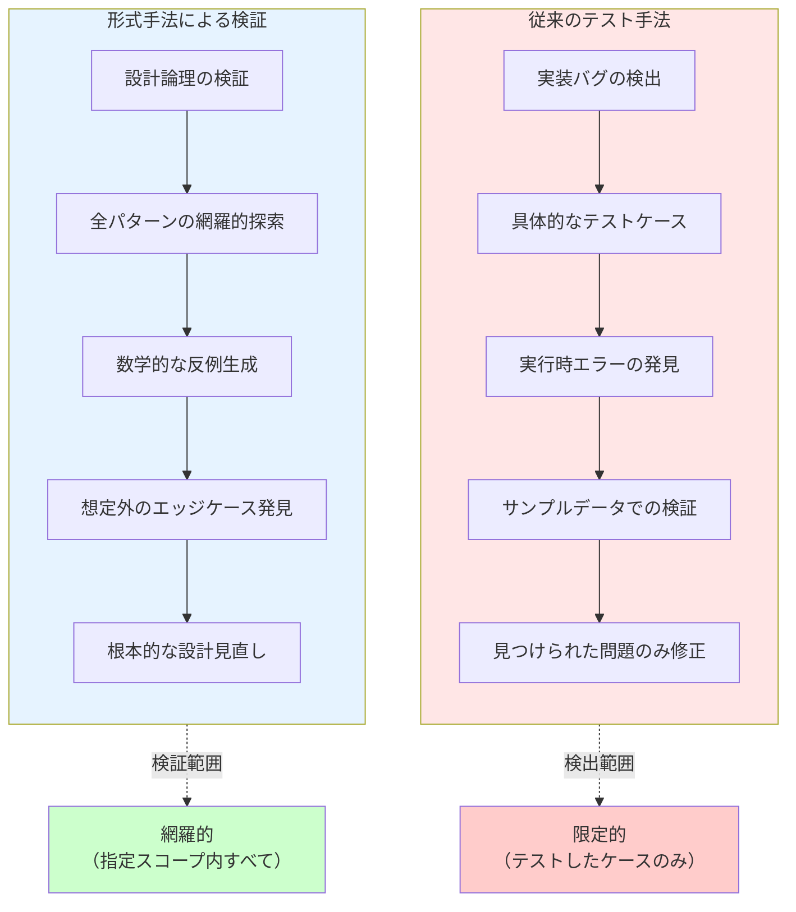
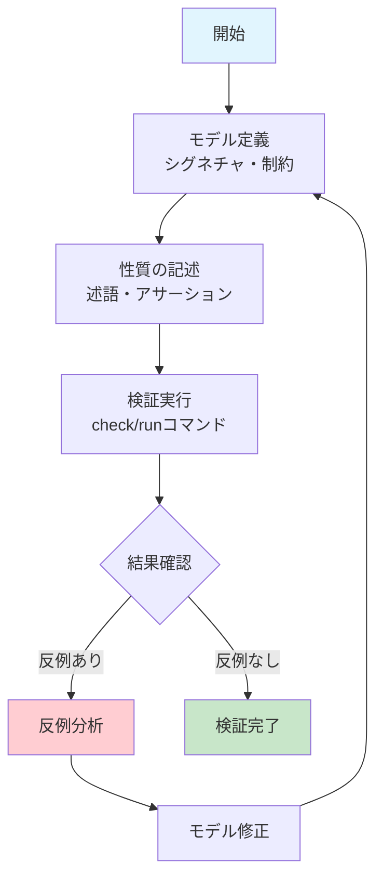

# Alloy形式手法によるシステム検証

## はじめに

ソフトウェアシステムが複雑化する中、従来のテスト手法だけでは品質保証に限界があります。特に、複雑な制約条件やビジネスルールを持つシステムでは、すべてのエッジケースを網羅することは困難です。

形式手法（Formal Methods）は、数学的基盤に基づいてシステムの仕様を厳密に記述し、その正確性を機械的に検証する手法です。本記事では、軽量形式手法の代表格である**Alloy**を用いて、飲食店の席予約システムを例にした検証手法を解説します。

## 形式手法とは

形式手法は、数学的記法を用いてシステムの仕様を記述し、その性質を厳密に証明・検証する手法です。

### 形式手法の分類

1. **モデル検査（Model Checking）**
   - 有限状態空間の網羅的探索
   - 反例の自動生成
   - Alloy、SPIN、NuSMVなど

2. **定理証明（Theorem Proving）**
   - 数学的証明による正確性保証
   - Coq、Isabelle/HOL、Leanなど

3. **型システム（Type Systems）**
   - 型による制約表現と検査
   - Liquid Haskell、Dafnyなど

### 品質保証手法の違い



## Alloyの特徴

Alloyは**軽量形式手法**として設計され、実用性と厳密性のバランスを重視しています。

**公式リソース**
- [AlloyTools GitHub](https://github.com/AlloyTools) - 最新版のダウンロードとドキュメント

### 環境設定

Alloyを使用するには以下の環境が必要です：

**必要な環境**
- **Java**: Java 8以上（JRE/JDKどちらでも可）
- **OS**: Windows、macOS、Linux対応

**インストール手順**
1. [AlloyTools GitHub](https://github.com/AlloyTools)から最新版をダウンロード
2. `alloy.jar`ファイルを取得
3. 以下のコマンドで起動：
   ```bash
   java -jar alloy.jar
   ```

**動作確認**
```alloy
// 簡単な動作確認用モデル
sig Person {
    friends: set Person
}

run {} for 3
```


*最もシンプルなAlloyモデルの実行結果。Personシグネチャが1つのノードとして表示される*

### 基本概念

:::message
**Alloyコードの読み方と実行について**

以下の各コード例は独立して実行できます。段階的に制約を追加することで、モデルがどのように変化するかを確認できます：

1. **制約なし** → あらゆる組み合わせが生成される（負の価格、空注文なども可能）
2. **基本制約** → 最低限のルール適用（正の価格など）
3. **厳密な制約** → 実用的なビジネスルール適用

**基本構文の読み方**：
- `sig A { b: B }` → 「AはBを持つ」
- `set A` → 「Aの集合（0個以上）」
- `A -> B` → 「AからBへの写像・関係」
- `all x: A | P[x]` → 「すべてのAに対してPが成り立つ」
- `some x: A | P[x]` → 「少なくとも1つのAに対してPが成り立つ」
- `run {} for N` → 「N個のオブジェクトで具体例を生成」
:::

**シグネチャ（Signature）**: データ型の定義
```alloy
// 文字列型の代替表現
abstract sig ProductName {}
one sig Pizza, Pasta, Salad, Drink extends ProductName {}

abstract sig CustomerName {}
one sig John, Mary, Alice, Bob extends CustomerName {}

abstract sig Email {}
one sig JohnEmail, MaryEmail, AliceEmail, BobEmail extends Email {}

// 実際のシグネチャ定義
sig Product {
    id: Int,
    name: ProductName,
    price: Int
}

sig Customer {
    name: CustomerName,
    email: Email
}

// 実行コマンド：基本シグネチャのインスタンスを生成
run {} for 3
```


*シグネチャのみのシンプルなモデル。CustomerNameとProductNameの列挙型が表示される*

:::message alert
**このコードの実行結果について**

この段階では制約がないため、以下のような「非現実的」なデータも生成される可能性があります：
- 商品価格が負の値（-100円など）
- 顔客名とメールアドレスが不一致（John + MaryEmail）
- IDが0や負の値

これは「制約の重要性」を示す良い例です。次のセクションで制約を追加していきます。
:::

**リレーション**: オブジェクト間の関係
```alloy
// 前のセクションのシグネチャを再定義（完全なモデル）
abstract sig ProductName {}
one sig Pizza, Pasta, Salad, Drink extends ProductName {}

abstract sig CustomerName {}
one sig John, Mary, Alice, Bob extends CustomerName {}

abstract sig Email {}
one sig JohnEmail, MaryEmail, AliceEmail, BobEmail extends Email {}

sig Product {
    id: Int,
    name: ProductName,
    price: Int
}

sig Customer {
    name: CustomerName,
    email: Email
}

// オブジェクト間の関係を表現
sig Order {
    customer: Customer,
    products: set Product,
    quantity: Product -> Int,
    timestamp: Int
}

// 基本制約
fact BasicConstraints {
    all o: Order | {
        // 注文時刻は正の値
        o.timestamp >= 0
        // 価格は正の値
        all p: Product | p.price > 0
    }
}

// 実行コマンド：注文システムの例を生成
run {} for 3
```


*Orderシグネチャが追加され、customerやtimestampの関係がエッジ（矢印）で表示される*

:::message
**リレーションの効果**

このコードでは`Order`シグネチャが追加され、オブジェクト間の関係が表現されます：
- `customer: Customer` → 注文者への参照
- `products: set Product` → 注文商品の集合
- `quantity: Product -> Int` → 商品ごとの数量マッピング

基本制約により、価格やタイムスタンプの非現実的な値が排除されますが、まだ空注文（商品なし）は可能です。
:::

**制約（Facts）**: システムが満たすべき不変条件
```alloy
// 完全なモデル定義（制約付き）
abstract sig ProductName {}
one sig Pizza, Pasta, Salad, Drink extends ProductName {}

abstract sig CustomerName {}
one sig John, Mary, Alice, Bob extends CustomerName {}

abstract sig Email {}
one sig JohnEmail, MaryEmail, AliceEmail, BobEmail extends Email {}

sig Product {
    id: Int,
    name: ProductName,
    price: Int
}

sig Customer {
    name: CustomerName,
    email: Email
}

sig Order {
    customer: Customer,
    products: set Product,
    quantity: Product -> Int,
    timestamp: Int
}

// システムが満たすべき不変条件
fact ValidOrder {
    all o: Order | {
        // 注文には少なくとも1つの商品が必要
        some o.products
        // 数量は正の値
        all p: o.products | o.quantity[p] > 0
        // 注文時刻は正の値
        o.timestamp >= 0
        // 価格は正の値
        all prod: Product | prod.price > 0
    }
}

// 実行コマンド：制約を満たす注文の例を生成
run {} for 3
```


*制約が適用された完全なモデル。左側に詳細な属性値が表示され、productsやquantityの豊富な関係が可視化される*

:::message
**制約（Facts）の効果**

`ValidOrder`制約により、以下が保証されます：
- `some o.products` → すべての注文に少なくとも1つの商品が含まれる
- `o.quantity[p] > 0` → 注文数量はすべて正の値
- 価格やタイムスタンプも正の値に限定

これでビジネスルールに沿った現実的な注文データのみが生成されます。制約の効果を実感できる例です。
:::

### Alloyの強み

1. **直感的な記法**: リレーショナルモデルによる自然な表現
2. **自動検証**: SAT solverによる高速な反例生成
3. **可視化**: グラフィカルな反例表示
4. **軽量性**: 学習コストが比較的低い

### Alloy Analyzerツール

Alloy Analyzerは、Alloyモデルの作成・検証・可視化を統合的に行うIDEです。

**主な機能**
- **構文ハイライト**: Alloy記法の色分け表示
- **自動補完**: シグネチャや述語の入力支援
- **モデル検査**: `check`コマンドによる性質検証
- **インスタンス生成**: `run`コマンドによる具体例生成
- **グラフ可視化**: モデルインスタンスの視覚的表示
- **テーマ機能**: 表示要素のカスタマイズ

**実際の使用例**
```alloy
// モデル定義後、以下のコマンドで検証
check NoDoubleBooking {
    not doubleBooking
} for 5

// 反例が見つかった場合、グラフィカルに表示される
// ノードとエッジで関係性を直感的に把握可能

// 具体例生成コマンド
run {} for 3
```

**Analyzerの利点**
- エラー箇所の即座の特定
- 複雑な関係性の視覚的理解
- 段階的なモデル構築の支援

## 他の形式手法との比較

### TLA+ との比較

**TLA+（Temporal Logic of Actions）**
- **強み**: 並行・分散システムの時相的性質を表現
- **適用例**: 分散アルゴリズム、プロトコル検証
- **vs Alloy**: より複雑な時間的振る舞いを扱えるが、学習コストが高い

### Dafny との比較

**Dafny（プログラム検証言語）**
- **強み**: 実装レベルでの契約プログラミング
- **適用例**: アルゴリズムの正確性証明
- **vs Alloy**: 実装コードの検証が可能だが、高レベル設計には不向き

### VDM との比較

**VDM（Vienna Development Method）**
- **強み**: ISO標準化された成熟した手法
- **適用例**: 大規模システムの仕様記述、安全性重要システム
- **vs Alloy**: より豊富な抽象データ型と段階的詳細化をサポート

**比較まとめ**

| 手法 | 記述スタイル | 検証手法 | 学習コスト | 適用領域 |
|------|-------------|----------|------------|----------|
| Alloy | リレーショナル | モデル検査 | 低 | 高レベル設計 |
| TLA+ | 時相論理 | モデル検査 | 高 | 並行システム |
| Dafny | 契約プログラミング | 証明支援 | 中 | 実装レベル |
| VDM | 関数型+命令型 | 型検査+証明 | 高 | 大規模仕様 |

## 飲食店席予約システムの実践例

飲食店の席予約システムを例に、Alloyによる段階的なモデル構築を見ていきます。予約システムでは時間軸と席の状態が複雑に絡み合い、特に「ダブルブッキング防止」は単純な計算では解決できない重要な制約です。

**予約システムの複雑さ**：
- 時間軸: 同じ席でも時間帯によって利用可能性が変わる
- 席の状態: 予約済み、利用中、清掃中、利用可能
- 重複防止: 同一時間帯での席の重複割り当て禁止
- 滞在時間: 予約時間と実際の利用時間の差異

### Step 1: 時間重複の見落とし - よくある設計欠陥

飲食店の予約システム開発でよく発生する設計欠陥を例に、Alloyの検出能力を見てみましょう。

#### 設計欠陥の内容

開発者がよく陥る思い込み：**「同じ日の予約なら時間チェックは簡単」**

```javascript
// よくある間違った実装
function isTimeConflict(reservation1, reservation2) {
    // 単純な開始時刻比較のみ
    return reservation1.date === reservation2.date && 
           reservation1.startTime === reservation2.startTime;
}
```

**問題**: この実装では以下の重複を検出できません：
- 18:00-20:00 と 19:00-21:00 （部分重複）
- 18:00-22:00 と 19:00-20:00 （包含関係）
- 18:00-20:00, 19:30-21:30, 20:00-22:00 （連鎖重複）

#### 自然言語レビューの限界

仕様書レビューでは気づきにくい問題：
- 「予約時間の重複を防ぐ」→ 具体的な重複パターンが見えない
- 人間のレビューでは3つ以上の予約が関わる複雑なケースを見落とし
- エッジケースの組み合わせ爆発を想定できない

#### Alloyによる問題の再現と検出

Alloyではまず**問題を再現するモデル**を作成し、具体的な欠陥パターンを発見します。以下は**意図的にダブルブッキングを許可するモデル**です：

```alloy
// 基本エンティティ
sig Table {
    id: Int
}

sig TimeSlot {
    startTime: Int,
    endTime: Int
}

sig Reservation {
    table: Table,
    timeSlot: TimeSlot,
    partySize: Int
}

// 基本制約
fact BasicTimeConstraints {
    // 開始時刻 < 終了時刻
    all ts: TimeSlot | ts.startTime < ts.endTime
    // パーティサイズは正の値
    all r: Reservation | r.partySize > 0
    // ID は正の値
    all t: Table | t.id > 0
}

// 時間重複の厳密な定義
pred timeSlotOverlap[ts1, ts2: TimeSlot] {
    // 数学的に正確な重複判定
    ts1.startTime < ts2.endTime and ts2.startTime < ts1.endTime
}

// ダブルブッキングの検出
pred doubleBooking {
    some disj r1, r2: Reservation | {
        r1.table = r2.table and
        timeSlotOverlap[r1.timeSlot, r2.timeSlot]
    }
}

// 複雑な連鎖重複の検出
pred chainedOverlap {
    some disj r1, r2, r3: Reservation | {
        r1.table = r2.table and r2.table = r3.table and
        timeSlotOverlap[r1.timeSlot, r2.timeSlot] and
        timeSlotOverlap[r2.timeSlot, r3.timeSlot] and
        not timeSlotOverlap[r1.timeSlot, r3.timeSlot]  // r1とr3は直接重複しない
    }
}

// 実行コマンド: 基本モデルの動作確認
run {} for 4

// 実行コマンド: ダブルブッキング問題の具体例を生成
run ShowDoubleBooking {
    doubleBooking
} for 4
```

:::message alert
**このモデルの重要なポイント**

このモデルは**意図的にダブルブッキングを許可**しています。目的は：

1. **問題の再現**: 現実に起こりうるダブルブッキングをモデル化
2. **具体例の提示**: 「18:00-20:00と19:00-21:00の重複」などを自動生成
3. **欠陥パターンの発見**: 人間が見落としがちな複雑なケースを網羅

次のステップで「ダブルブッキングを防止する制約」を追加していきます。
:::

#### 検証結果: 問題の発見

```alloy
// 検証: ダブルブッキングは発生しないか？
// → この検証は**失敗**し、反例が提示される
check NoDoubleBooking {
    not doubleBooking
} for 5

// 反例探索: 複雑な重複パターンを見つける
run ShowChainedOverlap {
    chainedOverlap
} for 4
```

**実際のAlloyアナライザ出力例**：

```
Executing "Run run$1 for 4"
   Solver=sat4j Bitwidth=4 MaxSeq=4 SkolemDepth=1 Symmetry=20
   3721 vars. 300 primary vars. 10123 clauses. 15ms.
   Instance found. Predicate is consistent. 26ms.

Executing "Check NoDoubleBooking for 5"
   Solver=sat4j Bitwidth=4 MaxSeq=5 SkolemDepth=1 Symmetry=20
   5903 vars. 395 primary vars. 16563 clauses. 12ms.
   Counterexample found. Assertion is invalid. 23ms.

Executing "Run ShowDoubleBooking for 4"
   3721 vars. 300 primary vars. 10123 clauses. 7ms.
   Instance found. Predicate is consistent. 18ms.

Executing "Run ShowChainedOverlap for 4"
   3721 vars. 300 primary vars. 10123 clauses. 6ms.
   Instance found. Predicate is consistent. 18ms.
```


*Counterexample found時のビジュアライザ表示。複数のReservationが同じTableを参照し、TimeSlotが重複している具体的なダブルブッキングの例が表示される*

:::message
**Alloyアナライザ出力の読み方**

- **`Instance found + Predicate is consistent`** → 条件を満たす具体例が生成された（成功）
- **`Counterexample found + Assertion is invalid`** → アサーションに反する反例が発見された

`check NoDoubleBooking`で`Counterexample found`が表示されたのは、**「ダブルブッキングが発生しない」という主張に反する具体例**をAlloyが発見したことを意味します。上のビジュアライザでは、実際に複数の予約が同じテーブルと重複する時間スロットを持つケースが表示されています。

これはエラーではなく、**期待された結果**です。
:::

**Alloyが発見する問題例**：
- 18:00-20:00, 19:30-21:30, 20:00-22:00の連鎖重複
- 包含関係: 18:00-22:00内の19:00-20:00
- 境界値: 20:00終了と20:00開始は重複しない

**このアプローチの価値**：
- 全ての可能な重複パターンを網羅的に発見
- 人間が見落としがちな複雑なケースを自動生成
- 数学的な厳密性で曖昧さを排除
- **次のステップ**: これらの問題を防止する制約を追加

### Step 2: 状態遷移の論理矛盾 - 見過ごされる設計欠陥

予約システムの状態管理では、開発者が状態間の論理的な遷移ルールを軽視しがちです。

#### 設計欠陥の内容

開発者がよく陥る思い込み：**「状態は単純にフラグで管理すれば十分」**

```javascript
// よくある間違った状態管理
class Reservation {
    constructor() {
        this.isConfirmed = false;
        this.isSeated = false;
        this.isCompleted = false;
        this.isCancelled = false;
    }
    
    // 危険：論理的矛盾を許す実装
    cancel() {
        this.isCancelled = true;
        // 他の状態はそのまま - 矛盾状態が発生！
    }
    
    complete() {
        this.isCompleted = true;
        // 着席済みチェックなし - 論理的におかしい
    }
}
```

**問題**: この実装では以下の論理矛盾が発生：
- キャンセル済み + 着席済み（物理的に不可能）
- 着席前 + 完了済み（時系列的に不整合）
- 確定前 + 着席済み（業務ルール違反）

#### 自然言語レビューの限界

仕様書では見つけにくい論理的な穴：
- 「予約をキャンセルできる」→ いつでも可能？他の状態との関係は？
- 「着席時に予約を確定扱いにする」→ キャンセル済み予約でも？
- 状態組み合わせの指数的増加を人間は想定できない

#### Alloyによる厳密な状態遷移定義

```alloy
// 予約状態の排他的定義
abstract sig ReservationStatus {}
one sig PENDING, CONFIRMED, SEATED, COMPLETED, CANCELLED extends ReservationStatus {}

// 決済状態の定義
abstract sig PaymentStatus {}
one sig UNPAID, PAID, REFUNDED extends PaymentStatus {}

// 決済エンティティ
sig Payment {
    reservation: Reservation,
    status: PaymentStatus
}

// 予約エンティティ（状態付き）
sig Reservation {
    id: Int,
    table: Table,
    timeSlot: TimeSlot,
    status: ReservationStatus,
    partySize: Int
}

// 論理的に不可能な状態組み合わせを禁止
fact NoLogicalContradictions {
    // 確定前は着席不可
    all r: Reservation | r.status = SEATED => {
        // 過去のある時点で確定済みだった（簡略化）
        r.status in CONFIRMED + SEATED + COMPLETED
    }
    
    // 着席前は完了不可
    all r: Reservation | r.status = COMPLETED => {
        // 着席を経由している
        r.status in SEATED + COMPLETED
    }
    
    // キャンセル後は他状態への遷移不可
    all r: Reservation | r.status = CANCELLED => {
        // キャンセルは終端状態
        r.status = CANCELLED
    }
}

// 状態遷移の順序制約
pred validTransition[before, after: ReservationStatus] {
    // 許可される遷移パターン
    (before = PENDING and after in CONFIRMED + CANCELLED) or
    (before = CONFIRMED and after in SEATED + CANCELLED) or
    (before = SEATED and after in COMPLETED + CANCELLED) or
    (before = COMPLETED and after = COMPLETED) or  // 完了後は変更なし
    (before = CANCELLED and after = CANCELLED)      // キャンセル後は変更なし
}

// 不正な状態遷移の検出（簡略化）
pred invalidTransition {
    some r: Reservation | {
        // キャンセル済みかつ完了済み（論理矛盾）
        r.status = CANCELLED and 
        some other: Reservation | other.table = r.table and other.status = COMPLETED
    }
}

// 実行コマンド: 状態遷移モデルの動作確認
run {} for 4

// 実行コマンド: 不正な状態遷移の具体例を探索
run ShowInvalidTransition {
    invalidTransition
} for 4
```

#### 複雑な論理矛盾の検出

```alloy
// 複合的な状態矛盾
pred complexStatusInconsistency {
    // 矛盾例1: キャンセル済みなのに席利用中
    some r: Reservation | {
        r.status = CANCELLED and
        // 同じ席・時間に完了済み予約が存在（時系列的におかしい）
        some other: Reservation | {
            other != r and other.table = r.table and
            other.status = COMPLETED and
            timeSlotOverlap[r.timeSlot, other.timeSlot]
        }
    }
}

// 業務ルール違反の状態組み合わせ
pred businessRuleViolation {
    // 矛盾例2: 着席前に決済完了
    some r: Reservation | {
        r.status = PENDING and
        // 決済処理だけ先行（実装上はありうるが業務的におかしい）
        some payment: Payment | payment.reservation = r and payment.status = COMPLETED
    }
}

// 時系列矛盾の検出  
pred temporalInconsistency {
    // 矛盾例3: 完了時刻が開始時刻より前
    some r: Reservation | {
        r.status = COMPLETED and
        r.timeSlot.endTime < r.timeSlot.startTime
    }
}
```

#### 検証結果

```alloy
// 検証: 状態遷移に論理矛盾がないか？
check NoStatusContradictions {
    not invalidTransition
} for 6

// 反例探索: 複雑な状態矛盾パターンを見つける
run ShowStatusInconsistency {
    complexStatusInconsistency
} for 4

// 検証: 業務ルール違反がないか？
check NoBusinessRuleViolations {
    not businessRuleViolation
} for 5
```

**Alloyが見つける問題例**：
- キャンセル済み予約が完了状態に遷移
- 確定前の予約が直接着席状態に
- 論理的に不可能な時系列の組み合わせ

**人間のレビューとの違い**：
- 全ての状態組み合わせを網羅的に検証（2^n個の組み合わせ）
- 複数エンティティ間の状態整合性も同時チェック
- 時系列制約と状態制約の相互作用を自動検証
```

### Step 3: 席の動的組み合わせ問題 - 隠れた設計の落とし穴

飲食店では複数の席を組み合わせて大人数パーティに対応しますが、この動的な席割り当てロジックに潜む欠陥は従来の手法では発見困難です。

#### 設計欠陥の内容

開発者がよく陥る思い込み：**「空席があれば組み合わせは自由」**

```javascript
// よくある間違った席組み合わせロジック
function assignTablesForParty(partySize, availableTables) {
    let totalSeats = 0;
    let assignedTables = [];
    
    // 危険：隣接性や組み合わせ制約を無視
    for (let table of availableTables) {
        if (totalSeats >= partySize) break;
        assignedTables.push(table);
        totalSeats += table.seats;
    }
    
    return totalSeats >= partySize ? assignedTables : null;
}
```

**問題**: この実装では以下の問題が発生：
- 離れた席の組み合わせ（顧客満足度低下）
- 過剰割り当て（無駄なスペース占有）
- 同時予約競合（異なる組み合わせで同じ席を使用）

#### 自然言語レビューの限界

複雑な組み合わせ制約の見落とし：
- 「大人数なら複数席を組み合わせる」→ どんな組み合わせでも？
- 「隣接する席を優先する」→ 隣接の定義は？斜めは？
- 組み合わせパターンの爆発的増加を人間は想定できない

#### Alloyによる厳密な席組み合わせ定義

```alloy
// 席の位置と隣接関係
sig Table {
    id: Int,
    seats: Int,
    x: Int,  // 位置を直接定義
    y: Int
}

// 席の隣接関係（マンハッタン距離）
pred adjacent[t1, t2: Table] {
    let dx = t1.x.sub[t2.x] |
    let dy = t1.y.sub[t2.y] |
    (dx = 1 or dx = -1) and dy = 0 or 
    (dy = 1 or dy = -1) and dx = 0
}

// 席の組み合わせ予約
sig TableCombination {
    tables: set Table,
    reservation: Reservation
}

// 基本制約
fact TableConstraints {
    // 席数は正の値
    all t: Table | t.seats > 0
    // 位置は非負の値
    all t: Table | t.x >= 0 and t.y >= 0
}

// 組み合わせ制約の厳密な定義
fact TableCombinationConstraints {
    all tc: TableCombination | {
        // 最低1席は必要
        some tc.tables
        
        // 総座席数がパーティサイズ以上
        sum t: tc.tables | t.seats >= tc.reservation.partySize
        
        // 過剰割り当て防止（効率性制約）
        let totalSeats = sum t: tc.tables | t.seats |
        totalSeats <= tc.reservation.partySize.add[2]  // 最大2席までの余剰許可
    }
}

// 簡略化された連結性チェック（再帰なし）
pred connected[tables: set Table] {
    #tables <= 1 or  // 1席以下は自動的に連結
    // 簡略化: 少なくとも1つの隣接ペアが存在
    some disj t1, t2: tables | adjacent[t1, t2]
}
```

#### 複雑な組み合わせ競合の検出

```alloy
// 席組み合わせの競合パターン
pred tableCombinationConflict {
    some disj tc1, tc2: TableCombination | {
        // 異なる予約で席が重複
        some tc1.tables & tc2.tables and
        tc1.reservation != tc2.reservation and
        
        // 時間も重複
        timeSlotOverlap[tc1.reservation.timeSlot, tc2.reservation.timeSlot]
    }
}

// 非効率な席割り当て
pred inefficientAllocation {
    some tc: TableCombination | {
        let totalSeats = sum t: tc.tables | t.seats |
        let partySize = tc.reservation.partySize |
        
        // 大幅な無駄（余剰が3席以上）
        totalSeats > partySize.add[3]
    }
}

// 非連結な席組み合わせ
pred disconnectedTables {
    some tc: TableCombination | {
        #tc.tables > 1 and not connected[tc.tables]
    }
}

// L字型レイアウトでの複雑なケース
pred complexLayoutIssue {
    some tc: TableCombination | {
        #tc.tables >= 3 and
        // L字型など複雑な形状
        some disj t1, t2, t3: tc.tables | {
            adjacent[t1, t2] and adjacent[t2, t3] and
            not adjacent[t1, t3]  // L字型
        }
    }
}

// 実行コマンド: 席組み合わせモデルの動作確認
run {} for 4

// 実行コマンド: 席組み合わせ競合の具体例を探索
run ShowTableCombinationConflict {
    tableCombinationConflict
} for 4

// 実行コマンド: 非効率な席割り当ての例を表示
run ShowInefficientAllocation {
    inefficientAllocation
} for 4
```

#### 検証結果

```alloy
// 検証: 席組み合わせに競合がないか？
check NoTableCombinationConflicts {
    not tableCombinationConflict
} for 8

// 検証: 非効率な割り当てがないか？
check EfficientAllocation {
    not inefficientAllocation
} for 6

// 検証: 全組み合わせが連結しているか？
check AllTablesConnected {
    not disconnectedTables  
} for 5

// 反例探索: 複雑なレイアウト問題を見つける
run ShowComplexLayoutIssues {
    complexLayoutIssue
} for 6
```

**Alloyが見つける問題例**：
- T字型配置で中央席が2つの予約に重複利用
- 効率的な4席組み合わせを無視して6席を割り当て
- 隣接していない席の組み合わせを「連結」と誤判定

**人間のレビューとの違い**：
- 全ての席配置パターンを網羅的に検証
- 隣接性のグラフ理論的な正確性を数学的に保証
- 効率性制約と連結性制約の相互作用を同時チェック

## Alloy検証の統合アプローチ

これまでに見た3つの設計欠陥事例を踏まえ、Alloyによる包括的な検証アプローチを整理します。

### 統合的な検証戦略

```alloy
// 3つの設計欠陥を統合的に検証
check ComprehensiveSystemVerification {
    // Step 1で扱った時間重複の見落とし防止
    not doubleBooking and
    
    // Step 2で扱った状態遷移の論理矛盾防止
    not invalidTransition and
    
    // Step 3で扱った席組み合わせ問題防止
    not tableCombinationConflict
} for 8

// 複合的な欠陥パターンの検出
pred combinedDefectPattern {
    // 複数の欠陥が同時発生するケース
    doubleBooking and invalidTransition
}

// 簡単な基本制約検証
check BasicSystemVerification {
    // 時間の整合性
    all ts: TimeSlot | ts.startTime < ts.endTime
    // パーティサイズの正当性  
    all r: Reservation | r.partySize > 0
} for 5

// 実行コマンド: 統合検証の動作確認
run {} for 6

// 実行コマンド: 複合的欠陥パターンの具体例を探索
run ShowCombinedDefects {
    combinedDefectPattern
} for 6
```

### 段階的な検証プロセス

**フェーズ1: 基本制約の検証**
```alloy
// 最低限満たすべき制約
pred basicSystemConstraints {
    // 時間の整合性
    all ts: TimeSlot | ts.startTime < ts.endTime
    // 席数の正当性
    all t: Table | t.seats > 0
    // 予約人数の妥当性
    all r: Reservation | r.partySize > 0
}

// 実行コマンド: 基本制約の確認
run ShowBasicConstraints {
    basicSystemConstraints
} for 3
```

**フェーズ2: 業務ルールの検証**
```alloy
// 飲食店特有の業務ルール
pred businessRuleCompliance {
    // ダブルブッキング防止
    not doubleBooking
    // 適切な席割り当て
    not inefficientAllocation
}

// 実行コマンド: 業務ルール遵守の確認
check BusinessRuleCompliance {
    businessRuleCompliance
} for 4
```

**フェーズ3: 例外シナリオの検証**
```alloy
// 複雑なエッジケースの処理
pred edgeCaseHandling {
    // キャンセル状態の一貫性
    all r: Reservation | r.status = CANCELLED implies {
        no other: Reservation | other.table = r.table and other.status = SEATED
    }
}

// 実行コマンド: エッジケース処理の確認
check EdgeCaseHandling {
    edgeCaseHandling
} for 5
```

## Alloy導入のベストプラクティス

### Alloy検証プロセス

Alloyによる検証は以下のフローで進めます：



### 段階的アプローチ

1. **コアエンティティの定義**: 基本的なデータ構造から開始
2. **制約の追加**: 不変条件を段階的に追加
3. **操作の定義**: システムの振る舞いをモデル化
4. **検証の実行**: 想定する性質を検査

### 反例からの学習

Alloyの強みは具体的な反例を生成することです。従来の形式手法では「証明失敗」で終わることが多いのに対し、Alloyは問題のある具体的な状況を提示します。

```alloy
// 検証が失敗した場合の反例分析
run ShowCounterexample {
    stockShortage
} for 3
```

**反例の活用方法**
1. **問題の可視化**: グラフ表示で関係性を直感的に理解
2. **仮定の見直し**: 想定していなかった状況の発見
3. **制約の改善**: より適切な制約条件の導出
4. **テストケース生成**: 反例を実装テストに活用

### モデルの段階的詳細化

```alloy
// シンプルなモデルから開始
sig SimpleOrder {
    product: Product,
    quantity: Int
}

// 複雑さを段階的に追加
sig ComplexOrder extends SimpleOrder {
    customer: Customer,
    priority: Priority,
    deliveryDate: Int
}

// 実行コマンド: 段階的モデリングの動作確認
run {} for 3

// 実行コマンド: シンプルオーダーのみの例を表示
run ShowSimpleOrder {
    some SimpleOrder
    no ComplexOrder
} for 3
```


### 導入時の注意点

**技術的課題**
- **スコープ制限**: `for N`による有界モデル検査の限界
- **状態爆発**: 大規模モデルでの検証時間増大
- **抽象化レベル**: 現実との適切なバランス調整
- **表現力の限界**: 一部の性質は表現困難

**組織的課題**
- **学習コスト**: 数学的思考とAlloy記法の習得
- **投資対効果**: 短期的なコスト増と長期的な品質向上
- **文化の変化**: 形式的思考の組織への浸透
- **ツール統合**: 既存開発フローとの調和

**克服策**
- 小規模なプロトタイプから開始
- 重要度の高い部分への集中適用
- 段階的なチーム教育とメンタリング

## まとめ

Alloyによる形式手法は、複雑なシステムの設計品質向上に有効な手法です。特に以下の特徴があります：

**Alloyの優位性**
- 軽量で実践的なアプローチ
- 直感的なリレーショナルモデル
- 自動的な反例生成による迅速なフィードバック

**適用効果**
- 設計段階での論理的不整合の早期発見
- 複雑な制約条件の厳密な検証
- システムの理解と文書化の促進

**成功のポイント**
- 小さく始めて段階的に拡大
- 具体的な問題領域への集中
- チーム全体での継続的な学習

形式手法は銀の弾丸ではありませんが、適切に導入することで、より信頼性の高いシステム開発が可能になります。飲食店の席予約システムのような時間軸と競合状態が複雑に絡み合う領域では、特にその効果を実感できるでしょう。

**次のステップ**
- [AlloyTools](https://github.com/AlloyTools)から最新版をダウンロード
- 公式チュートリアルで基本操作を習得
- 自分の担当領域で小さなモデルから実験開始

## 参考資料

- [AlloyTools GitHub](https://github.com/AlloyTools) - 公式リポジトリ
- "Software Abstractions" by Daniel Jackson - Alloy開発者による教科書
- Alloy Community - オンラインコミュニティとサンプル
