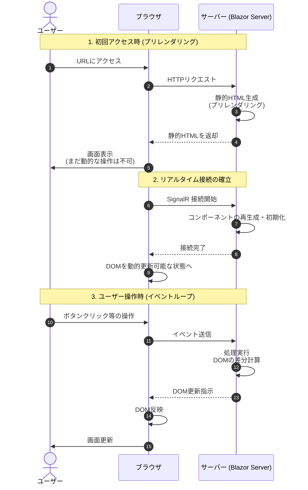
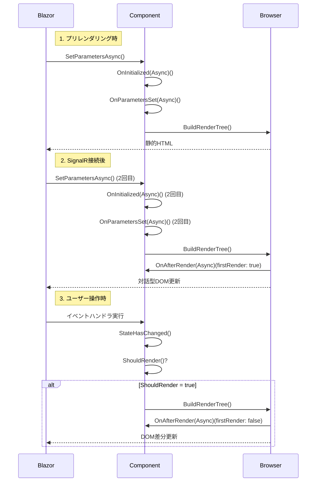

ネクスタの tetsu.k です。
生産管理アプリ「スマートF」の開発に携わっています。

今回は、C#のBlazorについて調べました。
主にBlazorのライフサイクルに焦点を当てます。

## はじめに

Blazorでは、画面をコンポーネントという部品の組み合わせで構築します。

各コンポーネントには「生まれる → 動く → 消える」というライフサイクルがあり、
そのタイミングで自動的にメソッドが呼ばれます。

この記事では、どのタイミングでどのメソッドが呼ばれるのかを解説します。

## Blazor Serverで画面が表示される仕組み

Blazor Serverでは、以下の流れで画面が表示されます。

Blazor Serverでは、まず静的HTML（プリレンダリング）を表示し、次にSignalRで接続して動的に操作できるようになります。

## コンポーネントのライフサイクル

上記の各段階で、コンポーネント内では以下のメソッドが呼ばれます：

シーケンス図のとおり、コンポーネントには「生まれる→動く→消える」のタイミングでメソッドが自動的に呼ばれます。

よく使うのは以下の4つです。
- OnInitialized - 初期化
- OnParametersSet - パラメータ受け取り後の処理
- OnAfterRender - 画面表示後の処理（動的行へのデータ設定など）
- StateHasChanged - 画面の再描画

詳しい実行順序は上のシーケンス図を参照してください。

※プリレンダリング：初回アクセス時にサーバーが静的HTMLを事前生成する仕組み

:::message alert
プリレンダリング有効時、`OnInitialized(Async)` は2回実行されます。
DB接続やAPI呼び出しを1回だけ実行したい場合は、`OnAfterRender(firstRender)` で `firstRender == true` の時のみ実行するようにします。
:::

すべてのrazorコンポーネントは、基本的にComponentBase（基底クラス）を継承しています。
ライフサイクルの各メソッドは、ComponentBaseの定義から確認が可能です。

これらのメソッドの動きやタイミングを理解することが、
Blazor開発の第一歩となります。

## サンプル

サンプルプロジェクトを用意しました。

[GitHubサンプルコード](https://github.com/pixcelo/zenn-content/tree/main/samples/blazor-lifecycle-demo)

各ライフサイクルメソッドの実行順序をログで確認できます。

## 参考リンク
- [ASP.NET Core Razor コンポーネントのライフサイクル](https://learn.microsoft.com/ja-jp/aspnet/core/blazor/components/lifecycle)
- [ASP.NET Core Razor コンポーネントのプリレンダリング](https://learn.microsoft.com/ja-jp/aspnet/core/blazor/components/prerender)
- [ASP.NET Core Razor コンポーネント](https://learn.microsoft.com/ja-jp/aspnet/core/blazor/components/)