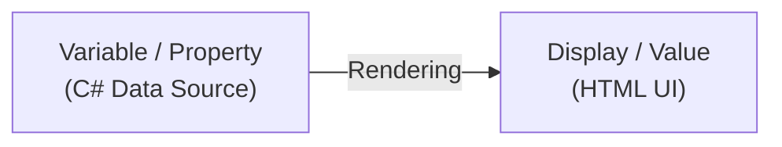
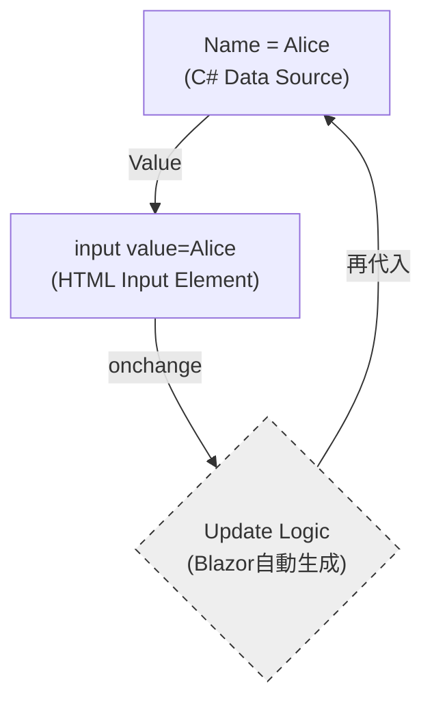
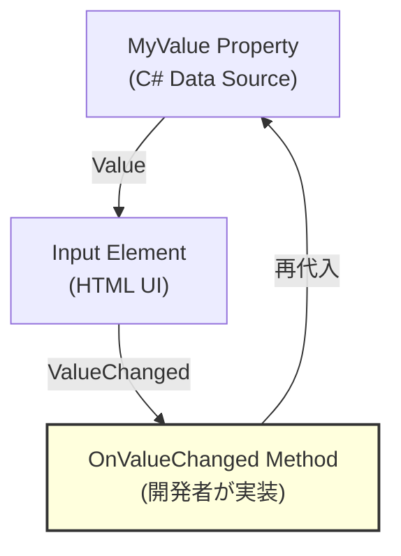
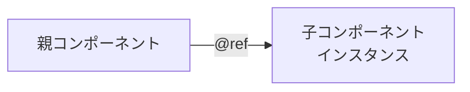
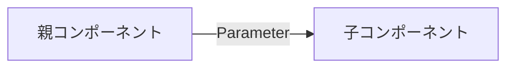
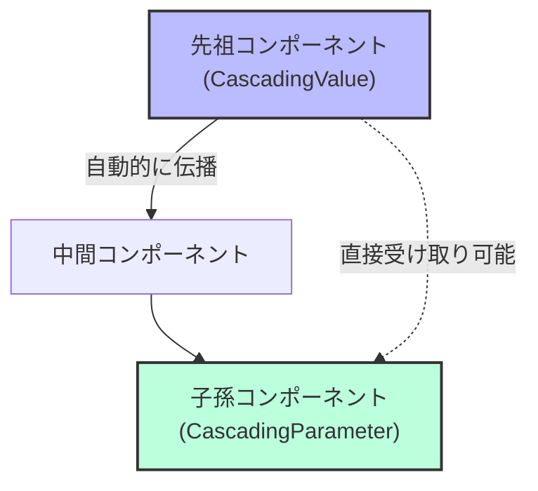
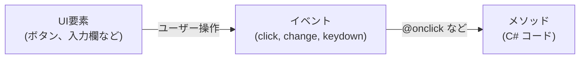
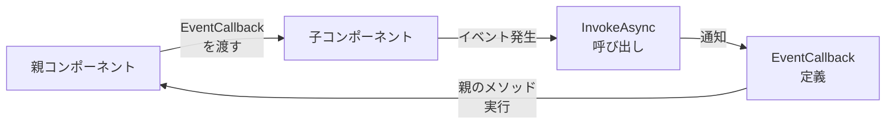
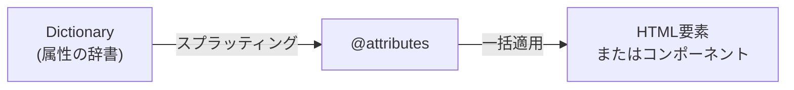
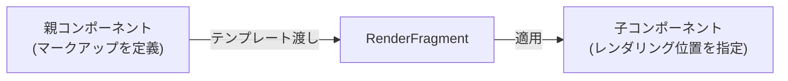

ネクスタの tetsu.k です。
基幹業務クラウド「SmartF」の開発に携わっています。

この記事では、Blazorにおけるデータフローとコンポーネント連携の仕組みについて、
調べた結果を共有します。


## 全体像

Blazorでデータ連携する仕組みを、機能別に整理しました。

### データバインディング

| 種類 | 構文例 | 結びつけるもの | 方向 |
|------|--------|----------------|------|
| 単方向データバインディング | `@変数名` | データ → UI | 単方向 |
| 双方向データバインディング | `@bind`/`@bind-Value` | データ ↔ UI | 双方向 |
| 明示的な双方向バインディング | `Value` + `ValueChanged` | データ ↔ UI | 双方向（手動） |

### コンポーネント連携

| 種類 | 構文例 | 結びつけるもの | 方向 |
|------|--------|----------------|------|
| パラメーター | `[Parameter]` | 親 → 子 | 単方向 |
| カスケードパラメーター | `[CascadingParameter]` | 先祖 → 子孫 | 単方向 |
| EventCallback | `EventCallback<T>` | 子 → 親 | 単方向 |

### イベント処理

| 種類 | 構文例 | 結びつけるもの | 方向 |
|------|--------|----------------|------|
| イベント処理 | `@onclick` | イベント → メソッド | 単方向 |

### 高度な機能

| 種類 | 構文例 | 結びつけるもの | 方向 |
|------|--------|----------------|------|
| コンポーネント参照 | `@ref` | インスタンス ↔ 変数 | 単方向 |
| 属性スプラッティング | `@attributes` | 辞書 → 属性 | 単方向 |
| テンプレートコンポーネント | `RenderFragment` | マークアップ → デリゲート | 単方向 |

以下で、個別に概念を紹介します。

## データバインディング

### 単方向データバインディング（One-way）

データがUIに「反映」されるだけの、最も純粋な形です。



```razor
<p>@message</p>

@code {
    private string message = "Hello, Blazor!";
}
```

変数 `message` の値が `<p>` タグに表示されます。変数を変更すると自動的にUIが更新されます。

### 双方向バインディング（Two-way / @bind）

「行き」と「帰り」がセットになった、循環する構造です。



```razor
<input @bind="name" />
<p>入力値: @name</p>

@code {
    private string name = "Alice";
}
```

入力欄に文字を入力すると、変数 `name` が自動的に更新され、`<p>` タグにも反映されます。

### 明示的な双方向バインディング（Two-way）

`@bind`を使わず、`Value` と `ValueChanged` を個別に指定します。



`@bind`との違い：
`OnValueChanged`メソッド内で、バリデーション・APIコール・条件付き更新など、変更時の処理を自由にカスタマイズできます。

```razor
<input value="@name" @onchange="OnNameChanged" />
<p>入力値: @name</p>

@code {
    private string name = "Alice";

    private void OnNameChanged(ChangeEventArgs e)
    {
        var newValue = e.Value?.ToString() ?? "";

        // バリデーション
        if (string.IsNullOrWhiteSpace(newValue))
        {
            return;
        }

        name = newValue;
    }
}
```

@bindの代わりに `value` と `@onchange` を使い、OnNameChangedメソッド内でバリデーションなどのカスタム処理を実行できます。

## コンポーネント連携

### コンポーネント参照（@ref）

コンポーネントやHTML要素のインスタンスを変数に保存します。



```razor
<MyDialog @ref="myDialog" />
```

**特徴**：
- 親から子コンポーネントのメソッドを直接呼び出せる
- JavaScript連携でDOM要素を渡せる（ElementReference）
- OnAfterRender以降でのみ利用可能

**注意**：
一般的には Parameter + EventCallback による宣言的なアプローチが推奨されます。
@ref は、フォーカス制御やサードパーティライブラリとの統合など、他に選択肢がない場合に使用します。

### パラメーター（Parameter）

親コンポーネントから子コンポーネントへデータを渡します。



**親コンポーネント**:
```razor
<ChildComponent Name="@userName" Age="@userAge" />

@code {
    private string userName = "Alice";
    private int userAge = 25;
}
```

**子コンポーネント（ChildComponent.razor）**:
```razor
<p>名前: @Name</p>
<p>年齢: @Age</p>

@code {
    [Parameter] public string Name { get; set; }
    [Parameter] public int Age { get; set; }
}
```

プロパティに `[Parameter]` 属性を付けることで、親から値を受け取れます。

**注意**: パラメーターは読み取り専用として扱い、子から親へのデータ送信には EventCallback を使います。

### カスケード型パラメーター（CascadingParameter）

先祖コンポーネントから子孫コンポーネントへ、階層を越えてデータを渡します。



**先祖コンポーネント**:
```razor
<CascadingValue Value="@theme">
    <ChildComponent />
</CascadingValue>

@code {
    private string theme = "dark";
}
```

**子孫コンポーネント（何階層下でもOK）**:
```razor
<p>テーマ: @Theme</p>

@code {
    [CascadingParameter] public string Theme { get; set; }
}
```

通常のパラメーターと異なり、中間のコンポーネントを経由せずに値を受け取れます。
レイアウト、テーマ、認証情報など、アプリ全体で共有する値に使用します。

## イベント処理（Event Handling）

UIイベントとメソッドを結びつけます。



**基本的な例**:
```razor
<button @onclick="OnClick">クリック</button>
<p>クリック回数: @count</p>

@code {
    private int count = 0;

    private void OnClick()
    {
        count++;
    }
}
```

ボタンをクリックすると `OnClick` メソッドが呼ばれ、カウンターが増加します。

:::details 主要なイベント種類

| イベント | 用途 | 構文例 |
|---------|------|--------|
| `@onclick` | クリック | `<button @onclick="OnClick">` |
| `@ondblclick` | ダブルクリック | `<button @ondblclick="OnDoubleClick">` |
| `@onmouseover` | マウスオーバー | `<div @onmouseover="OnMouseOver">` |
| `@onkeydown` | キーボード押下 | `<input @onkeydown="OnKeyDown">` |
| `@onchange` | 値変更（フォーカス離脱時） | `<input @onchange="OnChange">` |
| `@oninput` | 値変更（入力中） | `<input @oninput="OnInput">` |
| `@onfocus` | フォーカス取得 | `<input @onfocus="OnFocus">` |
| `@onblur` | フォーカス喪失 | `<input @onblur="OnBlur">` |

:::

### イベント引数の活用

イベントハンドラーでイベント情報を取得できます。

```razor
<button @onclick="OnClickWithArgs">クリック位置を取得</button>
<p>クリック位置: X=@clickX, Y=@clickY</p>

@code {
    private double clickX;
    private double clickY;

    private void OnClickWithArgs(MouseEventArgs e)
    {
        clickX = e.ClientX;
        clickY = e.ClientY;
    }
}
```

**主要なイベント引数**:
- `MouseEventArgs`: マウス位置、ボタン情報
- `KeyboardEventArgs`: キーコード、修飾キー（Ctrl, Shift, Alt）
- `ChangeEventArgs`: 変更後の値

### イベント制御

**stopPropagation**: イベントの伝播を止める

```razor
<div @onclick="OnOuterClick">
    外側
    <div @onclick="OnInnerClick" @onclick:stopPropagation="true">
        内側（クリックが外側に伝わらない）
    </div>
</div>
```

**preventDefault**: デフォルト動作を無効化

```razor
<form @onsubmit="OnSubmit" @onsubmit:preventDefault="true">
    <input />
    <button type="submit">送信</button>
</form>
```

フォーム送信時のページリロードを防ぎます。

### EventCallback

子コンポーネントから親コンポーネントへイベントを通知します。



**親コンポーネント**:
```razor
<ChildComponent OnValueChanged="@HandleValueChanged" />
<p>子から受け取った値: @receivedValue</p>

@code {
    private string receivedValue = "";

    private void HandleValueChanged(string value)
    {
        receivedValue = value;
    }
}
```

**子コンポーネント**:
```razor
<input @oninput="OnInput" />

@code {
    [Parameter] public EventCallback<string> OnValueChanged { get; set; }

    private async Task OnInput(ChangeEventArgs e)
    {
        var value = e.Value?.ToString() ?? "";
        await OnValueChanged.InvokeAsync(value);
    }
}
```

子で入力された値が、即座に親に通知されます。

### カスタムコンポーネントでの @bind サポート

`Parameter` と `EventCallback` を組み合わせることで、自作コンポーネントで `@bind-` 構文を使えるようにできます。

**親コンポーネント**:
```razor
<CustomInput @bind-Value="name" />
<p>入力値: @name</p>

@code {
    private string name = "";
}
```

**子コンポーネント（CustomInput.razor）**:
```razor
<input value="@Value" @oninput="OnInput" />

@code {
    [Parameter] public string Value { get; set; } = "";
    [Parameter] public EventCallback<string> ValueChanged { get; set; }

    private async Task OnInput(ChangeEventArgs e)
    {
        await ValueChanged.InvokeAsync(e.Value?.ToString() ?? "");
    }
}
```

**Blazorの命名規則**（公式仕様）:
- パラメーター名が `Value` の場合、EventCallbackは `ValueChanged` と命名する
- この規則に従うことで、`@bind-Value` 構文がコンパイル時に以下のように展開されます：
  ```razor
  <CustomInput Value="@name" ValueChanged="@((newValue) => name = newValue)" />
  ```

:::details コンパイル時の展開の詳細

**公式ドキュメントでの説明**:

標準の `<input>` での `@bind` は、以下のように展開されます：

```razor
<!-- 書くコード -->
<input @bind="InputValue" />

<!-- 展開後（等価なコード） -->
<input value="@InputValue"
       @onchange="@((ChangeEventArgs __e) => InputValue = __e?.Value?.ToString())" />
```

**Razorコンパイラが生成する実際のコード**:

```csharp
builder.AddAttribute("value", BindConverter.FormatValue(model.Age));
builder.AddAttribute("onchange", EventCallback.Factory.CreateBinder<int>(
    this, __value => model.Age = __value, model.Age));
```

**参考**:
- [ASP.NET Core Blazor データ バインディング](https://learn.microsoft.com/ja-jp/aspnet/core/blazor/components/data-binding)
- [Blazor Components Source Code (GitHub)](https://github.com/dotnet/aspnetcore/tree/main/src/Components)

:::

## 高度な機能

### 属性スプラッティング（Attribute Splatting）

辞書に格納した属性を、コンポーネントやHTML要素にまとめて適用します。



**基本的な例**:
```razor
<div @attributes="additionalAttributes">
    コンテンツ
</div>

@code {
    private Dictionary<string, object> additionalAttributes = new()
    {
        { "class", "alert alert-info" },
        { "role", "alert" },
        { "data-value", "123" }
    };
}
```

レンダリング結果：
```html
<div class="alert alert-info" role="alert" data-value="123">
    コンテンツ
</div>
```

:::details 詳細な使用例

#### 使用例：条件付き属性の適用

```razor
<button @attributes="GetButtonAttributes()">
    クリック
</button>

@code {
    private bool isDisabled = true;

    private Dictionary<string, object> GetButtonAttributes()
    {
        var attrs = new Dictionary<string, object>
        {
            { "class", "btn btn-primary" }
        };

        if (isDisabled)
        {
            attrs.Add("disabled", true);
        }

        return attrs;
    }
}
```

#### 属性の優先順位

`@attributes` の位置によって、属性の優先順位が決まります。

**@attributes が後ろにある場合**（明示的な属性が優先）:
```razor
<div class="fixed-class" @attributes="additionalAttributes">
    <!-- class="fixed-class" が優先される -->
</div>
```

**@attributes が前にある場合**（辞書の属性が優先）:
```razor
<div @attributes="additionalAttributes" class="fixed-class">
    <!-- additionalAttributes の class が優先される -->
</div>
```

**ルール**: 属性は**右から左**（最後から最初）に処理され、**最初に処理された値が優先**されます。

#### 任意のパラメーター（Arbitrary Parameters）

`[Parameter(CaptureUnmatchedValues = true)]` と組み合わせることで、親から渡された未定義の属性をすべてキャプチャできます。

**子コンポーネント**:
```razor
<div @attributes="AdditionalAttributes">
    @ChildContent
</div>

@code {
    [Parameter(CaptureUnmatchedValues = true)]
    public Dictionary<string, object>? AdditionalAttributes { get; set; }

    [Parameter]
    public RenderFragment? ChildContent { get; set; }
}
```

**親コンポーネント**:
```razor
<CustomDiv class="my-custom-class" data-id="123" aria-label="カスタム">
    コンテンツ
</CustomDiv>
```

レンダリング結果：
```html
<div class="my-custom-class" data-id="123" aria-label="カスタム">
    コンテンツ
</div>
```

**ポイント**:
- 定義されていない属性（`class`, `data-id`, `aria-label`）が自動的にキャプチャされる
- 再利用可能なコンポーネント作成時に便利
- HTML標準属性やカスタムデータ属性を柔軟に扱える

**参考**: [ASP.NET Core Blazor 属性スプラッティングと任意のパラメーター](https://learn.microsoft.com/ja-jp/aspnet/core/blazor/components/splat-attributes-and-arbitrary-parameters)

:::

### テンプレートコンポーネント（RenderFragment）

マークアップテンプレートを子コンポーネントに渡して、柔軟な表示を実現します。



**基本的な例**:

**子コンポーネント（Card.razor）**:
```razor
<div class="card">
    <div class="card-header">
        @Header
    </div>
    <div class="card-body">
        @ChildContent
    </div>
</div>

@code {
    [Parameter] public RenderFragment? Header { get; set; }
    [Parameter] public RenderFragment? ChildContent { get; set; }
}
```

**親コンポーネント**:
```razor
<Card>
    <Header>
        <h3>カードタイトル</h3>
    </Header>
    <ChildContent>
        <p>これはカードの本文です。</p>
        <button class="btn btn-primary">クリック</button>
    </ChildContent>
</Card>
```

レンダリング結果：
```html
<div class="card">
    <div class="card-header">
        <h3>カードタイトル</h3>
    </div>
    <div class="card-body">
        <p>これはカードの本文です。</p>
        <button class="btn btn-primary">クリック</button>
    </div>
</div>
```

**ポイント**:
- `RenderFragment` 型のパラメーターで、マークアップを受け取れる
- `ChildContent` という名前は規約（デフォルトのコンテンツ領域）
- 複数の `RenderFragment` を定義して、複数の領域にコンテンツを配置可能

:::details 詳細な使用例

#### パラメーター付きテンプレート（RenderFragment<T>）

データを伴ってテンプレートを渡せます。

**子コンポーネント（ItemList.razor）**:
```razor
<ul>
    @foreach (var item in Items)
    {
        <li>@ItemTemplate(item)</li>
    }
</ul>

@code {
    [Parameter] public List<string> Items { get; set; } = new();
    [Parameter] public RenderFragment<string>? ItemTemplate { get; set; }
}
```

**親コンポーネント**:
```razor
<ItemList Items="@fruits">
    <ItemTemplate Context="fruit">
        <strong>@fruit.ToUpper()</strong>
    </ItemTemplate>
</ItemList>

@code {
    private List<string> fruits = new() { "Apple", "Banana", "Orange" };
}
```

レンダリング結果：
```html
<ul>
    <li><strong>APPLE</strong></li>
    <li><strong>BANANA</strong></li>
    <li><strong>ORANGE</strong></li>
</ul>
```

**説明**:
- `RenderFragment<T>` は型パラメーターを受け取れる
- `Context` 属性で、テンプレート内で使用する変数名を指定
- 親が表示ロジックをカスタマイズでき、子が構造を提供する

#### 実用例：汎用的なダイアログコンポーネント

```razor
<!-- Dialog.razor -->
<div class="modal" style="display: @(IsVisible ? "block" : "none")">
    <div class="modal-dialog">
        <div class="modal-content">
            <div class="modal-header">
                @Title
            </div>
            <div class="modal-body">
                @Body
            </div>
            <div class="modal-footer">
                @Footer
            </div>
        </div>
    </div>
</div>

@code {
    [Parameter] public bool IsVisible { get; set; }
    [Parameter] public RenderFragment? Title { get; set; }
    [Parameter] public RenderFragment? Body { get; set; }
    [Parameter] public RenderFragment? Footer { get; set; }
}
```

使用例：
```razor
<Dialog IsVisible="@showDialog">
    <Title><h5>確認</h5></Title>
    <Body><p>この操作を実行しますか？</p></Body>
    <Footer>
        <button @onclick="OnConfirm">はい</button>
        <button @onclick="OnCancel">いいえ</button>
    </Footer>
</Dialog>
```

**参考**: [ASP.NET Core Blazor テンプレート コンポーネント](https://learn.microsoft.com/ja-jp/aspnet/core/blazor/components/templated-components)

:::

## サンプル

サンプルプロジェクトを用意しました。

[GitHubサンプルコード](https://github.com/pixcelo/zenn-content/tree/main/samples/blazor-databinding-sample)

環境
- .NET 8
- Blazor Web App (Interactive Server)
- プリレンダリング有効

## 参考
- [Blazor を使用して再利用可能な UI コンポーネントを構築する](https://learn.microsoft.com/ja-jp/dotnet/architecture/blazor-for-web-forms-developers/components)
- [ASP.NET Core Blazor データ バインディング
](https://learn.microsoft.com/ja-jp/aspnet/core/blazor/components/data-binding)