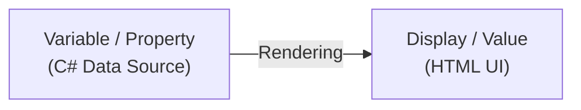
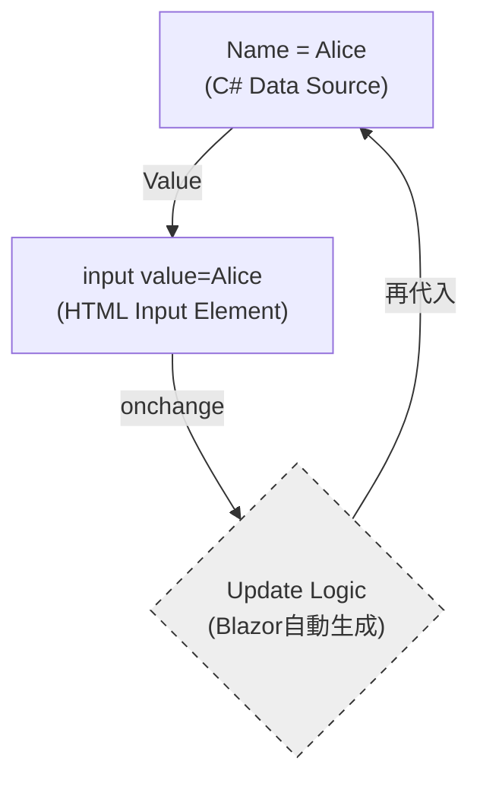
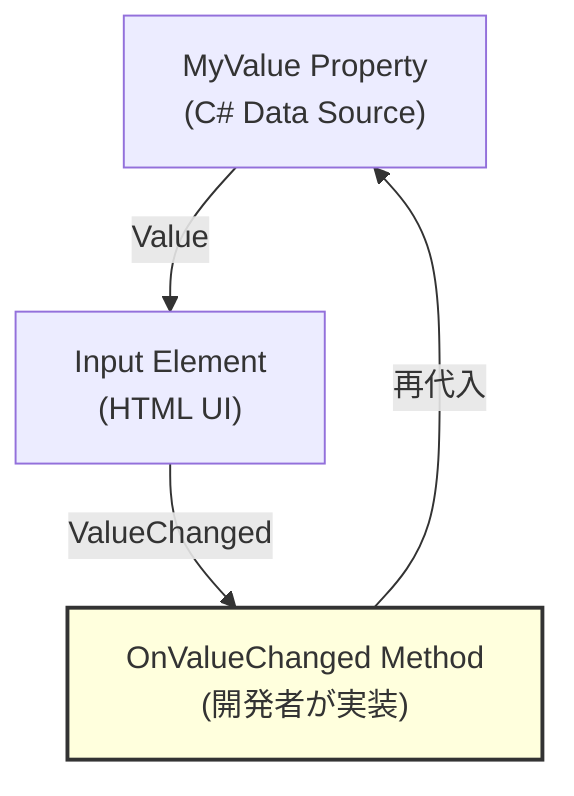
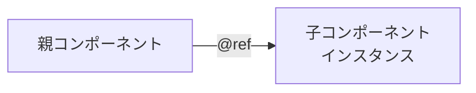

ネクスタの tetsu.k です。
基幹業務クラウド「SmartF」の開発に携わっています。

この記事では、Blazorにおけるバインディングの仕組みについて、
調べた結果を共有します。


## バインディングの種類

バインディングの全体像です。
それぞれに使いどころがあります。

| 種類 | 構文例 | 結びつけるもの | 方向 |
|---|---|---|---|
| 単方向データバインディング | `@変数名` | データ → UI | 単方向 |
| 双方向データバインディング | `@bind`/`@bind-Value`  | データ ↔ UI | 双方向 |
| 明示的な双方向バインディング | `Value` + `ValueChanged` | データ ↔ UI | 双方向（手動） |
| コンポーネント参照 | `@ref` | インスタンス ↔ 変数 | 単方向 |
| パラメーター | `[Parameter]` | 親 → 子 | 単方向 |
| カスケードパラメーター | `[CascadingParameter]` | 先祖 → 子孫 | 単方向 |
| イベント処理 (Event Handling) | `@onclick` | イベント → メソッド | 単方向 |
| EventCallback | `EventCallback<T>` | 子イベント → 親 | 単方向（逆流） |
| 属性スプラッティング | `@attributes` | 辞書 → 属性 | 単方向 |
| テンプレートコンポーネント (RenderFragment) | `ChildContent` | マークアップ → デリゲート | 単方向 |

以下で、個別に概念を紹介します。

## 単方向データバインディング（One-way）

データがUIに「反映」されるだけの、最も純粋な形です。



```razor
<p>@message</p>

@code {
    private string message = "Hello, Blazor!";
}
```

変数 `message` の値が `<p>` タグに表示されます。変数を変更すると自動的にUIが更新されます。

## 双方向バインディング（Two-way / @bind）

「行き」と「帰り」がセットになった、循環する構造です。



```razor
<input @bind="name" />
<p>入力値: @name</p>

@code {
    private string name = "Alice";
}
```

入力欄に文字を入力すると、変数 `name` が自動的に更新され、`<p>` タグにも反映されます。

## 明示的な双方向バインディング（Two-way）

`@bind`を使わず、`Value` と `ValueChanged` を個別に指定します。



`@bind`との違い：
`OnValueChanged`メソッド内で、バリデーション・APIコール・条件付き更新など、変更時の処理を自由にカスタマイズできます。

```razor
<input value="@name" @onchange="OnNameChanged" />
<p>入力値: @name</p>

@code {
    private string name = "Alice";

    private void OnNameChanged(ChangeEventArgs e)
    {
        var newValue = e.Value?.ToString() ?? "";

        // バリデーション
        if (string.IsNullOrWhiteSpace(newValue))
        {
            return;
        }

        name = newValue;
    }
}
```

@bindの代わりに `value` と `@onchange` を使い、OnNameChangedメソッド内でバリデーションなどのカスタム処理を実行できます。

## コンポーネント参照（@ref）

コンポーネントやHTML要素のインスタンスを変数に保存します。



```razor
<MyDialog @ref="myDialog" />
```

**特徴**：
- 親から子コンポーネントのメソッドを直接呼び出せる
- JavaScript連携でDOM要素を渡せる（ElementReference）
- OnAfterRender以降でのみ利用可能

**注意**：
一般的には Parameter + EventCallback による宣言的なアプローチが推奨されます。
@ref は、フォーカス制御やサードパーティライブラリとの統合など、他に選択肢がない場合に使用します。

## パラメーター（Parameter）

親コンポーネントから子コンポーネントへデータを渡します。


**親コンポーネント**:
```razor
<ChildComponent Name="@userName" Age="@userAge" />

@code {
    private string userName = "Alice";
    private int userAge = 25;
}
```

**子コンポーネント（ChildComponent.razor）**:
```razor
<p>名前: @Name</p>
<p>年齢: @Age</p>

@code {
    [Parameter] public string Name { get; set; }
    [Parameter] public int Age { get; set; }
}
```

プロパティに `[Parameter]` 属性を付けることで、親から値を受け取れます。

**注意**: パラメーターは読み取り専用として扱い、子から親へのデータ送信には EventCallback を使います。

## 環境

- .NET 8
- Blazor Web App (Interactive Server)
- プリレンダリング有効


## サンプル

サンプルプロジェクトを用意しました。

[GitHubサンプルコード](https://github.com/pixcelo/zenn-content/tree/main/samples/blazor-databinding-sample)


## 参考
- [Blazor を使用して再利用可能な UI コンポーネントを構築する](https://learn.microsoft.com/ja-jp/dotnet/architecture/blazor-for-web-forms-developers/components)
- [ASP.NET Core Blazor データ バインディング
](https://learn.microsoft.com/ja-jp/aspnet/core/blazor/components/data-binding)