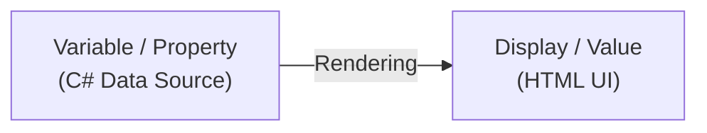
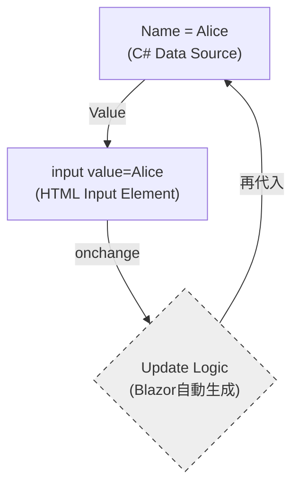
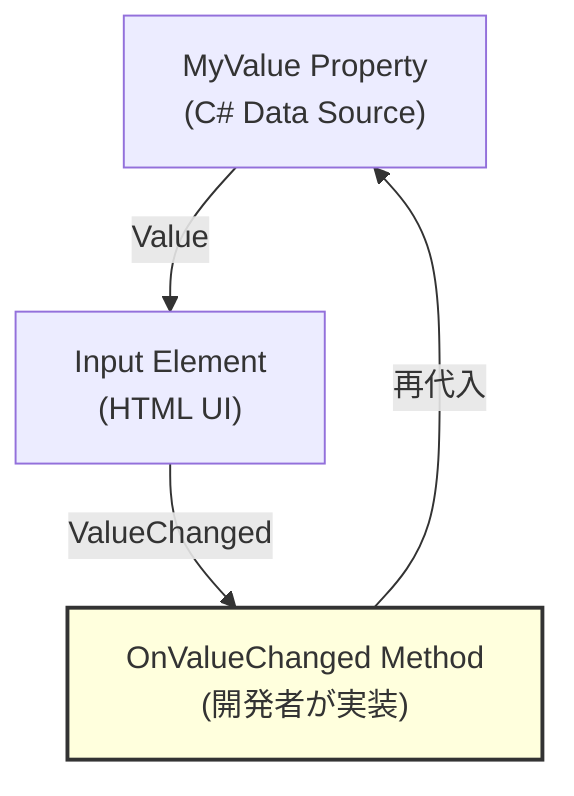
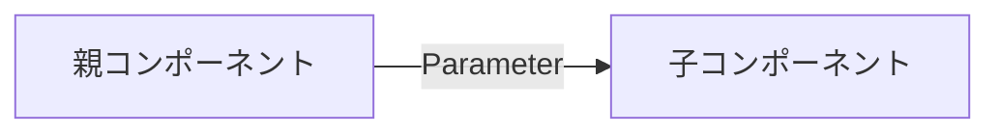
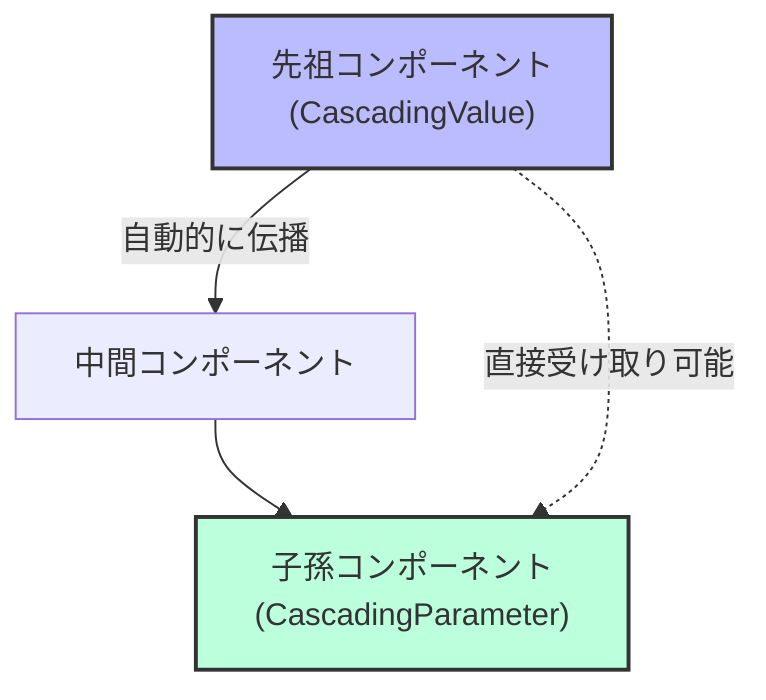
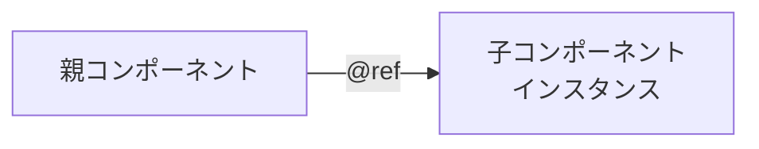
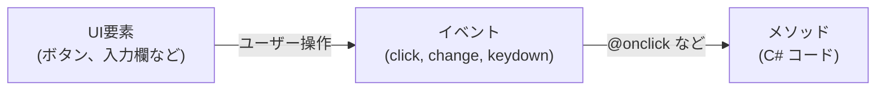
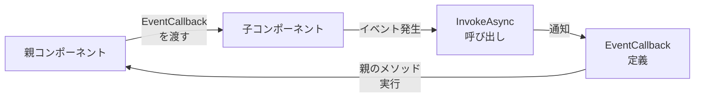
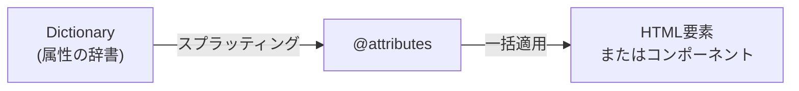
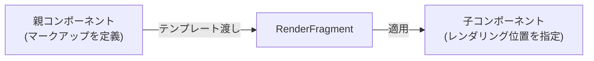

ネクスタの tetsu.k です。
基幹業務クラウド「SmartF」の開発に携わっています。

Blazor開発において、「コンポーネント間のデータの受け渡し」や「イベント処理の仕組み」を正しく理解することは、保守性の高いアプリケーションを開発する上でとても大事です。

この記事では、Blazorにおけるデータフローとコンポーネント連携の仕組みについて、調べた結果を共有します。


## 全体像

データ連携する仕組みを機能別に整理しました。

### データバインディング

| 種類 | 構文例 | 結びつけるもの | 方向 |
|------|--------|----------------|------|
| 単方向データバインディング | `@変数名` | データ → UI | 単方向 |
| 双方向データバインディング | `@bind`/`@bind-Value` | データ ↔ UI | 双方向 |
| 明示的な双方向バインディング | `Value` + `ValueChanged` | データ ↔ UI | 双方向（手動） |

### コンポーネント連携

| 種類 | 構文例 | 結びつけるもの | 方向 |
|------|--------|----------------|------|
| パラメーター | `[Parameter]` | 親 → 子 | 単方向 |
| カスケードパラメーター | `[CascadingParameter]` | 先祖 → 子孫 | 単方向 |
| EventCallback | `EventCallback<T>` | 子 → 親 | 単方向 |
| コンポーネント参照 | `@ref` | インスタンス ↔ 変数 | 単方向 |

### イベント処理

| 種類 | 構文例 | 結びつけるもの | 方向 |
|------|--------|----------------|------|
| イベント処理 | `@onclick` | イベント → メソッド | 単方向 |

### 高度な機能

| 種類 | 構文例 | 結びつけるもの | 方向 |
|------|--------|----------------|------|
| 属性スプラッティング | `@attributes` | 辞書 → 属性 | 単方向 |
| テンプレートコンポーネント | `RenderFragment` | マークアップ → デリゲート | 単方向 |

以下で、順を追って解説します。

## データバインディング

### 単方向データバインディング（One-way）

データがUIに「反映」されるだけの、最も純粋な形です。



```razor
<p>@message</p>

@code {
    private string message = "Hello, Blazor!";
}
```

変数 `message` の値が `<p>` タグに表示されます。変数を変更すると自動的にUIが更新されます。

### 双方向バインディング（Two-way / @bind）

「行き」と「帰り」がセットになった、循環する構造です。



```razor
<input @bind="name" />
<p>入力値: @name</p>

@code {
    private string name = "Alice";
}
```

入力欄に文字を入力すると、変数 `name` が自動的に更新され、`<p>` タグにも反映されます。

:::details @bind と @bind-Value の違い

同じ「双方向データバインディング」を実現するものですが、ターゲットが違います。

| 特徴 | @bind | @bind-Value |
|------|-------|-------------|
| 主な対象 | `input`, `select`, `textarea` などのHTML要素 | `InputText`, `InputNumber` などのBlazorコンポーネント |
| デフォルト属性 | `value` 属性と `onchange` イベントに紐づく | `Value` プロパティと `ValueChanged` イベントに紐づく |

:::

### 明示的な双方向バインディング（Two-way）

`@bind`を使わず、`Value` と `ValueChanged` を個別に指定します。



`OnValueChanged`メソッド内で、バリデーション・APIコール・条件付き更新など、変更時の処理を自由にカスタマイズできます。

```razor
<input value="@name" @onchange="OnNameChanged" />
<p>入力値: @name</p>

@code {
    private string name = "Alice";

    private void OnNameChanged(ChangeEventArgs e)
    {
        var newValue = e.Value?.ToString() ?? "";

        // バリデーション
        if (string.IsNullOrWhiteSpace(newValue))
        {
            return;
        }

        name = newValue;
    }
}
```

@bindの代わりに `value` と `@onchange` を使い、OnNameChangedメソッド内でバリデーションなどのカスタム処理を実行できます。

## コンポーネント連携

### パラメーター（Parameter）

親コンポーネントから子コンポーネントへデータを渡します。



**親コンポーネント**:
```razor
<ChildComponent Name="@userName" Age="@userAge" />

@code {
    private string userName = "Alice";
    private int userAge = 25;
}
```

**子コンポーネント（ChildComponent.razor）**:
```razor
<p>名前: @Name</p>
<p>年齢: @Age</p>

@code {
    [Parameter] public string Name { get; set; }
    [Parameter] public int Age { get; set; }
}
```

プロパティに `[Parameter]` 属性を付けることで、親から値を受けとれます。

:::message
パラメーターは読み取り専用として扱い、子から親へのデータ送信には EventCallback を使います。
子コンポーネント内でパラメーターに直接代入すると、親の再レンダリング時に値が上書きされます。
:::

### カスケード型パラメーター（CascadingParameter）

先祖コンポーネントから子孫コンポーネントへ、階層をこえてデータを渡します。



**先祖コンポーネント**:
```razor
<CascadingValue Value="@theme">
    <ChildComponent />
</CascadingValue>

@code {
    private string theme = "dark";
}
```

**子孫コンポーネント（何階層下でもOK）**:
```razor
<p>テーマ: @Theme</p>

@code {
    [CascadingParameter] public string Theme { get; set; }
}
```

通常のパラメーターと異なり、中間のコンポーネントを経由せずに値を受けとれます。
レイアウト、テーマ、認証情報など、アプリ全体で共有する値に使用します。

### コンポーネント参照（@ref）

コンポーネントやHTML要素のインスタンスを変数に保存します。



```razor
<MyDialog @ref="myDialog" />
```

親から子コンポーネントのメソッドを直接呼び出せます。

:::message
一般的には `Parameter` + `EventCallback` による宣言的なアプローチが推奨されます。
`@ref` は他に選択肢がない場合に使用します。
:::

## イベント処理（Event Handling）

UIイベントとメソッドを結びつけます。



**クリックイベントの例**:
```razor
<button @onclick="OnClick">クリック</button>
<p>クリック回数: @count</p>

@code {
    private int count = 0;

    private void OnClick()
    {
        count++;
    }
}
```

ボタンをクリックすると `OnClick` メソッドが呼ばれ、カウンターが増加します。

:::details 主要なイベント種類

| イベント | 用途 | 構文例 |
|---------|------|--------|
| `@onclick` | クリック | `<button @onclick="OnClick">` |
| `@ondblclick` | ダブルクリック | `<button @ondblclick="OnDoubleClick">` |
| `@onmouseover` | マウスオーバー | `<div @onmouseover="OnMouseOver">` |
| `@onkeydown` | キーボード押下 | `<input @onkeydown="OnKeyDown">` |
| `@onchange` | 値変更（フォーカス離脱時） | `<input @onchange="OnChange">` |
| `@oninput` | 値変更（入力中） | `<input @oninput="OnInput">` |
| `@onfocus` | フォーカス取得 | `<input @onfocus="OnFocus">` |
| `@onblur` | フォーカス喪失 | `<input @onblur="OnBlur">` |

:::

### イベント引数の活用

イベントハンドラーでは、マウス位置やキーコードなどの情報を取得できます。

:::details 詳しい使い方とコード例

```razor
<button @onclick="OnClickWithArgs">クリック位置を取得</button>
<p>クリック位置: X=@clickX, Y=@clickY</p>

@code {
    private double clickX;
    private double clickY;

    private void OnClickWithArgs(MouseEventArgs e)
    {
        clickX = e.ClientX;
        clickY = e.ClientY;
    }
}
```

**主要なイベント引数**:
- `MouseEventArgs`: マウス位置、ボタン情報
- `KeyboardEventArgs`: キーコード、修飾キー（Ctrl, Shift, Alt）
- `ChangeEventArgs`: 変更後の値（`e.Value` は `object` 型なのでキャストが必要）

:::

### イベント制御

**stopPropagation**: イベントの伝播を止める

```razor
<div @onclick="OnOuterClick">
    外側
    <div @onclick="OnInnerClick" @onclick:stopPropagation="true">
        内側（クリックが外側に伝わらない）
    </div>
</div>
```

**preventDefault**: デフォルト動作を無効化

```razor
<form @onsubmit="OnSubmit" @onsubmit:preventDefault="true">
    <input />
    <button type="submit">送信</button>
</form>
```

フォーム送信時のページリロードを防ぎます。

### EventCallback

子コンポーネントから親コンポーネントへイベントを通知します。



**親コンポーネント**:
```razor
<ChildComponent OnValueChanged="@HandleValueChanged" />
<p>子から受けとった値: @receivedValue</p>

@code {
    private string receivedValue = "";

    private void HandleValueChanged(string value)
    {
        receivedValue = value;
    }
}
```

**子コンポーネント**:
```razor
<input @oninput="OnInput" />

@code {
    [Parameter] public EventCallback<string> OnValueChanged { get; set; }

    private async Task OnInput(ChangeEventArgs e)
    {
        var value = e.Value?.ToString() ?? "";
        await OnValueChanged.InvokeAsync(value);
    }
}
```

子で入力された値が、即座に親に通知されます。

### カスタムコンポーネントでの @bind サポート

`Parameter` と `EventCallback` を組みあわせることで、自作コンポーネントで `@bind-` 構文を使えるようにできます。

**親コンポーネント**:
```razor
<CustomInput @bind-Value="name" />
<p>入力値: @name</p>

@code {
    private string name = "";
}
```

**子コンポーネント（CustomInput.razor）**:
```razor
<input value="@Value" @oninput="OnInput" />

@code {
    [Parameter] public string Value { get; set; } = "";
    [Parameter] public EventCallback<string> ValueChanged { get; set; }

    private async Task OnInput(ChangeEventArgs e)
    {
        await ValueChanged.InvokeAsync(e.Value?.ToString() ?? "");
    }
}
```

**Blazorの命名規則**:
- パラメーター名が `Value` の場合、EventCallbackは `ValueChanged` と命名する
- この規則に従うことで、`@bind-Value` 構文がコンパイル時に以下のように展開されます：
  ```razor
  <CustomInput Value="@name" ValueChanged="@((newValue) => name = newValue)" />
  ```

:::details コンパイル時の展開の詳細

**公式ドキュメントでの説明**:

標準の `<input>` での `@bind` は、以下のように展開されます：

```razor
<!-- 書くコード -->
<input @bind="InputValue" />

<!-- 展開後（等価なコード） -->
<input value="@InputValue"
       @onchange="@((ChangeEventArgs __e) => InputValue = __e?.Value?.ToString())" />
```

**Razorコンパイラが生成する実際のコード**:

```csharp
builder.AddAttribute("value", BindConverter.FormatValue(model.Age));
builder.AddAttribute("onchange", EventCallback.Factory.CreateBinder<int>(
    this, __value => model.Age = __value, model.Age));
```

**参考**:
- [ASP.NET Core Blazor データ バインディング](https://learn.microsoft.com/ja-jp/aspnet/core/blazor/components/data-binding)
- [Blazor Components Source Code (GitHub)](https://github.com/dotnet/aspnetcore/tree/main/src/Components)

:::

## 高度な機能

### 属性スプラッティング（Attribute Splatting）

辞書に格納した属性を、コンポーネントやHTML要素にまとめて適用します。



**基本的な例**:
```razor
<div @attributes="additionalAttributes">
    コンテンツ
</div>

@code {
    private Dictionary<string, object> additionalAttributes = new()
    {
        { "class", "alert alert-info" },
        { "role", "alert" },
        { "data-value", "123" }
    };
}
```

レンダリング結果：
```html
<div class="alert alert-info" role="alert" data-value="123">
    コンテンツ
</div>
```

### テンプレートコンポーネント（RenderFragment）

通常のプロパティが`string`や`int`を渡すのに対し、`RenderFragment`は UIそのものを渡します。



**基本的な例**:

**子コンポーネント（Card.razor）**:
```razor
<div class="card">
    <div class="card-header">
        @Header
    </div>
    <div class="card-body">
        @ChildContent
    </div>
</div>

@code {
    [Parameter] public RenderFragment? Header { get; set; }
    [Parameter] public RenderFragment? ChildContent { get; set; }
}
```

**親コンポーネント**:
```razor
<Card>
    <Header>
        <h3>カードタイトル</h3>
    </Header>
    <ChildContent>
        <p>これはカードの本文です。</p>
        <button class="btn btn-primary">クリック</button>
    </ChildContent>
</Card>
```

レンダリング結果：
```html
<div class="card">
    <div class="card-header">
        <h3>カードタイトル</h3>
    </div>
    <div class="card-body">
        <p>これはカードの本文です。</p>
        <button class="btn btn-primary">クリック</button>
    </div>
</div>
```

- `RenderFragment` 型のパラメーターで、マークアップを受けとれる
- `ChildContent` が唯一の`RenderFragment`の場合、タグを省略できる（特別な規約）
- 任意の名前（`Header`, `Body`, `Footer` など）でも定義可能
- 複数の `RenderFragment` がある場合は、`ChildContent` を含めてすべてタグで指定が必要

:::details ChildContent のタグ省略

`ChildContent` という名前には特別な規約があります。

**タグなし（ChildContent が唯一のRenderFragmentの場合のみ）**:
```razor
<SimplePanel>
    これが自動的に ChildContent に渡される
</SimplePanel>
```

**タグあり（明示的に指定）**:
```razor
<SimplePanel>
    <ChildContent>
        明示的にタグで囲むことも可能
    </ChildContent>
</SimplePanel>
```

**複数のRenderFragment（すべてタグが必要）**:
```razor
<Card>
    <Header>
        <h3>タイトル</h3>
    </Header>
    <ChildContent>
        本文（タグ省略不可）
    </ChildContent>
</Card>
```

:::message
複数の`RenderFragment`がある場合は、`ChildContent`を含めてすべてタグが必要です。
:::


## サンプル

サンプルプロジェクトを用意しました。

[GitHubサンプルコード](https://github.com/pixcelo/zenn-content/tree/main/samples/blazor-databinding-sample)

環境
- .NET 8
- Blazor Web App (Interactive Server)
- プリレンダリング有効

:::message
双方向バインディングやイベント処理を動かすには、適切なRenderMode（InteractiveServerなど）の設定が必要です。
SSR（Static Server-side Rendering）では一部のイベントが動作しません。
:::

## 参考
- [Blazor を使用して再利用可能な UI コンポーネントを構築する](https://learn.microsoft.com/ja-jp/dotnet/architecture/blazor-for-web-forms-developers/components)
- [ASP.NET Core Blazor データ バインディング
](https://learn.microsoft.com/ja-jp/aspnet/core/blazor/components/data-binding)