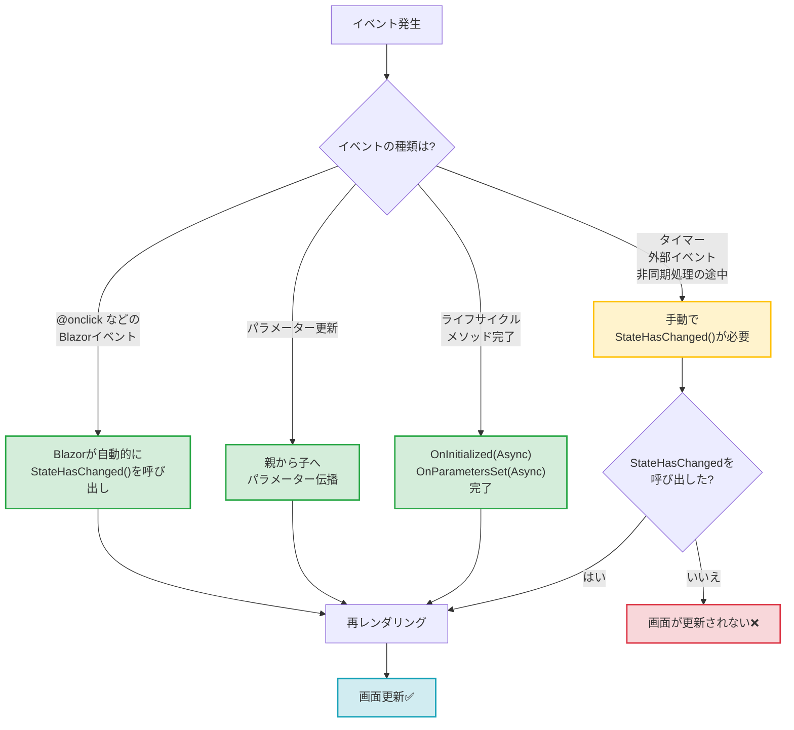
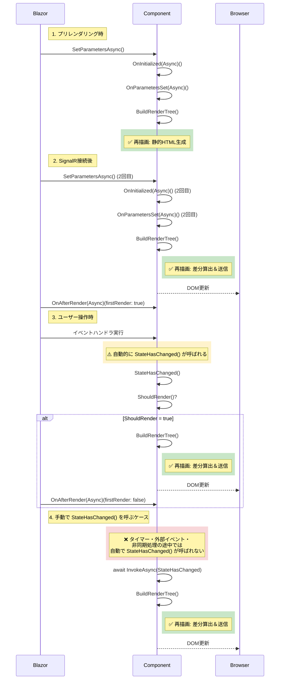
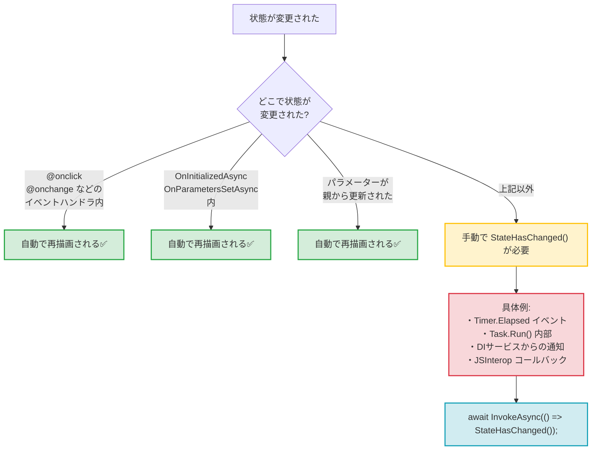

ネクスタの tetsu.k です。
基幹業務クラウド「SmartF」の開発に携わっています。

Blazor開発においての初心者がつまづくポイントのひとつが「データを変更したのに画面が更新されない」です。

この記事では、Blazorがいつ自動で再描画するのか、いつ手動で `StateHasChanged()` を呼ぶ必要があるのかを解説します。

:::message
本記事は、以下の記事の続編です。
- [Blazorのレンダリングの仕組みとコンポーネントのライフサイクル](https://zenn.dev/nexta_/articles/blazor-component-lifecycle)
- [Blazorのデータフローとコンポーネント連携](https://zenn.dev/nexta_/articles/blazor-databinding)

シリーズ第3弾として、「画面がいつ更新されるか」に焦点を当てます。
:::

## 結論

Blazorには「自動で再描画される」タイミングと「手動で `StateHasChanged()` が必要」なケースがあります。

### 自動で再描画される3つのタイミング

1. **イベントハンドラーの実行後** (`@onclick`, `@onchange` など)
2. **パラメーターが更新された時** (親コンポーネントから)
3. **ライフサイクルメソッドの実行後** (`OnInitializedAsync`, `OnParametersSetAsync`)

### 手動で StateHasChanged が必要な4つのケース

1. **非同期処理の途中**で画面を更新したい時
2. **タイマー**による定期更新
3. **DIサービスからの通知**を受け取った時
4. **JSInterop** からのコールバック

以下で詳しく解説します。

## 自動で再描画される3つのタイミング

まず、Blazorが「自動で」画面を更新してくれるケースを見ていきます。



### 1. イベントハンドラーの実行後

`@onclick` や `@onchange` などのBlazorイベント属性で登録したハンドラは、実行が完了すると**自動的に `StateHasChanged()` が呼ばれます**。

```razor
<button @onclick="IncrementCount">カウント: @count</button>

@code {
    private int count = 0;

    private void IncrementCount()
    {
        count++;
        // StateHasChanged() を呼ぶ必要はない
    }
}
```

この場合、ボタンをクリックすると自動的に画面が更新されます。

:::message
**対象となるイベント**:
- `@onclick`, `@ondblclick`
- `@onchange`, `@oninput`
- `@onkeydown`, `@onkeyup`
- `@onfocus`, `@onblur`
- など、すべてのBlazorイベント属性
:::

### 2. パラメーターが更新された時

親コンポーネントが再レンダリングされ、子コンポーネントに渡している `[Parameter]` の値が変わった（または変わった可能性がある）時、子コンポーネントは自動的に再描画されます。

**親コンポーネント**:
```razor
<button @onclick="UpdateMessage">メッセージ変更</button>
<ChildComponent Message="@currentMessage" />

@code {
    private string currentMessage = "初期メッセージ";

    private void UpdateMessage()
    {
        currentMessage = "更新されたメッセージ";
        // 親が再レンダリング → 子も自動的に再レンダリング
    }
}
```

**子コンポーネント**:
```razor
<p>受け取ったメッセージ: @Message</p>

@code {
    [Parameter] public string Message { get; set; } = "";
    // 親の再レンダリングで自動的に OnParametersSetAsync が呼ばれる
}
```

### 3. ライフサイクルメソッドの実行後

`OnInitializedAsync` や `OnParametersSetAsync` などの非同期ライフサイクルメソッドが完了すると、自動的に再描画されます。

```razor
<p>読み込み中: @isLoading</p>
<p>データ: @data</p>

@code {
    private bool isLoading = true;
    private string data = "";

    protected override async Task OnInitializedAsync()
    {
        data = await FetchDataAsync();
        isLoading = false;
        // メソッド完了後、自動的に StateHasChanged() が呼ばれる
    }

    private async Task<string> FetchDataAsync()
    {
        await Task.Delay(1000);
        return "取得完了";
    }
}
```

:::message alert
**注意**: 非同期メソッドが完了した時点で再描画されます。
メソッド内の途中で画面を更新したい場合（プログレスバーなど）は、手動で `StateHasChanged()` を呼ぶ必要があります。
:::

## ライフサイクルと再描画のタイミング

第1弾の記事で紹介したライフサイクル図に、再描画のタイミングを追加しました。



緑色のブロックが「再描画が発生するタイミング」です。

## 手動で StateHasChanged が必要な4つのケース

ここが初心者が最も「動かない」と悩むポイントです。



### 1. 非同期処理の途中で画面を更新したい時

長時間かかる処理で、途中経過を表示したい場合です。

**❌ 動かないコード**:
```razor
<p>進捗: @progress%</p>
<button @onclick="ProcessData">処理開始</button>

@code {
    private int progress = 0;

    private async Task ProcessData()
    {
        for (int i = 0; i <= 100; i += 10)
        {
            await Task.Delay(200);
            progress = i;
            // 画面は更新されない！
        }
    }
}
```

**✅ 正しいコード**:
```razor
<p>進捗: @progress%</p>
<button @onclick="ProcessData">処理開始</button>

@code {
    private int progress = 0;

    private async Task ProcessData()
    {
        for (int i = 0; i <= 100; i += 10)
        {
            await Task.Delay(200);
            progress = i;
            StateHasChanged(); // 手動で再描画を指示
        }
    }
}
```

:::message
**なぜ必要か？**
イベントハンドラ内でも、**非同期処理の途中**では自動的に `StateHasChanged()` は呼ばれません。
イベントハンドラ全体が完了した時点で1回だけ呼ばれるため、途中の `progress` の変化は画面に反映されません。
:::

### 2. タイマーによる定期更新

`System.Timers.Timer` や `System.Threading.Timer` による更新は、Blazorのイベントループの外で発生するため、手動で `StateHasChanged()` を呼ぶ必要があります。

**❌ 動かないコード**:
```razor
<p>経過時間: @elapsedSeconds 秒</p>

@code {
    private int elapsedSeconds = 0;
    private System.Timers.Timer? timer;

    protected override void OnInitialized()
    {
        timer = new System.Timers.Timer(1000);
        timer.Elapsed += (sender, e) =>
        {
            elapsedSeconds++;
            // 画面は更新されない！
        };
        timer.Start();
    }

    public void Dispose() => timer?.Dispose();
}
```

**✅ 正しいコード**:
```razor
@implements IDisposable

<p>経過時間: @elapsedSeconds 秒</p>

@code {
    private int elapsedSeconds = 0;
    private System.Timers.Timer? timer;

    protected override void OnInitialized()
    {
        timer = new System.Timers.Timer(1000);
        timer.Elapsed += async (sender, e) =>
        {
            elapsedSeconds++;
            await InvokeAsync(StateHasChanged); // UIスレッドで実行
        };
        timer.Start();
    }

    public void Dispose() => timer?.Dispose();
}
```

:::message alert
**重要**: タイマーのイベントは別スレッドで発生するため、必ず `InvokeAsync` で囲む必要があります。

```csharp
await InvokeAsync(StateHasChanged);
```

`InvokeAsync` なしで `StateHasChanged()` を直接呼ぶと、スレッドセーフでないためエラーになります。
:::

### 3. DIサービスからの通知

サービス側でデータが変更されても、コンポーネントは自動では感知できません。

**StateContainer パターン**:

**AppState.cs**:
```csharp
public class AppState
{
    private string _currentUser = "ゲスト";

    public string CurrentUser
    {
        get => _currentUser;
        set
        {
            _currentUser = value;
            NotifyStateChanged();
        }
    }

    public event Action? OnChange;

    private void NotifyStateChanged() => OnChange?.Invoke();
}
```

**Program.cs**:
```csharp
builder.Services.AddScoped<AppState>();
```

**コンポーネント**:
```razor
@inject AppState AppState
@implements IDisposable

<p>現在のユーザー: @AppState.CurrentUser</p>
<button @onclick="ChangeUser">ユーザー変更</button>

@code {
    protected override void OnInitialized()
    {
        // サービスの変更を購読
        AppState.OnChange += StateHasChanged;
    }

    private void ChangeUser()
    {
        AppState.CurrentUser = "太郎";
    }

    public void Dispose()
    {
        AppState.OnChange -= StateHasChanged;
    }
}
```

### 4. JSInterop からのコールバック

JavaScript から C# のメソッドを呼び出す際も、Blazorのイベントループの外で発生します。

**JavaScript**:
```javascript
window.notifyBlazor = (dotNetHelper) => {
    setTimeout(() => {
        dotNetHelper.invokeMethodAsync('OnJsCallback', '完了しました');
    }, 2000);
};
```

**Blazor**:
```razor
@inject IJSRuntime JS

<p>メッセージ: @message</p>

@code {
    private string message = "待機中";

    protected override async Task OnAfterRenderAsync(bool firstRender)
    {
        if (firstRender)
        {
            await JS.InvokeVoidAsync("notifyBlazor",
                DotNetObjectReference.Create(this));
        }
    }

    [JSInvokable]
    public async Task OnJsCallback(string result)
    {
        message = result;
        await InvokeAsync(StateHasChanged); // 必須
    }
}
```

## 逆に再描画を防ぐ技術

パフォーマンス最適化として、不要な再描画を防ぐ方法があります。

### ShouldRender のオーバーライド

デフォルトでは `ShouldRender()` は常に `true` を返しますが、オーバーライドすることで再描画を制御できます。

```razor
<p>カウント: @count</p>
<p>最終更新: @lastUpdate</p>
<button @onclick="IncrementCount">カウント+1</button>
<button @onclick="UpdateTime">時刻更新</button>

@code {
    private int count = 0;
    private DateTime lastUpdate = DateTime.Now;
    private bool shouldRender = true;

    protected override bool ShouldRender()
    {
        return shouldRender;
    }

    private void IncrementCount()
    {
        count++;
        shouldRender = true; // 再描画を許可
    }

    private void UpdateTime()
    {
        lastUpdate = DateTime.Now;
        shouldRender = false; // 再描画をブロック
    }
}
```

:::message
**使いどころ**:
- 高頻度で発生するイベント（マウス移動など）で、一部の更新だけ画面に反映したい場合
- 重い描画処理をスキップしたい場合

**注意**: 多用すると逆にバグの温床になるため、パフォーマンス問題が明確な場合のみ使用してください。
:::

### @key ディレクティブ

リスト内の要素を明示的に識別することで、不要な再描画を防ぎます。

```razor
@foreach (var item in items)
{
    <div @key="item.Id">
        @item.Name
    </div>
}

@code {
    private List<Item> items = new();
}

public class Item
{
    public int Id { get; set; }
    public string Name { get; set; } = "";
}
```

`@key` を指定すると、Blazorは要素の同一性を `Id` で判断し、順序が変わっただけの場合は再レンダリングをスキップします。

## 無限ループの罠

`OnAfterRender` 内で不用意に `StateHasChanged()` を呼ぶと、無限ループに陥ります。

**❌ 無限ループになるコード**:
```razor
@code {
    protected override async Task OnAfterRenderAsync(bool firstRender)
    {
        StateHasChanged(); // 無限ループ発生！
    }
}
```

**なぜ無限ループになるか？**

1. `OnAfterRenderAsync` が呼ばれる
2. `StateHasChanged()` を呼ぶ
3. 再レンダリングが発生
4. 再レンダリング後、再び `OnAfterRenderAsync` が呼ばれる
5. 1に戻る（無限ループ）

**✅ 正しいコード**:
```razor
@code {
    private bool isInitialized = false;

    protected override async Task OnAfterRenderAsync(bool firstRender)
    {
        if (firstRender && !isInitialized)
        {
            isInitialized = true;
            // 初回のみ実行したい処理
            StateHasChanged();
        }
    }
}
```

`firstRender` や独自のフラグで、1回だけ実行されるようにガードします。

## まとめ

### 自動で再描画される

- ✅ イベントハンドラー実行後 (`@onclick` など)
- ✅ パラメーター更新時
- ✅ ライフサイクルメソッド完了後

### 手動で StateHasChanged が必要

- ⚠️ 非同期処理の途中
- ⚠️ タイマーイベント
- ⚠️ DIサービスからの通知
- ⚠️ JSInterop コールバック

### 覚えておくべきポイント

1. **Blazorのイベント属性で登録したハンドラは自動で再描画**
2. **それ以外は基本的に手動で `StateHasChanged()` が必要**
3. **別スレッドからの呼び出しは `InvokeAsync` で囲む**
4. **OnAfterRender 内での StateHasChanged は無限ループに注意**

この仕組みを理解することで、「なぜ画面が更新されないのか」という問題の大半は解決できます。

次回は、パフォーマンス最適化やレンダリングのカスタマイズについて掘り下げる予定です。

## 参考リンク

- [ASP.NET Core Razor コンポーネントのライフサイクル](https://learn.microsoft.com/ja-jp/aspnet/core/blazor/components/lifecycle)
- [ASP.NET Core Blazor でのイベント処理](https://learn.microsoft.com/ja-jp/aspnet/core/blazor/components/event-handling)
- [ASP.NET Core Blazor の状態管理](https://learn.microsoft.com/ja-jp/aspnet/core/blazor/state-management)
