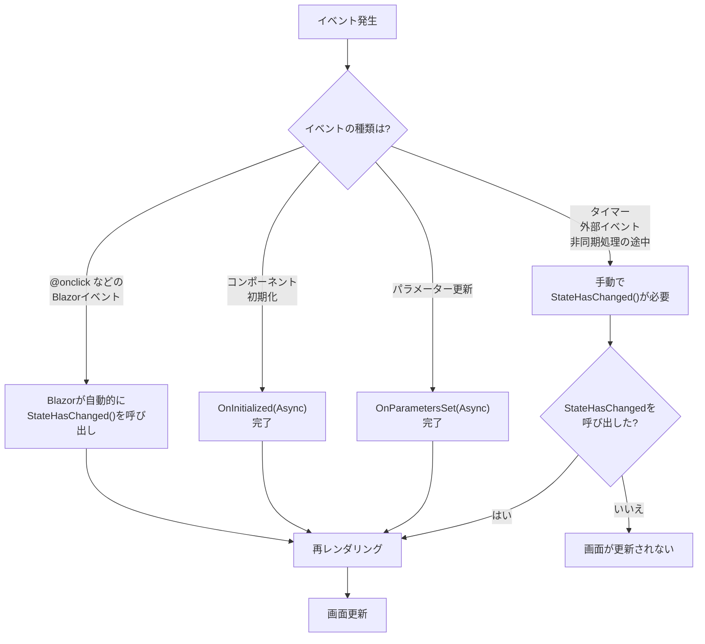

ネクスタでsmartFの開発エンジニアをしている tetsu.k です。

Blazor開発において、`StateHasChanged`は非常によく使うメソッドですが、その仕組みを正確に理解していないと、「データを変更したのに画面が更新されない」といった問題やパフォーマンス低下を引き起こします。

この記事では、StateHasChangedの本質的な仕組みから、いつ自動で呼ばれ、いつ手動で呼ぶべきなのかを解説します。

:::message
本記事は、以下の記事の続編です。
- [Blazorのレンダリングの仕組みとコンポーネントのライフサイクル](https://zenn.dev/nexta_/articles/blazor-component-lifecycle)
- [Blazorのデータフローとコンポーネント連携](https://zenn.dev/nexta_/articles/blazor-databinding)

シリーズ第3弾として、「StateHasChangedを適切に扱う」に焦点を当てます。
:::

## StateHasChangedの仕組みとレンダリングフロー

`StateHasChanged` を呼ぶと、即座にブラウザのDOM（HTML）が書き換わるわけではありません。Blazorは、RenderTree（レンダーツリー）という仕組みで描画を制御しています。

1. `StateHasChanged`が呼ばれると、コンポーネントは「再レンダリングが必要」とマークされます
2. Blazorは、現在の状態に基づいて新しいRenderTreeをメモリ上で生成します
3. 古いRenderTreeと新しいRenderTreeを比較し、変更された部分（差分）だけを抽出します
4. 抽出された差分のみを、実際のブラウザのDOMに反映します

つまり、`StateHasChanged`は「データが変わったから、RenderTreeを再評価してね」というBlazorへの通知です。画面を直接更新する「リフレッシュボタン」ではありません。

:::details 実装の詳細
実際のComponentBase.csの実装を見ると、`StateHasChanged`メソッドは`_renderHandle.Render(_renderFragment)`を呼び出しているだけです。

```csharp
protected void StateHasChanged()
{
    // ... 省略 ...
    _renderHandle.Render(_renderFragment);  // _renderHandleに委譲
}
```

DOM操作は一切行わず、Blazorフレームワークに「このコンポーネントを再レンダリング候補としてマークする」よう指示しています。実際の描画処理はRenderHandleが担当します。

https://github.com/dotnet/aspnetcore/blob/f9b6fcf1918d8a8faeebf5d1341ccf6b8eae9478/src/Components/Components/src/ComponentBase.cs#L123-L144


:::

## 自動で再描画される3つのタイミング

まず、Blazorが「自動で」画面を更新してくれるケースを見ていきます。


```mermaid
flowchart TD
    Start["イベント発生"] --> Check{"イベントの種類は?"}

    Check -->|"@onclick などの<br/>Blazorイベント"| Auto["Blazorが自動的に<br/>StateHasChanged()を呼び出し"]
    Check -->|"コンポーネント<br/>初期化"| Init["OnInitialized(Async)<br/>完了"]
    Check -->|"パラメーター更新"| Param["OnParametersSet(Async)<br/>完了"]

    Auto --> Render["再レンダリング"]
    Init --> Render
    Param --> Render

    Check -->|"タイマー<br/>外部イベント<br/>非同期処理の途中"| Manual["手動で<br/>StateHasChanged()が必要"]

    Manual --> UserCall{"StateHasChangedを<br/>呼び出した?"}
    UserCall -->|"はい"| Render
    UserCall -->|"いいえ"| NoUpdate["画面が更新されない"]

    Render --> Display["画面更新"]
```

### 1. イベントハンドラの実行後

`@onclick` や `@onchange` などのBlazorイベント属性で登録したハンドラは、実行が完了すると自動的に `StateHasChanged()` が呼ばれます。

```razor
<button @onclick="IncrementCount">カウント: @count</button>

@code {
    private int count = 0;

    private void IncrementCount()
    {
        count++;
        // StateHasChanged() を呼ぶ必要はない
    }
}
```

この場合、ボタンをクリックすると自動的に画面が更新されます。

対象となるイベント: `@onclick`, `@ondblclick`, `@onchange`, `@oninput` など、すべてのBlazorイベント属性。

:::details 実装の詳細

@onclickなどのイベントハンドラが実行された後、自動で再レンダリングがトリガーされる実装になっています。

https://github.com/dotnet/aspnetcore/blob/f9b6fcf1918d8a8faeebf5d1341ccf6b8eae9478/src/Components/Components/src/ComponentBase.cs#L355-L369

:::

https://learn.microsoft.com/ja-jp/aspnet/core/blazor/components/event-handling

### 2. コンポーネントの初期化時

`OnInitialized(Async)` が完了すると、自動的に再描画されます。このメソッドはコンポーネントの生存期間中、最初の1回だけ呼ばれます（※プリレンダリング有効時はサーバー側とクライアント側で計2回呼ばれます）。

```razor
<p>読み込み中: @isLoading</p>
<p>データ: @data</p>

@code {
    private bool isLoading = true;
    private string data = "";

    protected override async Task OnInitializedAsync()
    {
        data = await FetchDataAsync();
        isLoading = false;
        // メソッド完了後、自動的に StateHasChanged() が呼ばれる
    }

    private async Task<string> FetchDataAsync()
    {
        await Task.Delay(1000);
        return "取得完了";
    }
}
```

:::message alert
非同期メソッドが完了した時点で再描画されます。メソッド内の途中で画面を更新したい場合（プログレスバーなど）は、手動で `StateHasChanged()` を呼ぶ必要があります。
:::

### 3. パラメーターが更新された時

親コンポーネントが再レンダリングされ、子コンポーネントに渡している `[Parameter]` の値が変わった（または変わった可能性がある）時、`OnParametersSet(Async)` が実行され、その完了後に子コンポーネントは自動的に再描画されます。

親コンポーネント:
```razor
<button @onclick="UpdateMessage">メッセージ変更</button>
<ChildComponent Message="@currentMessage" />

@code {
    private string currentMessage = "初期メッセージ";

    private void UpdateMessage()
    {
        currentMessage = "更新されたメッセージ";
        // 親が再レンダリング → 子の OnParametersSetAsync が呼ばれる → 子も再レンダリング
    }
}
```

子コンポーネント:
```razor
<p>受け取ったメッセージ: @Message</p>

@code {
    [Parameter] public string Message { get; set; } = "";

    // 親の再レンダリングで自動的に OnParametersSetAsync が呼ばれる
    protected override async Task OnParametersSetAsync()
    {
        // パラメーター更新時の処理をここに記述
        await base.OnParametersSetAsync();
    }
}
```

:::message
`OnParametersSet(Async)` は、初回レンダリング時（`OnInitialized(Async)` の直後）にも呼ばれます。つまり、コンポーネントの初期化時とパラメーター更新時の両方で実行されます。

実行順序: `OnInitialized(Async)` → `OnParametersSet(Async)` → 再レンダリング
:::

:::details 実装の詳細

親コンポーネントから新しいパラメーターが渡されると、フレームワークはコンポーネントの `SetParametersAsync` メソッドを呼び出します。このメソッド内でプロパティへの値のセットが行われ、開発者がオーバーライド可能な `OnParametersSet(Async)` が実行されます。そして、これらの処理がすべて完了した最後に `SetParametersAsync` の内部から `StateHasChanged()` が呼び出される仕様になっています。

https://github.com/dotnet/aspnetcore/blob/f9b6fcf1918d8a8faeebf5d1341ccf6b8eae9478/src/Components/Components/src/ComponentBase.cs#L259-L333

:::

https://learn.microsoft.com/ja-jp/aspnet/core/blazor/components/lifecycle?view=aspnetcore-10.0#when-parameters-are-set-setparametersasync

## 手動で StateHasChanged が必要なケースの例

ここが初心者が最も「動かない」と悩むポイントです。Blazorが自動で再描画してくれるのは、前述の「自動で再描画される3つのタイミング」だけです。それ以外の場合は、手動で `StateHasChanged()` を呼ぶ必要があります。

### 例1: 非同期処理の途中で画面を更新したい時

長時間かかる処理で、途中経過を表示したい場合です。

動かないコード例:
```razor
<p>進捗: @progress%</p>
<button @onclick="ProcessData">処理開始</button>

@code {
    private int progress = 0;

    private async Task ProcessData()
    {
        for (int i = 0; i <= 100; i += 10)
        {
            await Task.Delay(200);
            progress = i;
            // 画面は更新されない！
        }
    }
}
```

正しいコード例:
```razor
<p>進捗: @progress%</p>
<button @onclick="ProcessData">処理開始</button>

@code {
    private int progress = 0;

    private async Task ProcessData()
    {
        for (int i = 0; i <= 100; i += 10)
        {
            await Task.Delay(200);
            progress = i;
            StateHasChanged(); // 手動で再描画を指示
        }
    }
}
```

イベントハンドラ内でも、非同期処理の途中では自動的に `StateHasChanged()` は呼ばれません。イベントハンドラ全体が完了した時点で1回だけ呼ばれるため、途中の `progress` の変化は画面に反映されません。

### 例2: タイマーによる定期更新

`System.Timers.Timer` や `System.Threading.Timer` による更新は、Blazorのイベントループの外で発生するため、手動で `StateHasChanged()` を呼ぶ必要があります。

動かないコード例:
```razor
<p>経過時間: @elapsedSeconds 秒</p>

@code {
    private int elapsedSeconds = 0;
    private System.Timers.Timer? timer;

    protected override void OnInitialized()
    {
        timer = new System.Timers.Timer(1000);
        timer.Elapsed += (sender, e) =>
        {
            elapsedSeconds++;
            // 画面は更新されない！
        };
        timer.Start();
    }

    public void Dispose() => timer?.Dispose();
}
```

正しいコード例:
```razor
@implements IDisposable

<p>経過時間: @elapsedSeconds 秒</p>

@code {
    private int elapsedSeconds = 0;
    private System.Timers.Timer? timer;

    protected override void OnInitialized()
    {
        timer = new System.Timers.Timer(1000);
        timer.Elapsed += async (sender, e) =>
        {
            elapsedSeconds++;
            await InvokeAsync(StateHasChanged); // UIスレッドで実行
        };
        timer.Start();
    }

    public void Dispose() => timer?.Dispose();
}
```

### InvokeAsyncを使う理由

「タイマーによる定期更新」のコードでは、`InvokeAsync(StateHasChanged)` を使用する必要があります。

Blazorコンポーネントは特定のスレッド(同期コンテキスト)に紐付いています。別スレッドから直接`StateHasChanged()`を呼ぶと、Blazor Serverで`InvalidOperationException`が発生します。


使い分けの判断基準:

- `StateHasChanged()`: Blazorイベント（`@onclick`など）やライフサイクルメソッド内で呼ぶ場合
- `InvokeAsync(StateHasChanged)`: タイマー、`Task.Run()`、外部イベント（SignalRなど）から呼ぶ場合

すでにUIスレッドにいる場合でも`InvokeAsync`は正常に動作します。どちらを使うべきか確信が持てない場合は、`InvokeAsync`を使っておけば安全です。

```csharp
// NG: タイマーやTask.Runなど、別スレッドからは直接呼ばない
StateHasChanged();  // InvalidOperationException が発生

// OK: InvokeAsyncでUIスレッドに処理を委譲
await InvokeAsync(StateHasChanged);
```

## おわりに

`StateHasChanged`を適切に扱うための重要なポイントは3つです。

1. 自動再描画されるケース: Blazorイベント、初期化、パラメーター更新
2. 手動呼び出しが必要なケース: タイマー、非同期処理の途中、外部イベント
3. 別スレッドからは必ず`InvokeAsync`で囲む

この理解があれば、「画面が更新されない」問題や不要な再レンダリングを避けられます。

本記事がBlazorの仕組み理解の手助けとなれば幸いです。

## 参考リンク

- [ASP.NET Core Razor コンポーネントのライフサイクル](https://learn.microsoft.com/ja-jp/aspnet/core/blazor/components/lifecycle)
- [ASP.NET Core Blazor でのイベント処理](https://learn.microsoft.com/ja-jp/aspnet/core/blazor/components/event-handling)
- [ASP.NET Core Blazor の状態管理](https://learn.microsoft.com/ja-jp/aspnet/core/blazor/state-management)
