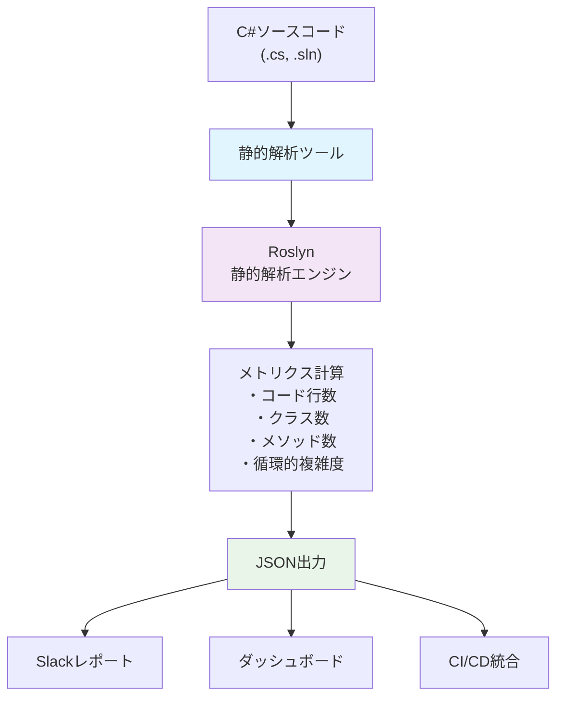

# Claude Codeで始めるコード品質の見える化

## はじめに

「このコード、なんとなく複雑だなぁ」「技術的負債が溜まってる気がするけど、どこから手をつけよう」

こんな悩みを抱えた経験はありませんか？私も普段の開発で、コードの複雑さや品質について「体感値」でしか判断できずにいました。商用ツールもありますが、もっと手軽に、開発フローに自然に組み込める方法はないだろうか。

そこで思いついたのが、**Claude Code**を活用したコード品質の見える化です。

Claude Codeは、AIペアプログラミングの強力な機能だけでなく、開発者の「作りたい」を実現する優秀なツールでもあります。今回は、Microsoft Roslynを使用した静的解析ツールを作成し、C#プロジェクトのコード品質を定量的に測定・可視化する方法をご紹介します。

## この記事で分かること

- Roslynを使った静的解析ツールの概要
- 循環的複雑度（Cyclomatic Complexity）の計算と活用
- Claude Codeでの開発体験とその活用方法
- チーム内での共有アイデア

## なぜコード品質の見える化が必要なのか

プロダクトの方向性を品質重視にシフトしたいとき、まず現状把握が重要です。しかし、多くの場合：

- どこから改善すべきかの優先順位付けの指針がない
- 改善の優先度が主観的になりがち
- シニアエンジニアとジュニアエンジニアで「品質が悪い」の認識が異なる
- チーム間で品質基準が統一されていない
- 改善効果が可視化されない

定量的な指標があることで、これらの課題を解決し、**継続的な品質改善**が可能になります。

### 経験レベルによる品質認識の違い

特に見落としがちなのが、**シニアエンジニアとジュニアエンジニアで「品質が悪い」の認識が大きく異なる**ことです。

#### シニアエンジニアが感じる「品質の悪さ」
- アーキテクチャレベル: クラス設計、責任分離、依存関係
- 保守性の観点: 将来の変更容易性、拡張性
- ビジネスロジックの複雑さ: ドメイン知識の適切な表現
- 技術的負債の影響: システム全体への波及効果

#### ジュニアエンジニアが感じる「品質の悪さ」
- コードの読みやすさ: 変数名、メソッド名の分かりやすさ
- 表面的な複雑さ: ネストの深さ、長いメソッド
- コメントの有無: 説明の充実度
- 一般的なコーディング規約: インデント、命名規則

この認識の違いは自然なものですが、**共通の指標なしに議論すると噛み合わない**ことが多々あります。循環的複雑度のような定量的指標は、経験レベルに関係なく客観的な議論の土台を提供してくれます。

### 循環的複雑度の限界と位置づけ

ただし、**循環的複雑度だけですべての品質問題が解決されるわけではない**点は重要です：

#### 循環的複雑度で測れるもの
- メソッドレベルの制御フローの複雑さ
- 条件分岐やループの数
- テストのしやすさの目安

#### 循環的複雑度では測れないもの
- アーキテクチャの適切性（クラス設計、責任分離）
- ビジネスロジックの妥当性（要件との整合性）
- 命名の分かりやすさ（変数名、メソッド名）
- コメントの適切性（保守性への配慮）
- パフォーマンス（実行速度、メモリ使用量）

#### 他の重要なメトリクス

循環的複雑度と組み合わせることで、より包括的な品質評価が可能になる指標：

- コード行数（Lines of Code）: メソッド・クラスのサイズ感
- ネストレベル（Depth of Nesting）: 条件分岐の入れ子の深さ
- クラス結合度（Coupling）: 他クラスとの依存関係の強さ
- 凝集度（Cohesion）: クラス内部の関連性の強さ
- 重複コード率（Code Duplication）: 同一・類似コードの割合
- テストカバレッジ（Test Coverage）: テストされているコードの割合

循環的複雑度は、チームの品質意識を変える「きっかけ」として有効です。数値という共通言語を手に入れることで、漠然としていた品質への関心が具体的なアクションへと変わっていきます。この一つの指標から始まる小さな変化が、チーム全体の品質議論を活性化させ、より包括的な改善活動へと発展していく。そんな変革の第一歩になることを期待しています。

## 作成したツール

今回Claude Codeと一緒に開発したのは、軽量な静的解析ツールです。

### 主な特徴

- Roslyn（Microsoft.CodeAnalysis）を使用した正確な構文解析
- 循環的複雑度（McCabe Cyclomatic Complexity）の計算
- SonarQubeを参考にした品質基準とレポート形式
- JSON出力による他ツールとの連携
- 軽量・高速な実行

### システム構成



### 測定可能なメトリクス

#### 1. コード行数（Lines of Code）
実際のコード行数を正確にカウント（空白行・コメント行を除外）

#### 2. 構造メトリクス
- クラス数: プロジェクト内のクラス定義数
- メソッド数: 各クラス内のメソッド数

#### 3. 循環的複雑度（Cyclomatic Complexity）

循環的複雑度（サイクロマティック複雑度）は、Thomas J. McCabeによって考案されたソフトウェアメトリクスです。

基本概念：
プログラムの制御フローグラフにおける独立したパス数を測定します。言い換えると、「そのメソッドを完全にテストするために必要な最小テストケース数」を表します。

McCabe手法の計算式：
```
循環的複雑度 = E - N + 2P
```
- E: エッジ数（制御フローの矢印数）
- N: ノード数（実行文の数）
- P: 連結成分数（通常は1）

実用的な簡易計算式：
```
複雑度 = 基本値(1) + 判定分岐点数
```

判定分岐点の例：
- `if`文、`while`ループ、`for`ループ
- `switch`文、`catch`句
- 三項演算子

なぜ重要なのか：
- テスト網羅性: 複雑度が高いほど、すべてのパスをテストするのが困難
- バグ発生率: 複雑度10超のメソッドは統計的にバグ率が2-3倍高い
- 保守性: 複雑度が高いほど、変更時の影響範囲が予測困難

具体例で理解する：
```csharp
// 複雑度 = 1（分岐なし）
public int Simple(int x)
{
    return x * 2;
}

// 複雑度 = 3（if文2つ = +2）
public string Classify(int score)
{
    if (score >= 80)      // +1
        return "優秀";
    if (score >= 60)      // +1
        return "合格";
    return "不合格";
}

// 複雑度 = 6（if文1つ、for文1つ、内部if文3つ = +5）
public int ComplexMethod(int[] numbers)
{
    if (numbers == null)  // +1
        return 0;

    int sum = 0;
    for (int i = 0; i < numbers.Length; i++)  // +1
    {
        if (numbers[i] > 0)      // +1
            sum += numbers[i];
        else if (numbers[i] < 0) // +1
            sum -= numbers[i];
        else                     // +1
            sum += 1;
    }
    return sum;
}
```

### プロジェクト構成

```bash
code-metrics/
├── CodeMetrics.csproj    # プロジェクト設定
├── Program.cs            # CLIエントリーポイント
├── CodeAnalyzer.cs       # Roslyn解析エンジン
└── README.md
```

## Visual Studio 2022の組み込み機能との比較

実は、このようなツールを独自開発しなくても、Visual Studio 2022には標準でコードメトリクス計算機能が搭載されています。まずはその機能を紹介し、独自ツールとの違いを整理してみましょう。

### Visual Studio 2022のコードメトリクス機能

Visual Studio 2022では、「分析」→「コードメトリックスを計算する」から簡単にメトリクス分析が実行できます。


Visual Studio 2022では保守容易性インデックス、循環的複雑度、継承の深度、クラス結合度、コード行数の5つのメトリクスを計算し、ツリー形式での表示やExcel出力が可能です。


### Microsoft.CodeAnalysis.Metrics NuGet パッケージ

実は、Visual Studio 2022の機能はNuGetパッケージとしてコマンドライン実行も可能です。Microsoftが公式提供している [Microsoft.CodeAnalysis.Metrics](https://www.nuget.org/packages/Microsoft.CodeAnalysis.Metrics/) パッケージを使用することで、CI/CDパイプラインでも同じメトリクス計算が実行できます。

このパッケージを導入すると、`msbuild /t:Metrics` コマンドでコマンドラインからメトリクス計算を実行でき、XML形式で詳細なレポートが出力されます。出力ファイル名の指定やレガシーモード（VS2015互換）での実行も可能です。

詳細情報：[コード メトリック データを生成する - Microsoft Learn](https://learn.microsoft.com/ja-jp/visualstudio/code-quality/how-to-generate-code-metrics-data?view=vs-2022)

### 3つのアプローチ比較

| 項目 | VS2022 GUI | Microsoft.CodeAnalysis.Metrics | 独自静的解析ツール |
|------|------------|------------------------------|------------------|
| **導入コスト** | 無し | NuGet追加のみ | 開発・メンテナンス必要 |
| **実行環境** | Visual Studio必須 | .NET SDK環境 | CLI単体で実行可能 |
| **出力形式** | GUI表示 + Excel | XML（構造化データ） | JSON（プログラム連携） |
| **CI/CD統合** | 困難 | 可能（MSBuildターゲット） | 簡単（JSONパース） |
| **カスタマイズ性** | 限定的 | 中程度（パラメータ設定） | 完全にカスタマイズ可能 |
| **メトリクス種類** | 5種類（固定） | 6種類（Microsoft標準） | 必要な項目のみ選択可能 |
| **学習コスト** | 低い | 低い（MSBuild知識） | 中程度（開発必要） |

### 循環的複雑度の閾値について

比較表で示した閾値設定の違いについて補足します。

Microsoftの標準設定では、循環的複雑度の警告閾値は25に設定されています（[CA1502ルール](https://learn.microsoft.com/ja-jp/dotnet/fundamentals/code-analysis/quality-rules/ca1502)）。これは一般的な開発において実用的なバランスを考慮した値です。

一方、より厳格な品質管理を目指す場合は、閾値を10程度に設定することが推奨されます。これにより：

- 早期に複雑なメソッドを検出
- リファクタリングの必要性を明確化  
- チーム全体での一貫した品質基準の維持

閾値の選択は、プロジェクトの性質、チームの経験レベル、品質要求に応じて調整することが重要です。

### 使い分けの指針

Visual Studio 2022組み込み機能が適している場合：
- 開発者個人の品質確認
- 一時的・単発的な品質分析
- Visual Studioを日常的に使用している環境
- 詳細な保守容易性インデックスが必要

独自ツールが適している場合：
- チーム全体での継続的品質管理
- CI/CDパイプラインでの自動品質チェック
- Slack・ダッシュボードとの連携
- 品質基準のカスタマイズが必要
- コマンドライン・スクリプト環境での実行

## 技術的詳細

ここからは、実際にClaude Codeと一緒に開発した際の技術的なポイントを詳しく解説します。

### Claude Codeでの開発体験

Claude Codeを使った開発の最大の魅力は、「こういうツールが欲しい」という曖昧な要求から、実際に動くコードまで一気に進められることです。

開発プロセス：
1. 「コードメトリクスを測定したい」という要求
2. Roslynの使い方、MSBuild統合の調査
3. 循環的複雑度計算ロジックの実装
4. レガシープロジェクト対応の追加
5. JSON出力形式の最適化

Claude Codeは、各段階で適切な技術選択とコード実装を提案してくれました。

### 技術的なポイント

#### Roslynによる構文解析
Microsoft Roslynを使用することで、C#コードの構文木を正確に解析し、各メソッドの循環的複雑度を計算できます。if文、while文、switch文などの分岐構造を自動検出し、McCabe手法に基づいて複雑度を算出します。

#### JSON出力による連携性
構造化されたJSON形式での出力により、CI/CDパイプライン、Slackレポート、ダッシュボードなど様々なツールとの連携が容易になります。


#### 処理の流れ
1. ソースコード解析: Roslynがプロジェクトファイルを読み込み
2. 構文木構築: C#コードの構造を解析
3. メトリクス計算: 各メソッドの複雑度を算出
4. JSON出力: 構造化データとして結果を出力

#### 品質基準の設定
業界標準に基づき、循環的複雑度10を警告閾値として設定。これにより早期の品質問題検出が可能になります。


この形式により、ダッシュボード、Slackレポート、CI/CD統合が容易になります。

## 見える化アイデア：データを価値に変える

CodeMetrics CLIで得られるデータを、チーム全体の品質向上に活かすアイデアをご紹介します。

### Slackでの定期レポート

#### 週次品質レポートの自動配信

```markdown
📊 週次品質レポート (2025/01/20-26)

📈 今週の改善実績
✅ 複雑メソッド削減: 376個 → 358個 (-18個)
✅ 平均複雑度改善: 8.4 → 7.8 (-0.6)
✅ 新規複雑メソッド: 2個 (先週: 5個)

🏆 今週のMVP
👑 田中さん: 5個の複雑メソッド改善
🥈 佐藤さん: 新規コード平均複雑度 2.1
🥉 鈴木さん: 3個のメソッド複雑度削減

🔴 緊急対応が必要 (複雑度15+)
1. ProcessLegacyData (複雑度: 23) DataService.cs:142
2. ValidateBusinessRules (複雑度: 18) Validator.cs:89

🎯 来週の目標
- 複雑メソッド350個以下 (あと8個削減)
- 新規複雑メソッド0個

#コード品質 #技術的負債 #品質向上
```

### ダッシュボード構築

JSON出力データを時系列データベースに蓄積し、Grafanaなどの可視化ツールで品質推移をダッシュボード化。リアルタイムでの品質モニタリングが可能になります。

#### 主要な可視化パターン

1. 複雑度分布ヒストグラム
```
メソッド複雑度分布
│
│ ████████ (80個) 1-5   [健全]
│ ████     (40個) 6-10  [注意]
│ ██       (20個) 11-15 [要改善]
│ █        (10個) 16+   [緊急]
└─────────────────────
```

2. 複雑度推移チャート
```
複雑メソッド数推移 (月次)
400│ ●
   │  ╲
300│   ●━━━ 目標ライン
   │    ╲
200│     ●
   │      ╲
100│       ● ← 改善効果
   └─────────────
   Jan Feb Mar Apr
```

3. 部門別品質ヒートマップ
```
部門別複雑度状況
Controllers/     🟢🟢🟡🔴🔴  (2個の問題)
Services/        🟢🟡🔴🔴🔴  (3個の問題)
Models/          🟢🟢🟢🟢🟢  (問題なし)
Utils/           🟡🟡🔴      (1個の問題)

🟢 複雑度1-5   🟡 複雑度6-10   🔴 複雑度11+
```

### 継続的改善のサイクル

#### 週次改善プロセス

1. 月曜日: 前週の品質レポート配信
2. 火曜日: Top 3複雑メソッドの改善計画
3. 水-木曜日: リファクタリング実施
4. 金曜日: 改善効果の測定と次週計画

#### 品質目標の設定例

短期目標（1ヶ月）：
- 複雑メソッド数：380個 → 300個 (-21%)
- 平均複雑度：8.4 → 7.0 (-17%)
- 新規複雑メソッド：週5個以下

中期目標（3ヶ月）：
- 複雑メソッド数：300個 → 200個 (-33%)
- 複雑度15+メソッド：ゼロ達成
- 部門別健全率：全部門80%以上

### ゲーミフィケーション要素

#### 品質改善バッジシステム

```
🏆 品質リーダーボード (今月)

1. 🥇 田中 (複雑度削減: -45点)
2. 🥈 佐藤 (新規低複雑度: +20点)
3. 🥉 鈴木 (リファクタリング: +15点)

🎯 チーム目標
複雑メソッド300個以下まで: あと58個! 84%達成

獲得可能バッジ:
🛠️ リファクタリングマスター (月10個改善)
⚡ 速攻改善者 (複雑度20→10以下)
🎯 品質ガーディアン (新規複雑メソッド0個)
```

### アラート・通知システム

#### 品質劣化時の即座アラート

```json
{
  "trigger": "complexity > 20",
  "action": "immediate_alert",
  "channels": ["#tech-quality", "@tech-lead"],
  "message": "🚨 極めて複雑なメソッドが検出されました (複雑度: 28)"
}
```

#### Teams通知の例

```
🚨 品質アラート

新規追加された複雑メソッド:
- PaymentService.ProcessRefund (複雑度: 13)
  by: 山田太郎 in PR #142

今日の品質目標達成度: 80% 📊
推奨対応: try-catchブロックの分離検討
```

### 効果測定とROI

#### 定量的効果指標

- バグ削減率: 複雑度削減 → バグ報告数の相関
- 開発速度: 平均複雑度 → 機能開発時間の相関
- 保守性向上: リファクタリング時間の短縮
- 新人教育: コード理解時間の短縮

#### 技術的負債の可視化

```
技術的負債推定 (複雑度ベース)
┌─────────────────────────────────┐
│ 高複雑度メソッド: 28個          │
│ 推定改善工数: 84時間            │
│ 月次保守コスト: +25%           │
│ バグリスク倍率: 3.2倍          │
└─────────────────────────────────┘

改善後の予想効果:
✅ 保守工数: -30時間/月
✅ バグ対応: -50%
✅ 新機能開発: +20%高速化
```

## まとめと今後の展望

### この記事で実現できたこと

今回のClaude Codeを活用した開発により、以下を実現できました：

#### 1. 手軽なコード品質測定
- 軽量なCLIツールで即座にメトリクス取得
- レガシープロジェクト対応で幅広い環境で利用可能
- JSON出力による拡張性と連携性

#### 2. データドリブンな品質改善
- 定量的指標による客観的な現状把握
- 改善優先度の明確化（複雑度ランキング）
- 継続的な効果測定と改善サイクル

#### 3. チーム全体での品質意識向上
- Slackレポートによる定期的な情報共有
- CI/CD統合による自動品質チェック
- ゲーミフィケーションによる楽しい改善活動

### Claude Codeの開発体験

本プロジェクトを通じて感じたClaude Codeの価値：

1. 迅速なプロトタイピング
「こんなツールが欲しい」から実際の動作まで、驚くほど短時間で実現できました。

2. 技術的課題の解決
Roslynの複雑なAPI、MSBuild統合の問題など、技術的な詰まりポイントで的確なサポートを得られました。

3. 実装パターンの提案
循環的複雑度の計算ロジック、エラーハンドリング、レガシー対応など、ベストプラクティスに基づいた実装が行えました。

4. ドキュメント作成
技術的な内容を分かりやすく説明するためのドキュメント作成も効率的に進められました。

### 導入効果の仮説と期待

#### 定量化による意識変化
静的解析ツール導入によって期待される効果：

見える化の意味
- 主観的品質 → 客観的指標: 「なんとなく複雑」から「複雑度15」へ
- 改善優先度の明確化: 数値による改善対象の順位付け
- 進捗の可視化: リファクタリング前後の具体的な改善量

チーム内の意識変化
- 共通言語の確立: 「複雑度」が品質議論の共通指標になる
- 経験レベル間のギャップ解消: シニア・ジュニア問わず客観的議論が可能
- 建設的なコードレビュー: 主観的批判から具体的改善提案へ転換

#### 定量化することの意味
継続的改善の基盤
- 現状把握: 改善前の正確な品質状態を記録
- 効果測定: 改善取り組みの成果を数値で確認
- トレンド分析: 品質の推移を時系列で追跡

### おわりに

コード品質の見える化は、思っていたよりずっと手軽に始められました。Claude Codeと一緒に開発を進めることで、「こんなツールがあったらいいな」が数時間で形になる。この体験は、開発者として本当にワクワクするものでした。

「なんとなく複雑だよね」という会話が、「複雑度15だから、まずここから手をつけよう」に変わる。たったそれだけのことですが、チームの品質に対する意識は確実に変わっていきます。

もしあなたのチームでも品質改善に取り組むなら、まずは一つの指標を測ることから始めてみてください。完璧を目指す必要はありません。小さく始めて、少しずつ改善していく。その積み重ねが、いつの間にかチーム全体の文化として根付いていくのだと思います。
