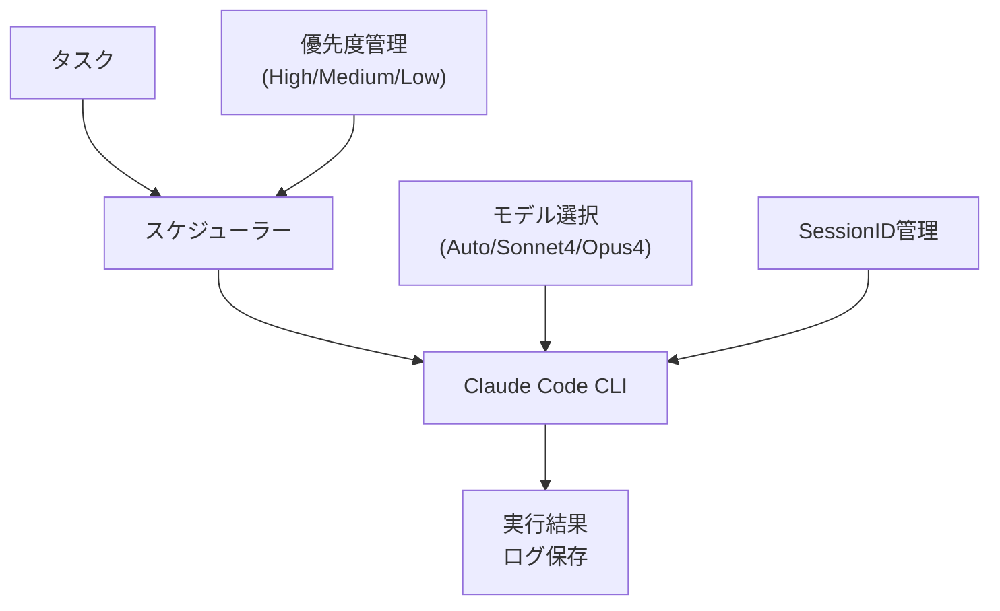

## はじめに

Claude CodeはAnthropicが提供する強力なコード生成・編集ツールですが、5時間ごとの使用制限があります。特にOpusモデルを使用していると、その高性能ゆえに制限により早く到達してしまうという現実があります。

開発者として、この貴重な5時間という制限時間を最大限に活用したい、そして夜間や休日の時間も有効活用したいという思いがありました。そこで、使用制限を前提としつつ、その制約の中でClaude Codeの能力を最大限に引き出すタスクランナーを作成しました。

本記事では、実際に開発したタスクランナーの設計思想と運用経験について詳しく解説します。

## Claude Codeの使用制限とその現実

### 使用制限の詳細

Claude Codeには以下の制限があります：

**5時間制限**：
- **使用時間**: 連続5時間の使用後、一定時間の休止が必要
- **リセットタイミング**: 使用開始から5時間経過後
- **制限内容**: API呼び出し、コード生成、ファイル操作等すべての機能

**週次制限**：
- **プランごとに異なる週次制限**: 利用プランにより上限が設定
- **モデル別時間**: SonnetとOpusで利用可能時間が異なる
- **複合的制約**: 5時間制限と週次制限の両方を考慮する必要

### Opusユーザー特有の課題

特にOpusモデルを使用している場合、以下の特徴があります：

- **計算コストの違い**: Opus 4は最も高性能なモデルで、より多くの計算リソースを必要とするため制限に早く到達
- **計算時間の消費**: 5時間制限は実際の時間ではなく「計算時間」として計算されており、Opusは同じタスクでもより多くの計算時間を消費
- **処理の複雑さ**: より詳細で複雑な分析や回答を生成するため、一回の処理でより多くのリソースを使用

### 開発現場での具体的な困りごと

この制限により、以下の課題が発生していました：

**業務時間中の制限問題**：
- コアタイム（日中）にOpusを使用していて制限に達すると、全く使用できなくなる
- 最も集中して開発したい時間帯に、Claude Codeが使えない状況が発生
- 業務時間内での生産性が大幅に低下してしまう

## タスクランナーの設計思想

### 基本コンセプト

制限を前提として、以下の設計思想でタスクランナーを構築しました：

1. **時間分散実行**: タスクを5時間以内の単位に細分化
2. **スケジューリング**: 制限解除タイミングの自動計算と最適化
3. **状態管理**: 実行中断・再開の適切な処理
4. **優先度制御**: 重要度に応じたタスクの実行順序制御
5. **シンプル設計**: タスクランナー本体はシンプルに保ち、複雑なロジックは外部化

### システム概要

図1に示すように、タスクランナーはシンプルな構成で処理を実現しています：

*図1: タスクランナーのシステム概要*

## 実装アプローチの概要

### 1. タスク管理システム

タスクの追加・削除・実行を管理する基本的なシステムを実装しました：

**主な機能**：
- タスク追加・削除
- スケジュール実行
- ロギング

### 2. スケジューラー

使用制限を考慮したタスクスケジューリングを実装：

**スケジューリング戦略**：
- タスクの推定実行時間に基づく配置
- 優先度を考慮した実行順序決定

### 3. プレイブック駆動設計

タスクランナー自体はシンプルに保ち、実際のタスク内容は別途用意したMarkdownファイル（プレイブック）で管理する設計としました：

**プレイブックの構造**：
- 設計タスク用プレイブック
- コードレビュー用プレイブック
- リファクタリング用プレイブック
- 各プレイブックには具体的な手順とプロンプトを記載

**シンプル設計のメリット**：
- タスクランナーのメンテナンスが容易
- プレイブックの独立した更新が可能
- 新しいタスクタイプの追加が簡単
- チーム間でのプレイブック共有が可能

## 実際の活用シーン

### 1. 難しい機能の設計

**実行内容**：
- 複雑な仕様の設計検討
- アーキテクチャパターンの選定
- 技術選定と比較検討
- 設計ドキュメントの作成

**効果**：
Opusの高い分析能力を活用して、質の高い設計を効率的に作成できます。

### 2. 夜間コードレビュー自動化

**実行内容**：
- プルリクエストの自動レビュー
- コードの品質チェック
- 改善提案の生成
- レビューコメントの自動投稿

**効果**：
朝にはすべてのプルリクエストがレビュー済みの状態になり、チームの開発速度が向上します。

### 3. 夜間の小規模リファクタリング

**実行内容**：
- コードの可読性向上
- 重複コードの統合
- 命名の改善
- 軽微な設計パターンの適用

**効果**：
夜間に継続的に小さな改善を積み重ねることで、コード品質が着実に向上します。

## 運用結果と効果

### パフォーマンス改善

タスクランナー導入後の変化：

**導入前の課題**：
- 日中の業務時間でOpusを使用し、制限に早期到達
- 最も重要な業務時間帯でClaude Codeが使用不可になる
- 夜間・休日の時間を有効活用できていない
- 制限時間の配分が非効率

**導入後の改善**：
- 夜間・休日に自動でタスクを実行し、日中の制限時間を温存
- 重要な業務時間帯でClaude Codeを安定して使用可能
- 制限時間の効率的な配分と最適化
- 24時間を通じた時間の有効活用

### 具体的な改善指標

**稼働回転数の改善**：

表1の通り、タスクランナー導入により利用機会が大幅に向上しました：

| 項目 | 改善前 | 改善後 | 改善効果 |
|---|---|---|---|
| 1日の回転数 | 2回転/日 | 4回転/日 | 利用機会が2倍に！ 🚀 |
| 週間の回転数 | 10回転/週 (平日のみ) | 28回転/週 (毎日) | 利用機会が2.8倍に！ ✨ |
| 休日の活用 | 0回 | 8回転 (土日) | 新たな機会を創出 |

*表1: 稼働回転数の改善効果*

## まとめ

Claude Codeの5時間制限という制約があるからこそ、夜間や休日も含めた時間の有効活用という発想に至り、より効率的で安定した開発環境を構築することができました。特にOpusモデルの高性能を最大限活用しながら、重要な業務時間帯で安定してClaude Codeを使える環境が実現できたことは大きな成果です。

### 主な学び

1. **制約は創造の源**: 制限があることで、より効率的なシステム設計を追求できた
2. **時間配分の重要性**: 制限時間をどう使うかが、制限時間の長さより重要
3. **24時間思考**: 業務時間だけでなく、1日全体での時間活用を考える視点
4. **モデル特性の理解**: Opusの計算コストを理解した上での効率的な活用法

### 今後の展開

このタスクランナーの経験を活かし、AI ツールの制限を前提とした、より効率的な開発ワークフローの構築を続けていきます。同じような課題を抱えている開発者の方々の参考になれば幸いです。

