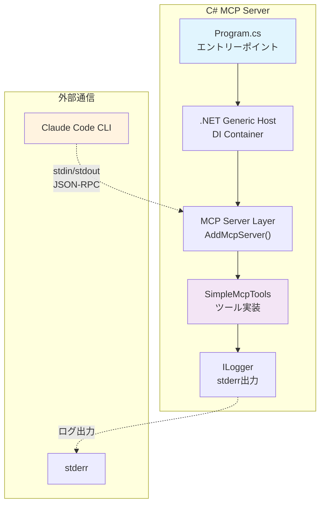
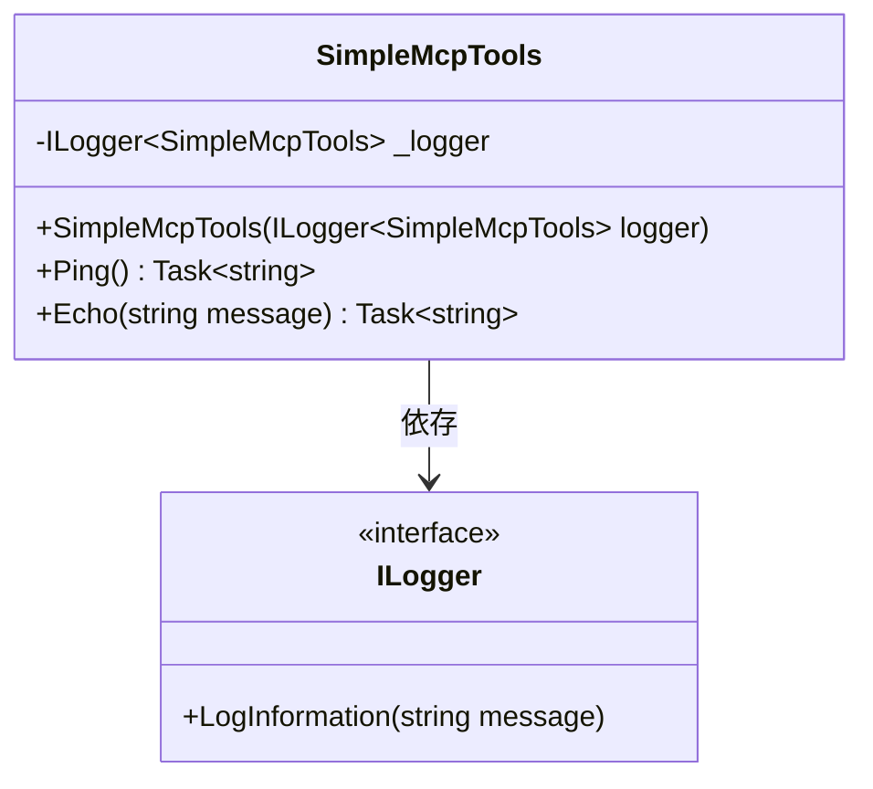
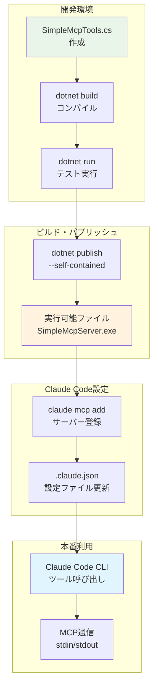
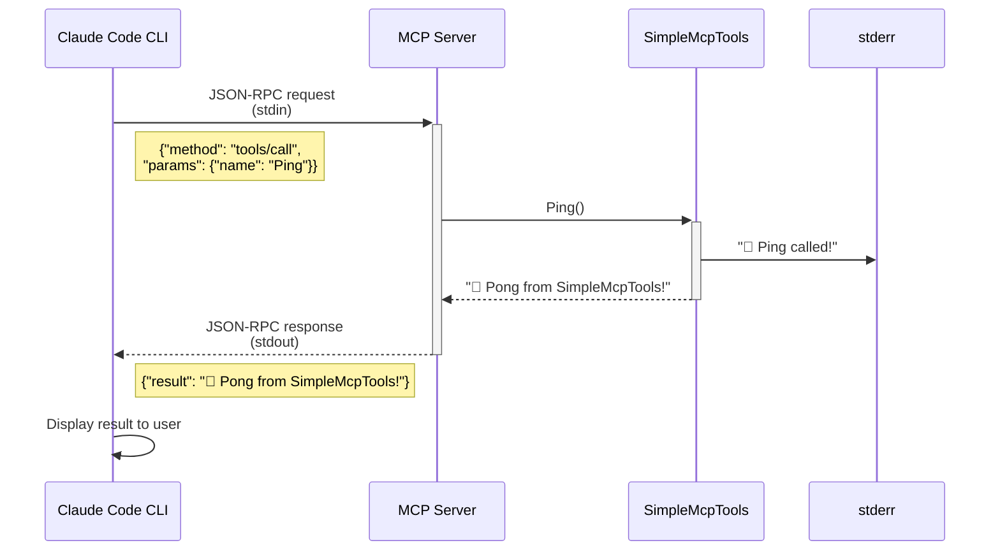

# C#でMCPサーバーを作ってみよう

この記事では、C#を使ってModel Context Protocol（MCP）サーバーを作成し、Claude Codeと連携する方法を解説します。

## はじめに

Model Context Protocol（MCP）は、AIエージェントが外部ツールやデータソースと安全に連携するためのオープンスタンダードです。この記事では、C#でシンプルなMCPサーバーを実装し、Claude Codeから呼び出せるようにします。

## 環境構築・依存関係

### 必要な環境
- **.NET 10.0 SDK** (Preview 6以上) - MCPサーバーテンプレートが必要
- **Visual Studio Code** または Visual Studio 2022
- **Claude Code CLI**

:::message
テンプレートで作成されるプロジェクトのTarget Frameworkは.NET 8.0です。.NET 10.0 SDKでも.NET 8.0アプリケーションを作成できます。
:::

### MCPサーバーテンプレートのインストール

Microsoftが提供する公式テンプレートを使用します：

```bash
# MCPサーバーテンプレートをインストール
dotnet new install Microsoft.Extensions.AI.Templates

# テンプレートから新しいプロジェクトを作成
dotnet new mcpserver -n SimpleMcpServer
cd SimpleMcpServer

# ビルドして動作確認
dotnet build
```

:::message
.NET 10.0 Preview版が必要です。[公式ダウンロードページ](https://dotnet.microsoft.com/en-us/download/dotnet/10.0)からインストールしてください。
:::

:::message alert
📂 **完全なサンプルコード**

この記事で説明するプロジェクトの完全なサンプルコードは以下で確認できます：
- [GitHub: サンプルプロジェクト](https://github.com/pixcelo/zenn-content/tree/main/samples/csharp-mcp-server)
- すぐに動作するプロジェクトファイル一式
- 詳細なセットアップガイド
- トラブルシューティング情報
:::

### 手動でプロジェクトを作成する場合

テンプレートを使わず手動で作成する場合：

```bash
# 新しいコンソールアプリケーションを作成
dotnet new console -n SimpleMcpServer
cd SimpleMcpServer

# 必要なパッケージをインストール
dotnet add package ModelContextProtocol.Server
dotnet add package Microsoft.Extensions.Hosting
dotnet add package Microsoft.Extensions.Logging
```

## 基本的なMCPプロトコル実装

### アーキテクチャ概要

まず、C# MCPサーバーの全体構成を確認しましょう：



この構成により、Claude Codeとの安全な通信とツールの実行が実現されます。

### Program.csの基本構造

MCPサーバーは.NET Generic Hostを使用してセットアップします。以下が最小限の構成です：

```csharp
using Microsoft.Extensions.DependencyInjection;
using Microsoft.Extensions.Hosting;
using Microsoft.Extensions.Logging;

var builder = Host.CreateApplicationBuilder(args);

// ログの設定（重要：stderrに出力）
builder.Logging.AddConsole(o => o.LogToStandardErrorThreshold = LogLevel.Trace);

// MCPサーバーとツールの登録
builder.Services
    .AddMcpServer()
    .WithStdioServerTransport()
    .WithTools<SimpleMcpTools>();

await builder.Build().RunAsync();
```

### MCPサーバーの設定詳細

#### 1. ログ設定の重要性

```csharp
builder.Logging.AddConsole(o => o.LogToStandardErrorThreshold = LogLevel.Trace);
```

**なぜstderrにログを出力するのか？**
- **stdout**: MCPプロトコルの通信に使用（JSON-RPCメッセージ）
- **stderr**: デバッグ・ログ情報用
- 混在するとプロトコル通信が破綻します

#### 2. MCPサーバー設定

```csharp
builder.Services
    .AddMcpServer()                    // MCPサーバー基盤を追加
    .WithStdioServerTransport()        // stdin/stdout通信を設定
    .WithTools<SimpleMcpTools>();      // ツールクラスを登録
```

- **AddMcpServer()**: MCPプロトコル処理の基盤機能を追加
- **WithStdioServerTransport()**: Claude Codeとの標準入出力通信を設定
- **WithTools<>()**: 実際のツール機能を持つクラスを登録

#### 3. 依存性注入（オプション）

より複雑なサーバーでは、サービスを追加できます：

```csharp
// カスタムサービスの登録例
builder.Services.AddSingleton<IMyCustomService, MyCustomService>();
builder.Services.AddScoped<IDataService, DataService>();
```

## 具体的なツール実装例

### SimpleMcpToolsクラスの実装

実際に動作するシンプルなツールを作成します。まず、クラス構造を確認しましょう：



新しくファイル `SimpleMcpTools.cs` を作成しましょう：

```csharp
using System.ComponentModel;
using ModelContextProtocol.Server;
using Microsoft.Extensions.Logging;

/// <summary>
/// MCP診断用の最小限ツールクラス
/// </summary>
internal class SimpleMcpTools
{
    private readonly ILogger<SimpleMcpTools> _logger;

    public SimpleMcpTools(ILogger<SimpleMcpTools> logger)
    {
        _logger = logger;
        _logger.LogInformation("🚀 SimpleMcpTools constructed successfully!");
        Console.Error.WriteLine("🚀 SimpleMcpTools constructed successfully!");
    }

    [McpServerTool]
    [Description("MCPサーバーの基本動作確認")]
    public async Task<string> Ping()
    {
        _logger.LogInformation("🏓 SimpleMcpTools.Ping called!");
        Console.Error.WriteLine("🏓 SimpleMcpTools.Ping called!");
        await Task.Delay(10);
        return "🏓 Pong from SimpleMcpTools!";
    }

    [McpServerTool]
    [Description("文字列を返すシンプルなテスト")]
    public async Task<string> Echo(
        [Description("エコーするメッセージ")] string message = "Hello World")
    {
        _logger.LogInformation("📢 SimpleMcpTools.Echo called with: {Message}", message);
        Console.Error.WriteLine($"📢 SimpleMcpTools.Echo called with: {message}");
        await Task.Delay(10);
        return $"Echo: {message}";
    }
}
```

### 実装のポイント解説

#### 1. Pingツール（パラメータなし）

```csharp
[McpServerTool]
[Description("MCPサーバーの基本動作確認")]
public async Task<string> Ping()
```

- **`[McpServerTool]`**: このメソッドをMCPツールとして登録
- **`[Description]`**: Claude Codeで表示される説明文
- **パラメータなし**: 最もシンプルなツール例
- **戻り値**: 必ず何かしらの値を返す

#### 2. Echoツール（文字列パラメータ）

```csharp
[McpServerTool]
[Description("文字列を返すシンプルなテスト")]
public async Task<string> Echo(
    [Description("エコーするメッセージ")] string message = "Hello World")
```

- **パラメータに`[Description]`**: パラメータの説明をClaude Codeで表示
- **デフォルト値**: `= "Hello World"` でデフォルト値を設定
- **パラメータ説明**: Claude Codeがツール使用時に参考にする

#### 3. ログ出力・デバッグ手法

```csharp
_logger.LogInformation("🏓 SimpleMcpTools.Ping called!");
Console.Error.WriteLine("🏓 SimpleMcpTools.Ping called!");
```

**2つのログ出力を使い分け：**
- **`_logger.LogInformation`**: 構造化ログ（本格運用向け）
- **`Console.Error.WriteLine`**: 即座にstderrに出力（デバッグ用）

#### 4. 非同期処理の重要性

```csharp
public async Task<string> Ping()
{
    await Task.Delay(10);  // 最小限の非同期処理
    return "🏓 Pong from SimpleMcpTools!";
}
```

MCPプロトコルは非同期処理を前提としているため、`async Task<T>` で実装します。

## Claude Codeとの連携テスト

### MCPサーバーの起動

まず、作成したMCPサーバーをビルドして実行可能にします：

```bash
# プロジェクトをビルド
dotnet build -c Release

# 実行可能ファイルの場所を確認
dotnet publish -c Release --self-contained true -r win-x64
```

### Claude Code設定

開発からClaude Code連携までの流れを確認しましょう：



Claude Code CLIでは、`claude mcp add`コマンドを使用してMCPサーバーを設定します。

#### コマンドでの設定

```bash
# 開発時（プロジェクトディレクトリで）
claude mcp add simple-mcp-server dotnet run --project ./SimpleMcpServer

# 本番用（publish済み実行ファイル）
claude mcp add simple-mcp-server /path/to/SimpleMcpServer.exe

# プロジェクトスコープで設定（.mcp.jsonファイルに保存）
claude mcp add simple-mcp-server --scope project dotnet run --project ./SimpleMcpServer

# ユーザースコープで設定（全プロジェクトで利用可能）
claude mcp add simple-mcp-server --scope user /path/to/SimpleMcpServer.exe
```

#### 手動設定（.mcp.json）

プロジェクトルートに`.mcp.json`を作成することも可能：

```json
{
  "mcpServers": {
    "simple-mcp-server": {
      "command": "dotnet",
      "args": ["run", "--project", "./SimpleMcpServer"],
      "env": {
        "LOG_LEVEL": "DEBUG"
      }
    }
  }
}
```

#### 設定の確認

```bash
# 設定済みサーバー一覧を表示
claude mcp list

# 特定のサーバー詳細を表示
claude mcp get simple-mcp-server
```

### 実際の呼び出しテスト

Claude CodeからMCPツールを呼び出す際の通信フローを確認しましょう：



Claude Codeを再起動後、以下のようにツールを呼び出せます：

#### 1. Pingツールのテスト

Claude Codeで以下のように入力：

```
MCPサーバーのpingツールを呼び出してください
```

期待される結果：
```
🏓 Pong from SimpleMcpTools!
```

#### 2. Echoツールのテスト

```
"Hello MCP World!"というメッセージでechoツールを呼び出してください
```

期待される結果：
```
Echo: Hello MCP World!
```

### デバッグとトラブルシューティング

#### ログの確認

MCPサーバー実行時のログは以下で確認できます：

```bash
# 開発時の直接実行
dotnet run

# stderr出力で以下のようなログが表示されるはず：
# 🚀 SimpleMcpTools constructed successfully!
# 🏓 SimpleMcpTools.Ping called!
```

#### よくある問題

1. **Claude Codeがサーバーに接続できない**
   - **パス形式の問題**: Windowsの場合、バックスラッシュが削除される
   ```bash
   # ❌ 失敗例
   claude mcp add server C:\path\to\server.exe
   
   # ✅ 成功例 
   claude mcp add server "C:/path/to/server.exe"
   ```
   - 実行ファイルのパスは引用符で囲み、スラッシュ（/）を使用

2. **Claude Codeがツールを認識しない**
   - `claude mcp list`でサーバーが✅Connectedになっているか確認
   - Claude Codeの再起動
   - サーバーの再登録

3. **実行時エラー**
   - .NET 10.0 SDKがインストールされているか確認
   - プロジェクトが正常にビルドできるか確認

4. **ログが出力されない**
   - stderrとstdoutの使い分けができているか確認

## まとめ

C#でMCPサーバーを作成する基本的な流れを学びました。この記事では以下を実装しました：

- .NET Generic Hostを使用したMCPサーバーの基本構成
- SimpleMcpToolsクラスによるPing/Echoツールの実装
- Claude Code CLIとの連携設定
- JSON-RPC通信によるツール呼び出し

### 📂 サンプルコードの活用

完全なプロジェクトは[GitHubリポジトリ](https://github.com/pixcelo/zenn-content/tree/main/samples/csharp-mcp-server)で公開しています。すぐに動作するコードとして活用してください。

### 🚀 次のステップ

より実用的なツールの実装に挑戦してみてください：
- ファイル操作ツール（読み書き、検索）
- Web API呼び出しツール
- データベース操作ツール
- 複数パラメータを持つ複雑なツール

## 参考資料

- [Model Context Protocol公式ドキュメント](https://spec.modelcontextprotocol.io/)
- [Claude Code公式ドキュメント](https://docs.anthropic.com/en/docs/claude-code)
- [Microsoft公式: C#でMCPサーバーを構築する](https://learn.microsoft.com/ja-jp/dotnet/ai/quickstarts/build-mcp-server)