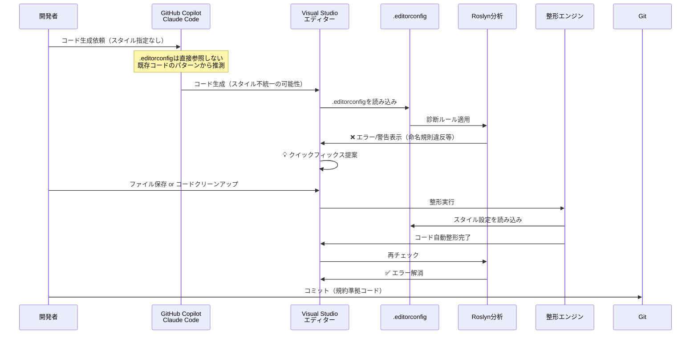

## はじめに - AI時代のC#コード品質管理

GitHub CopilotやClaude Codeなど、AI支援ツールがC#開発に浸透してきました。しかし、AI生成コードには「スタイルの不統一」という課題があります。

- あるメソッドでは `var` を使い、別のメソッドでは明示的な型指定
- 古いC#スタイルの提案（`new List<string>()` vs `new()`）
- privateフィールドの命名規則が統一されない（`_field` vs `field`）

これらを毎回手動で修正するのは非効率です。`.editorconfig`を使えば、AI生成後のコードをIDE（Visual Studio）が自動整形し、プロジェクトの規約に従わせることができます。

### この記事で分かること

- `.editorconfig`とは何か、Visual Studioでどのように使うか
- 重大度レベル（severity）の使い分けと実践的な設定方法
- AI生成コードとEditorConfigの実際の関係（AIは直接参照しないが、IDEが自動整形）
- 既存プロジェクトへの段階的な導入戦略
- 実用的な設定テンプレートとカスタマイズ例

本記事では、C#とVisual Studioに特化して、`.editorconfig`の実践的な活用方法を解説します。

## 前提条件

本記事は以下の環境を想定しています：

- **Visual Studio**: 2019以降（2022推奨）
- **C#**: 8.0以降（最新機能の例ではC# 10+を使用）
- **.NET**: .NET Core 3.1以降、または.NET 5+

レガシーな.NET Framework 4.xでも`.editorconfig`は利用可能ですが、一部の新しいC#構文（レコード型、ファイルスコープ名前空間等）は使用できません。

## EditorConfigとは？

前のセクションで、AI生成コードのスタイル不統一という課題を確認しました。ここでは、その解決策となる`.editorconfig`の基本を説明します。

`.editorconfig`は、エディターに依存しないコーディングスタイル設定ファイルです。プロジェクトのルートに配置することで、チーム全体で統一されたコーディング規約を設定できます。コードクリーンアッププロファイルの設定により、保存時やコードクリーンアップ時に自動適用することも可能です。

:::message
EditorConfigは、C#専用ではなく業界標準の設定フォーマットです。VS Code、IntelliJ IDEA、PyCharmなど40以上のエディターで対応し、Java、Python、TypeScriptなど多くの言語で利用できます。

本記事では、C#とVisual Studioに特化した活用法を解説します。特に、Visual StudioのRoslynアナライザーとの連携による「ビルドエラー化」は、C#ならではの機能です。
:::

### Visual Studioでのサポート

Visual Studio 2017以降、`.editorconfig`がネイティブサポートされています。特にC#では、Roslynアナライザーと連携することで機能を発揮します。

:::message
**バージョン要件の詳細**

- **基本機能（インデント、改行等）**: Visual Studio 2017以降
- **ルールの有効化と重大度設定**: Visual Studio 2019 version 16.3以降
- **ビルド時のコードスタイル強制**: Visual Studio 2019 version 16.8以降（.NET 5.0 RC2 SDK含む）

本記事で解説する「ビルドエラー化」機能は、Visual Studio 2019 version 16.8以降で利用可能です。
:::

:::message
**Visual StudioとVS Codeの違い**

- **Visual Studio**: Roslyn連携によるビルドエラー化が可能（本記事の対象）
- **Visual Studio Code**: 基本的なEditorConfig機能は対応。C# Dev Kit導入でRoslyn機能が利用可能だが、ビルド時エラー化の統合度はVisual Studioほど高くない

本記事で解説する「ビルドエラー化」は、Visual Studio特有の機能です。
:::

## C#で何ができるのか？

`.editorconfig`でC#では以下のような設定が可能です：

- **基本設定**: インデント、改行、文字コード
- **命名規則**: privateフィールドに`_`、インターフェースに`I`プレフィックス
- **コードスタイル**: `var`の使用、式形式メンバー、using配置
- **フォーマット**: 中括弧の改行位置、スペース設定

具体的な設定例は、後述の「推奨設定テンプレート」を参照してください。

## EditorConfigの「強制力」- 重大度レベルとは

`.editorconfig`の最も重要な特徴である重大度レベル（severity）について詳しく説明します。この理解により、プロジェクトに適した設定が可能になります。

`.editorconfig`の最も重要な特徴は、設定の重要度レベルを制御できることです。

### 重大度レベルの全体像（5段階）

Visual Studioでは、以下の5段階の重大度レベル（severity）が定義されています：

| 設定値 | 日本語表示 | エディター表示 | ビルド | 用途 |
|--------|-----------|--------------|--------|------|
| `none` | 無効 | 表示なし | 成功 | ルールを無効化 |
| `silent` | リファクタリング | 表示なし（自動整形） | 成功 | 静かに修正 |
| `suggestion` | 提案事項 | 💡 灰色点線 | 成功 | 推奨スタイル |
| `warning` | 警告 | ⚠️ 緑波線 | 成功 | 警告表示 |
| `error` | エラー | ❌ 赤波線 | **失敗** | 必須ルール |

**実務では、`silent`（リファクタリング）、`suggestion`（提案事項）、`warning`（警告）、`error`（エラー）の4つを使い分けます。** `none`（無効）はルールを書かないのと同じ効果のため、ほぼ使用しません。

以下、実用的な4つのレベルを詳しく解説します。

---

### Level 1: リファクタリングのみ（silent）

ユーザーに通知せず、個別にリファクタリングを適用できます。

```ini
[*.cs]
# リファクタリングのみ（コードクリーンアップには参加しない）
dotnet_diagnostic.IDE0055.severity = silent
```

**動作:**
- エディター上に視覚的な警告なし
- Visual Studioのコード生成機能がこのスタイルに従う
- クイックアクション（電球アイコン）から個別に適用可能
- コードクリーンアップには参加しない（保存時の自動適用には含まれない）

:::message
**重要: silentレベルの制限**

検証結果によると、`silent`（Refactoring Only）レベルのルールはコードクリーンアップに参加しません。

- 保存時の自動適用には含まれない
- コードクリーンアップ（Ctrl+K, Ctrl+E）では適用されない
- 個別にクイックアクションから適用する必要がある

**注意**: コードスタイルの設定（例: `csharp_style_implicit_object_creation_when_type_is_apparent`）は、重大度レベルに関わらず、保存時やコードクリーンアップで自動修正されない場合があります。電球アイコンから手動で適用するか、コードクリーンアッププロファイルで明示的に有効にする必要があります。

一方で、Visual Studioのコード生成機能（コード補完、スニペット展開等）は、`silent`を含むすべての重大度レベル（`none`を除く）において、`.editorconfig`のスタイル設定に従います。これは、AI生成コードではなく、IDE側の自動整形やコード補完機能の動作です。
:::

### Level 2: 推奨（suggestion）

コードに灰色の点線と電球アイコンが表示されます。

```ini
[*.cs]
# varの使用を推奨（電球アイコン表示）
csharp_style_var_when_type_is_apparent = true:suggestion
```

**動作:**
- エディター上に灰色の点線
- 電球アイコンでクイックフィックス提案
- 「エラー一覧」ウィンドウには表示されない
- ビルドは成功する

### Level 3: 警告（warning）

コードに緑色の波線が表示され、警告リストに表示されます。

```ini
[*.cs]
# 中括弧の省略を警告
csharp_prefer_braces = true:warning
```

**動作:**
- エディター上に緑の波線
- 「エラー一覧」ウィンドウに警告表示
- ビルドは成功する
- CI/CDで `/warnaserror` を使うとエラー化可能

### Level 4: エラー（error）

コードに赤色の波線が表示され、ビルドエラーとして扱われます。

```ini
[*.cs]
# privateフィールドの命名規則違反はビルドエラー
dotnet_naming_rule.private_fields_with_underscore.severity = error

# usingの配置ミスはビルドエラー
csharp_using_directive_placement = outside_namespace:error
```

**動作:**
- エディター上に赤の波線
- コンパイルが失敗する
- CI/CDで自動的にブロック
- 絶対遵守が必要なルールに使用

```csharp
// ❌ ビルドエラー: IDE0065
namespace MyApp
{
    using System;  // error: usingはnamespace外に配置すべき
}

// ✅ 正しい
using System;

namespace MyApp
{
}
```

ポイント: `severity = error`に設定することで、usingの配置ミスがビルドエラーになります。これにより、規約違反のコードをコミット前に検出できます。

### Roslynアナライザーとの連携

Visual StudioのC#コンパイラー（Roslyn）は、`.editorconfig`の設定を診断ルールとして認識します。

主要な診断ID：

| 診断ID | 内容 | 推奨severity |
|--------|------|--------------|
| IDE0055 | フォーマット規則違反 | warning |
| IDE0001 | 名前の簡略化 | suggestion |
| IDE0005 | 不要なusing | warning |
| IDE0065 | usingの配置 | error |
| IDE0011 | 中括弧の追加 | warning |

```ini
[*.cs]
# すべてのフォーマット違反をエラー化（厳格）
dotnet_diagnostic.IDE0055.severity = error

# 不要なusingは警告のみ
dotnet_diagnostic.IDE0005.severity = warning
```

## どんなメリットがあるのか？

### ✅ コードレビュー時間の削減

機械的にチェックできるスタイル指摘がゼロになります。

**削減できるレビューコメント例:**
- 「privateフィールドには`_`をつけてください」
- 「usingはnamespaceの外に出してください」
- 「ここは`var`を使った方が良いです」
- 「インデントがずれています」

これらはすべて`.editorconfig`で自動チェック可能です。人間のレビュアーは、アーキテクチャやロジックなど本質的な部分に集中できます。

### ✅ CI/CD連携で品質担保

`.editorconfig`の設定は、CI/CD環境でも自動的にチェックできます。

#### CI/CDでの自動チェックの仕組み

`.editorconfig`の設定は、`dotnet build`コマンドで自動的にチェックされます。

:::message
**ビルド時のコードスタイル強制について**

ビルド時にコードスタイル違反を警告・エラーとして報告するには、Visual Studio 2019 version 16.8以降（.NET 5.0 RC2 SDK含む）が必要です。この機能により、CI/CD環境でコードスタイルを厳格にチェックできます。

プロジェクトファイル（.csproj）に以下を追加することで、ビルド時のコードスタイル強制を有効化できます：

```xml
<PropertyGroup>
  <EnforceCodeStyleInBuild>true</EnforceCodeStyleInBuild>
</PropertyGroup>
```
:::

重要なポイント：

- `severity = warning`の設定は、デフォルトではビルド成功
- `/warnaserror`オプションで警告をエラー化
- CI/CD環境では厳格にチェック、ローカルでは柔軟に運用可能

**実行例:**

```bash
# ローカル開発（警告は表示されるがビルド成功）
dotnet build

# CI/CD環境（警告をエラー化してビルド失敗させる）
dotnet build /warnaserror

# 特定のWarningのみエラー化
dotnet build /warnaserror:IDE0055,IDE1006
```

これにより、開発者のローカル環境では柔軟に開発しつつ、マージ時には厳格にチェックする運用が可能です。

**GitHub Actionsの例:**

```yaml
# .github/workflows/build.yml
- name: Build
  run: dotnet build --configuration Release /p:TreatWarningsAsErrors=true
```

プルリクエスト時点で自動的にスタイル違反をブロックできます。

## AIとEditorConfigの実践的な関係

重大度レベルの理解ができたところで、冒頭で触れた「AI生成コードを整形」の実際の仕組みと実践的な活用方法を詳しく解説します。

### AIコーディングエージェントの動作原理

現在、多くのAIコーディングエージェントが登場しています：

- **GitHub Copilot** (Agent Mode)
- **Claude Code**
- **Cursor** (Agent Mode)
- **Windsurf** (Cascade)
- **Cline** (VS Code拡張)
- **JetBrains Junie**

これらのAIエージェントは、以下の情報からコーディングスタイルを推測します：

- **既存コードのパターン**: プロジェクト内の既存コードから学習
- **コンテキスト**: 周辺のコードスタイルを参考にする
- **トレーニングデータ**: 大量のOSSコードから学習した一般的なパターン

**重要なポイント: 通常、`.editorconfig`ファイルを自動的に読み取る機能は存在しません。**

実際、GitHub Copilotのコミュニティディスカッションでは、フォーマット設定を正しく尊重しないという報告が多数寄せられています（Visual Studio 17.5～17.8系で継続的に問題が発生）。

### AI生成コードの実際の課題と解決策

#### 課題1: 古いC#スタイルの提案

GitHub Copilotは、トレーニングデータの影響で古いC#スタイルを提案することがあります。

**例: ターゲット型new演算子の未使用**

```csharp
// ❌ Copilotが提案するコード（C# 9.0以前のスタイル）
List<string> names = new List<string>();
Dictionary<int, string> map = new Dictionary<int, string>();

// ✅ .editorconfigで自動修正後（C# 9.0以降）
List<string> names = new();
Dictionary<int, string> map = new();
```

ポイント: AIが古いスタイルを提案しても、コードクリーンアッププロファイルの設定により、保存時やコードクリーンアップ時に最新のC#スタイルに自動変換されます。開発者は手動で修正する必要がありません。

**`.editorconfig`設定:**

```ini
[*.cs]
csharp_style_implicit_object_creation_when_type_is_apparent = true:warning
```

自動修正の設定:

`warning`/`error`レベルの設定を自動修正するには、コードクリーンアッププロファイルに「EditorConfig で設定されたすべての警告とエラーを修正」を追加する必要があります。詳細は「コードクリーンアッププロファイルの設定」セクションを参照してください。

#### 課題2: プロンプトでC#規約を毎回説明する非効率さ

AI支援ツールにコード生成を依頼する際、毎回スタイルを説明するのは非効率です。

**`.editorconfig`を使えば、プロンプトがシンプルに:**

```
「新しいUserServiceクラスを作成してください」
```

AI生成後、IDE側の保存時フォーマットが自動的にスタイルを整えます。

#### 課題3: 命名規則違反の検出

AI生成コードは、プロジェクトの命名規則に従わないことがあります。

**例: privateフィールドの命名**

```csharp
// ❌ AIが生成したコード
public class UserService
{
    private readonly ILogger logger;  // アンダースコアなし
    private readonly HttpClient client;

    public UserService(ILogger logger, HttpClient client)
    {
        this.logger = logger;
        this.client = client;
    }
}
```

ポイント: AIが命名規則に従わないコードを生成しても、ビルドエラーで検出できます。クイックフィックスで一括修正も可能です。

**`.editorconfig`設定:**

```ini
[*.cs]
# privateフィールドは _camelCase を強制
dotnet_naming_rule.private_fields_with_underscore.severity = error
dotnet_naming_rule.private_fields_with_underscore.symbols = private_fields
dotnet_naming_rule.private_fields_with_underscore.style = prefix_underscore

dotnet_naming_symbols.private_fields.applicable_kinds = field
dotnet_naming_symbols.private_fields.applicable_accessibilities = private

dotnet_naming_style.prefix_underscore.capitalization = camel_case
dotnet_naming_style.prefix_underscore.required_prefix = _
```

**結果:**

```
Error IDE1006: Naming rule violation: These words must begin with upper case characters: logger
Error IDE1006: Naming rule violation: These words must begin with upper case characters: client
```

ビルドエラーになるため、気づかずにコミットできません。

### AIエージェントにEditorConfigを参照させる方法

#### 方法1: 明示的にファイル参照（推奨）

開発者が明示的に`.editorconfig`をコンテキストに含めれば、AIエージェントは内容を読み取って従います：

**GitHub Copilot（Agent Mode）:**
```
@workspace #file:.editorconfig
このEditorConfigの規約に従ってUserServiceクラスを作成してください
```

**Claude Code:**
```
.editorconfigファイルの内容を参考に、UserServiceクラスを作成してください
```

**Cursor/Windsurf:**
- チャットで`.editorconfig`ファイルをコンテキストに追加
- エージェントが自動的にファイルを読み取って適用

この場合、AIエージェントはEditorConfigの内容（命名規則、var使用、中括弧ルール等）を読み取り、それに従ったコードを生成します。ただし、これは**開発者が意図的に参照した場合のみ**で、通常のインライン補完では適用されません。

#### 方法2: AGENTS.md（クロスツール標準）

**AGENTS.md**は、AIコーディングエージェント向けの標準規格として提案されています。EditorConfigと同様に、クロスツール互換性を目指しています。

```markdown
# AGENTS.md
## C# Coding Guidelines

When generating C# code, follow these conventions:
- Private fields: Use `_` prefix with camelCase
- `var`: Use only when type is apparent
- `using`: Place outside namespace
- Braces: Always required (no omission)
```

**メリット:**
- ✅ GitHub上で20,000以上のリポジトリで採用
- ✅ Copilot、Cursor、Windsurf、Cline等で互換性
- ✅ プロジェクトルートに1ファイルのみ
- ✅ 標準規格として推奨（https://agent-rules.org/）

#### 方法3: ツール固有の設定ファイル

各ツールは独自の設定ファイルもサポートしています：

| ツール | 設定ファイル | パス |
|--------|------------|------|
| GitHub Copilot | `copilot-instructions.md` | `.github/copilot-instructions.md` |
| Claude Code | `CLAUDE.md` | プロジェクトルート |
| JetBrains Junie | `guidelines.md` | `.junie/guidelines.md` |

**推奨アプローチ:**

1. **基本**: `.editorconfig`をメイン設定として使用（IDE整形で確実）
2. **応用**: `AGENTS.md`でAIエージェント向けガイドラインを追加
3. **特定ツール**: 必要に応じてツール固有ファイルを併用

ただし、**`.editorconfig`を明示的に参照する方が、設定ファイルの二重管理を避けられるため最も推奨されます。**

### Visual Studioの整形機能

Visual StudioでEditorConfig設定を適用する方法：

- **保存時の自動フォーマット**: ツール → オプション → コードクリーンアップ → 「保存時に自動実行する」
- **コードのクリーンアップ**: `Ctrl + K, Ctrl + E`
- **ドキュメントのフォーマット**: `Ctrl + K, Ctrl + D`

#### コードクリーンアッププロファイルの設定（重要）

`warning`や`error`レベルの設定を自動修正するには、コードクリーンアッププロファイルに「EditorConfig で設定されたすべての警告とエラーを修正」を追加する必要があります。

**設定手順:**

1. **ツール → オプション → テキストエディター → C# → コードクリーンアップ**
2. 「コードクリーンアップの構成」を開く
3. 「使用可能な修正ツール」から「EditorConfig で設定されたすべての警告とエラーを修正」を選択
4. ↓ボタンで「含まれる修正ツール」に移動
5. 「保存時にコードクリーンアッププロファイルを実行」にチェック


**ポイント:**
- `suggestion`レベルは「警告とエラーを修正」の対象外（自動修正されない）
- `warning`/`error`レベルは、この設定により保存時やコードクリーンアップ時に自動修正される
- 検証用サンプルプロジェクト: [samples/EditorConfigTest](https://github.com/tetsurok/zenn-content/tree/main/samples/EditorConfigTest)

### AI駆動開発での動作フロー



この図から分かるように、`.editorconfig`の効果は「AI → IDE → 整形」という流れで発揮されます。

### まとめ: AIエージェントとEditorConfigの役割分担

| 主体 | 役割 | EditorConfig参照 | 備考 |
|------|------|-----------------|------|
| **AIエージェント（通常）** | コード生成・提案 | ❌ 自動参照しない | 既存コードから推測 |
| **AIエージェント（明示的参照）** | コード生成・提案 | ✅ 参照可能 | `#file`や直接指示で参照 |
| **AIエージェント（AGENTS.md）** | コード生成・提案 | ✅ 自動参照 | クロスツール標準設定 |
| **IDE（Visual Studio）** | 整形・フォーマット | ✅ 自動読み取り | 保存時/手動整形で適用 |

つまり、`.editorconfig`の活用には**3つのレベル**があります：

#### Level 1: IDE経由の自動整形（基本）
- AIエージェントは`.editorconfig`を参照しない
- IDE側の保存時フォーマットで整形
- 確実で推奨される方法

#### Level 2: AIエージェント設定（応用）
**方法A: AGENTS.md（推奨）**
- クロスツール標準（Copilot、Cursor、Windsurf等で互換）
- プロジェクトルートに配置で自動適用
- GitHub上で20,000+リポジトリで採用

**方法B: 明示的参照**
- プロンプトで`.editorconfig`を明示的に参照
- AIが生成時点で規約に従う

**方法C: ツール固有ファイル**
- `copilot-instructions.md`、`CLAUDE.md`等

#### Level 3: 多層防御（最も品質が高い）
1. AGENTS.md or 明示的参照 → AI生成時に規約適用
2. IDE自動整形 → 保存時に最終チェック
3. CI/CDビルド → `/warnaserror`で厳格チェック

この理解が重要な理由：
- 「.editorconfigを置くだけ」ではAIエージェントは自動的に従わない
- 保存時フォーマットやコードクリーンアップの設定が必須
- AGENTS.mdや明示的参照を活用すれば、生成時点で規約に従ったコードを得られる
- 複数の防御層を組み合わせることで、最も高い品質を実現

## Visual Studioでの実践 - プロジェクトへの導入手順

EditorConfigの基本を理解したところで、実際にVisual Studioで使ってみましょう。ここでは、すぐに使える実践的な導入手順を説明します。

### 新規プロジェクトの場合

#### 方法1: プロジェクト作成時に追加

Visual Studio 2022では、新規プロジェクト作成時に`.editorconfig`を自動追加できます。

1. **ファイル → 新規作成 → プロジェクト**
2. プロジェクトテンプレートを選択（例: ASP.NET Core Web API）
3. **追加情報**画面で、詳細設定を確認
4. （Visual Studio 2022の場合、デフォルトで`.editorconfig`が含まれる場合があります）

#### 方法2: 既存プロジェクトに手動追加

1. **ソリューションエクスプローラー**でソリューションまたはプロジェクトを右クリック
2. **追加 → 新しい項目**
3. 検索ボックスに「editorconfig」と入力
4. editorconfig ファイル（既定値）を選択
5. 追加をクリック

### Visual Studioの設定から`.editorconfig`を生成

Visual Studioの現在のコードスタイル設定を`.editorconfig`として出力できます。

1. **ツール → オプション**
2. **テキストエディター → C# → コードスタイル**
3. 各設定項目を希望の値に変更
4. **設定から .editorconfig ファイルを生成**ボタンをクリック
5. 保存場所を選択（通常はソリューションルート）

**コードスタイル設定画面:**


**命名規則スタイル設定画面:**


**アナライザー設定画面:**


### 推奨設定テンプレート（C#特化版）

#### よく使う設定の抜粋版

プロジェクトでよく使われる設定を抜粋した実用的なテンプレートです。この設定から始めて、必要に応じて追加・調整してください。

:::message
**注意: .NET 8以前のバージョンでの構文**

.NET 8以前のバージョンでは、オプション形式での重大度設定（例: `csharp_style_var_when_type_is_apparent = true:suggestion`）がビルド時に考慮されない場合があります。その場合は、`dotnet_diagnostic.IDE*.severity` 形式を使用してください。

例：
```ini
# .NET 8以前の場合
dotnet_diagnostic.IDE0001.severity = suggestion
```
:::

```ini
# トップレベル .editorconfig
root = true

# すべてのファイル
[*]
charset = utf-8
insert_final_newline = true
trim_trailing_whitespace = true

# C#ファイル
[*.cs]
#### コアEditorConfig オプション ####
indent_style = space
indent_size = 4
end_of_line = crlf

#### .NET コーディング規則 ####
# using の整理
dotnet_separate_import_directive_groups = false
dotnet_sort_system_directives_first = true

# this. の設定
dotnet_style_qualification_for_field = false:warning
dotnet_style_qualification_for_property = false:warning
dotnet_style_qualification_for_method = false:warning

# 言語キーワード vs BCL 型
dotnet_style_predefined_type_for_locals_parameters_members = true:warning
dotnet_style_predefined_type_for_member_access = true:warning

# 修飾子の設定
dotnet_style_require_accessibility_modifiers = always:warning

#### C# コーディング規則 ####
# var 設定
csharp_style_var_elsewhere = false:suggestion
csharp_style_var_for_built_in_types = false:suggestion
csharp_style_var_when_type_is_apparent = false:suggestion

# コードブロックの設定
csharp_prefer_braces = true:warning
csharp_prefer_simple_using_statement = true:suggestion

# 'using' ディレクティブの設定
csharp_using_directive_placement = outside_namespace:error

#### C# 書式ルール ####
# 改行設定
csharp_new_line_before_catch = true
csharp_new_line_before_else = true
csharp_new_line_before_open_brace = all

# インデント設定
csharp_indent_block_contents = true
csharp_indent_braces = false

# スペース設定
csharp_space_after_comma = true
csharp_space_around_binary_operators = before_and_after
csharp_space_between_method_call_name_and_opening_parenthesis = false

#### 命名スタイル ####
# 命名ルール
dotnet_naming_rule.interface_should_be_begins_with_i.severity = error
dotnet_naming_rule.interface_should_be_begins_with_i.symbols = interface
dotnet_naming_rule.interface_should_be_begins_with_i.style = begins_with_i

dotnet_naming_rule.types_should_be_pascal_case.severity = error
dotnet_naming_rule.types_should_be_pascal_case.symbols = types
dotnet_naming_rule.types_should_be_pascal_case.style = pascal_case

dotnet_naming_rule.private_field_should_be_begins_with__.severity = error
dotnet_naming_rule.private_field_should_be_begins_with__.symbols = private_field
dotnet_naming_rule.private_field_should_be_begins_with__.style = begins_with__

# 記号仕様
dotnet_naming_symbols.interface.applicable_kinds = interface
dotnet_naming_symbols.interface.applicable_accessibilities = public, internal, private, protected, protected_internal, private_protected

dotnet_naming_symbols.private_field.applicable_kinds = field
dotnet_naming_symbols.private_field.applicable_accessibilities = private

dotnet_naming_symbols.types.applicable_kinds = class, struct, interface, enum
dotnet_naming_symbols.types.applicable_accessibilities = public, internal, private, protected, protected_internal, private_protected

# 命名スタイル
dotnet_naming_style.pascal_case.capitalization = pascal_case

dotnet_naming_style.begins_with_i.required_prefix = I
dotnet_naming_style.begins_with_i.capitalization = pascal_case

dotnet_naming_style.begins_with__.required_prefix = _
dotnet_naming_style.begins_with__.capitalization = camel_case
```

:::details Microsoft公式推奨設定の完全版を表示（約200行）

上記の抜粋版で足りない場合は、Microsoft公式推奨設定の完全版を参照してください。すべての設定項目を含む完全版は、[.NET のコード スタイル規則オプション | Microsoft Learn](https://learn.microsoft.com/ja-jp/dotnet/fundamentals/code-analysis/code-style-rule-options) で確認できます。

Visual Studioの設定から`.editorconfig`を生成する方法：
1. **ツール → オプション → テキストエディター → C# → コードスタイル**
2. 各設定項目を希望の値に変更
3. **設定から .editorconfig ファイルを生成**ボタンをクリック

:::

#### 実用的なカスタマイズ例

プロジェクトの性質に応じて調整した設定例です。

**Modern C# スタイル（C# 10+）**

```ini
[*.cs]
# ファイルスコープ名前空間を優先
csharp_style_namespace_declarations = file_scoped:warning

# レコード型の優先
dotnet_diagnostic.IDE0090.severity = suggestion

# グローバルusingの整理
dotnet_sort_system_directives_first = true
dotnet_separate_import_directive_groups = false

# 最新のnullable参照型設定
dotnet_style_prefer_is_null_check_over_reference_equality_method = true:warning
csharp_style_prefer_null_check_over_type_check = true:suggestion
```

#### 実際のプロジェクト設定例

**Blazor Radzenプロジェクトの設定例**

Blazor Radzenプロジェクトでは、コンポーネントベースの開発に適した設定が有効です。

```ini
[*.cs]
# ファイルスコープ名前空間を優先（Blazorコンポーネントで有効）
csharp_style_namespace_declarations = file_scoped:warning

# 式形式メンバーを推奨（プロパティの簡潔な記述）
csharp_style_expression_bodied_properties = true:suggestion

# 命名規則: privateフィールドは _camelCase
dotnet_naming_rule.private_fields_with_underscore.severity = warning
dotnet_naming_rule.private_fields_with_underscore.symbols = private_fields
dotnet_naming_rule.private_fields_with_underscore.style = prefix_underscore

dotnet_naming_symbols.private_fields.applicable_kinds = field
dotnet_naming_symbols.private_fields.applicable_accessibilities = private

dotnet_naming_style.prefix_underscore.required_prefix = _
dotnet_naming_style.prefix_underscore.capitalization = camel_case
```

**Web APIプロジェクトの設定例**

ASP.NET Core Web APIプロジェクトでは、コントローラーとサービスの命名規則を厳格にします。

```ini
[*.cs]
# usingはnamespace外に配置（必須）
csharp_using_directive_placement = outside_namespace:error

# インターフェースは I プレフィックス必須
dotnet_naming_rule.interface_should_be_begins_with_i.severity = error
dotnet_naming_rule.interface_should_be_begins_with_i.symbols = interface
dotnet_naming_rule.interface_should_be_begins_with_i.style = begins_with_i

# 中括弧は必須（可読性のため）
csharp_prefer_braces = true:warning

# varの使用は型が明らかな場合のみ
csharp_style_var_when_type_is_apparent = true:suggestion
csharp_style_var_elsewhere = false:suggestion
```

**クラスライブラリの設定例**

再利用可能なクラスライブラリでは、より厳格な設定が推奨されます。

```ini
[*.cs]
# アクセシビリティ修飾子は必須
dotnet_style_require_accessibility_modifiers = always:error

# 命名規則: すべての型とメンバーはPascalCase
dotnet_naming_rule.types_should_be_pascal_case.severity = error
dotnet_naming_rule.non_field_members_should_be_pascal_case.severity = error

# 不要なusingは警告
dotnet_diagnostic.IDE0005.severity = warning

# フォーマット違反は警告
dotnet_diagnostic.IDE0055.severity = warning
```

## 既存C#プロジェクトへの導入戦略

新規プロジェクトでの導入方法を確認しましたが、既存プロジェクトへの導入には特別な配慮が必要です。ここでは、段階的な導入戦略を説明します。

### よくある懸念点

既存プロジェクトに`.editorconfig`を導入する際、次のような懸念が出ることがあります。

#### 1. 既存コードに大量の差分が発生する

数万行のコードベースに`.editorconfig`を適用すると、すべてのファイルが変更されてしまいます。

懸念:
- プルリクエストのレビューが困難
- `git blame`が使えなくなる
- マージコンフリクトが多発

#### 2. レガシーなASP.NET Frameworkプロジェクトとの共存

古いプロジェクトと新しいプロジェクトが混在している場合、統一が難しいことがあります。

懸念:
- 旧コードを全修正するリソースがない
- 部分的に適用するとかえって混乱する

#### 3. チーム内の抵抗感

「今まで問題なかったのに、なぜ変える必要があるのか」という声が出ることがあります。

懸念:
- 学習コスト
- 慣れ親しんだスタイルの変更
- 「余計な仕事が増える」という反発

### 段階的導入のベストプラクティス

これらの懸念を解消するため、**段階的に導入**します。

| Phase | 内容 | 重大度 | 期間 | 既存コードへの対応 |
|-------|------|--------|------|------------------|
| **Phase 1** | 基本設定（インデント、改行、文字コード） | `warning` | 1-2週間 | 修正しない |
| **Phase 2** | 命名規則（`_`プレフィックス、`I`プレフィックス） | `warning` | チーム合意後 | 触った箇所のみ修正 |
| **Phase 3** | コードスタイル（`var`、using配置、中括弧） | `suggestion`/`warning` | 継続 | 触った箇所のみ修正 |
| **Phase 4** | 厳格化（ビルドエラー化） | `error` | 1-2ヶ月後 | 一括整形実施 |

#### 導入時のチーム合意形成

**ステップ1: 設定内容のレビュー**
- 設定内容をチーム全体で確認
- 「なぜこの設定にするのか」を議論
- 既存コードへの影響を説明

**ステップ2: トライアル期間（1-2週間）**
- Phase 1の基本設定のみ適用（`severity = warning`以下）
- フィードバックを収集し、必要に応じて調整

#### CI/CDでの段階的強化

Azure DevOpsやGitHub Actionsで、段階的にチェックを厳格化します。

```yaml
# .github/workflows/build.yml
- name: Build with strict EditorConfig check
  run: dotnet build --configuration Release /warnaserror
```

**段階的な適用:**
- **Phase 1-2**: 警告のみ表示（ビルド成功）
- **Phase 3**: プルリクエストのみ `/warnaserror` で厳格化
- **Phase 4**: 全ブランチで警告をエラー化

### 導入時のトラブルシューティング

#### 大量差分対策

**Git blame無視設定:**

一括整形コミットを`git blame`から除外します。

1. プロジェクトルートに `.git-blame-ignore-revs` ファイルを作成
2. Gitに設定を追加: `git config blame.ignoreRevsFile .git-blame-ignore-revs`
3. チーム全員に共有

**一括整形の実行:**

Phase 4で全体リフォーマットを行う際は、`dotnet format`コマンドを使用します。

```bash
# .editorconfigに従って自動整形
dotnet format
```

**プルリクエスト戦略:**

大量差分のPRをレビューしやすくするため、コミットを分割します：
- 基本整形（インデント、改行）
- using整理
- 命名規則修正

空白差分の除外確認: `git diff --ignore-all-space main...feature/editorconfig`

## よくある質問（FAQ）

### Q1: AIツール（Copilot/Claude Code）はEditorConfigを直接参照しますか？

**A: 自動的には参照しませんが、明示的に指定すれば参照できます。**

通常のインライン補完では、AIエージェントは`.editorconfig`を自動的に読み取りません。既存のコードパターンから間接的にスタイルを推測します。

明示的に参照する方法：
- **GitHub Copilot（Agent Mode）**: `@workspace #file:.editorconfig` でファイルを参照
- **Claude Code**: プロンプトで`.editorconfig`ファイルを明示的に指定
- **AGENTS.md**: プロジェクトルートに配置で自動参照（推奨）

詳細は「AIとEditorConfigの実践的な関係」セクションを参照してください。

### Q2: StyleCop/FxCopとEditorConfigの違いは？

**A:**

- **EditorConfig**: コードスタイル（整形、命名規則）に特化
- **StyleCop**: より厳格なコーディング規約チェック
- **FxCop/Roslyn Analyzer**: コード品質・設計の分析

推奨：

- EditorConfigを基本として導入
- 必要に応じてStyleCopやカスタムAnalyzerを追加

EditorConfigはRoslynアナライザーと連携するため、組み合わせて使うのがベストです。

### Q3: 重大度（severity）をerrorにすれば、AIが生成するコード自体が変わりますか？

**A: いいえ、AIの生成動作自体は変わりません。**

重大度レベル（`silent`、`suggestion`、`warning`、`error`）は、**IDE側の動作**を制御するものです：

- **AI生成時**: どの重大度でも、AIは`.editorconfig`を直接参照しません
- **IDE整形時**: すべての重大度レベルで、Visual Studioのコード生成機能はEditorConfigスタイルに従います
- **ビルド時**: `error`に設定すると、規約違反でコンパイルエラーになります

つまり、重大度の違いは：
- `silent`: 視覚的な警告なし、コードクリーンアップには参加しない（個別にクイックアクションから適用可能）
- `suggestion`: 灰色点線で提案、コードクリーンアップには参加しない
- `warning`: 緑波線、ビルド成功、コードクリーンアッププロファイル設定により自動修正可能
- `error`: 赤波線、**ビルド失敗**、コードクリーンアッププロファイル設定により自動修正可能

AIの出力は変わらず、IDE側のチェックの厳格度が変わる、という理解が正しいです。

### Q4: VS Codeでも使える？

**A:**

基本的なEditorConfig機能（インデント、改行等）は使えますが、本記事で解説したビルドエラー化（Roslyn連携）はVisual Studio限定です。

VS CodeでC#開発する場合：

- EditorConfigの基本設定は有効
- C# Dev Kitを導入すれば一部のRoslyn機能が利用可能
- ただし、Visual Studioほどの統合度はない

### Q5: .NET FrameworkとASP.NET Frameworkでも使える？

**A:**

はい、使えます。ただし制限と追加設定があります：

**使用可能な機能：**
- 基本フォーマット（インデント、改行等）
- 命名規則
- using配置

**制限事項：**
- 最新C#構文（レコード型、ファイルスコープ名前空間等）は使用不可
- Visual Studioバージョン：2017以降が必要

**追加設定が必要：**

.NET Framework 4.xプロジェクトでEditorConfigのコード分析を有効にするには、プロジェクトファイル（.csproj）に以下の設定を追加する必要があります：

```xml
<PropertyGroup>
  <EnableNETAnalyzers>true</EnableNETAnalyzers>
</PropertyGroup>
```

この設定により、Roslynアナライザーが有効化され、EditorConfigのコードスタイルルールがビルド時に適用されます。

レガシープロジェクトでも、これらの設定で段階的導入により十分な効果が得られます。

### Q6: 複数の.editorconfigファイルを階層的に配置できる？

**A:**

はい、可能です。`.editorconfig`は階層的に適用されます。

```
solution/
├── .editorconfig          # ソリューション全体の設定
├── WebApp/
│   ├── .editorconfig      # WebApp固有の設定（上書き）
│   └── Controllers/
└── ClassLibrary/
    └── .editorconfig      # ClassLibrary固有の設定
```

下位階層の設定が上位を上書きします。最上位のファイルには `root = true` を指定して検索を停止させます。

これにより、プロジェクトごとに異なるルールを適用できます。例えば、テストプロジェクトでは命名規則を緩和するなどの運用が可能です。

## まとめ

`.editorconfig`は、AI時代のC#開発における有用なツールです。

本記事で解説した内容をまとめると：

- **AI生成コードをプロジェクト規約に従わせる**（コードクリーンアッププロファイル設定により自動修正可能）
- **コードレビューの効率化**（スタイル指摘がゼロになる）
- **チーム全体のスタイル統一**（新メンバーも規約に従える）
- **ビルドエラー化で品質担保**（Visual StudioのRoslyn連携による強制力）

導入のポイントは、段階的に導入し、チーム合意を得て、既存コードは焦らずに進めることです。詳細は「どんなメリットがあるのか？」と「既存C#プロジェクトへの導入戦略」セクションを参照してください。

### 参考リンク

- [.NET のコード スタイル規則オプション | Microsoft Learn](https://learn.microsoft.com/ja-jp/dotnet/fundamentals/code-analysis/code-style-rule-options)
- [EditorConfig.org](https://editorconfig.org/)
- [Visual Studio での EditorConfig | Microsoft Learn](https://learn.microsoft.com/ja-jp/visualstudio/ide/create-portable-custom-editor-options)

---

AI駆動開発において、`.editorconfig`はコード品質を自動的に担保するツールです。ぜひプロジェクトに導入して、より生産的な開発体験を手に入れてください。
