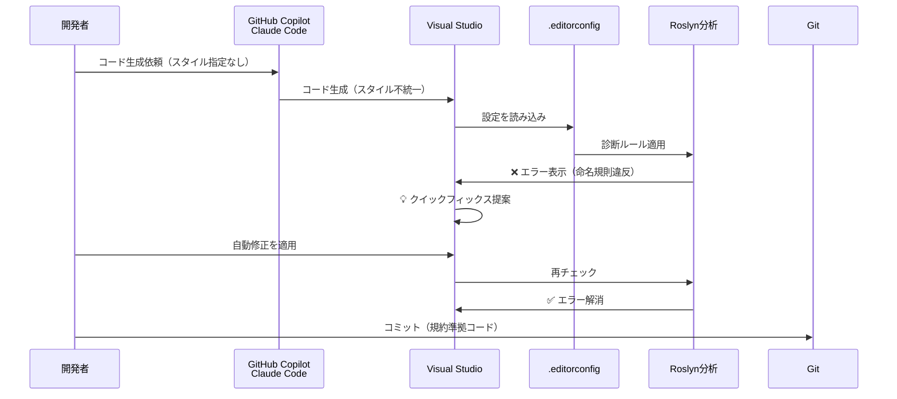

## はじめに - AI時代のC#コード品質管理

GitHub CopilotやClaude Codeなど、AI支援ツールがC#開発に浸透してきました。しかし、AI生成コードには「スタイルの不統一」という課題があります。

- あるメソッドでは `var` を使い、別のメソッドでは明示的な型指定
- 古いC#スタイルの提案（`new List<string>()` vs `new()`）
- privateフィールドの命名規則が統一されない（`_field` vs `field`）

これらを毎回手動で修正するのは非効率です。`.editorconfig`を使えば、AI生成コードを自動的にプロジェクトの規約に従わせることができます。

本記事では、C#とVisual Studioに特化して、`.editorconfig`の実践的な活用方法を解説します。

## 前提条件

本記事は以下の環境を想定しています：

- **Visual Studio**: 2019以降（2022推奨）
- **C#**: 8.0以降（最新機能の例ではC# 10+を使用）
- **.NET**: .NET Core 3.1以降、または.NET 5+

レガシーな.NET Framework 4.xでも`.editorconfig`は利用可能ですが、一部の新しいC#構文（レコード型、ファイルスコープ名前空間等）は使用できません。

## EditorConfigとは？

`.editorconfig`は、エディターに依存しないコーディングスタイル設定ファイルです。プロジェクトのルートに配置することで、チーム全体で統一されたコーディング規約を自動適用できます。

:::message
EditorConfigは、C#専用ではなく業界標準の設定フォーマットです。VS Code、IntelliJ IDEA、PyCharmなど40以上のエディターで対応し、Java、Python、TypeScriptなど多くの言語で利用できます。

本記事では、C#とVisual Studioに特化した活用法を解説します。特に、Visual StudioのRoslynアナライザーとの連携による「ビルドエラー化」は、C#ならではの強力な機能です。
:::

### Visual Studioでのサポート

Visual Studio 2017以降、`.editorconfig`がネイティブサポートされています。特にC#では、Roslynアナライザーと連携することで強力な機能を発揮します。

:::message
**Visual StudioとVS Codeの違い**

- **Visual Studio**: Windows/Mac向けフル機能IDE（本記事の対象）
  - Roslyn連携によるビルドエラー化が可能
  - コードのクリーンアップ機能
  - 詳細なC#コードスタイル設定

- **Visual Studio Code**: 軽量エディター
  - 基本的なEditorConfig機能（インデント、改行等）は対応
  - C# Dev Kit導入で一部のRoslyn機能が利用可能
  - Visual Studioほどの統合度はなし

本記事で解説する「ビルドエラー化」は、Visual Studio特有の機能です。
:::

## C#で何ができるのか？

`.editorconfig`でC#では以下のような設定が可能です：

- **基本設定**: インデント、改行、文字コード
- **命名規則**: privateフィールドに`_`、インターフェースに`I`プレフィックス
- **コードスタイル**: `var`の使用、式形式メンバー、using配置
- **フォーマット**: 中括弧の改行位置、スペース設定

具体的な設定例は、後述の「推奨設定テンプレート」を参照してください。

## EditorConfigの「強制力」- 重大度レベルとは

`.editorconfig`の最も重要な特徴は、**設定の重要度レベルを制御できる**ことです。

### 重大度レベルの全体像（5段階）

Visual Studioでは、以下の5段階の重大度レベル（severity）が定義されています：

| 設定値 | 日本語表示 | エディター表示 | ビルド | 用途 |
|--------|-----------|--------------|--------|------|
| `none` | 無効 | 表示なし | 成功 | ルールを無効化 |
| `silent` | リファクタリング | 表示なし（自動整形） | 成功 | 静かに修正 |
| `suggestion` | 提案事項 | 💡 灰色点線 | 成功 | 推奨スタイル |
| `warning` | 警告 | ⚠️ 緑波線 | 成功 | 警告表示 |
| `error` | エラー | ❌ 赤波線 | **失敗** | 必須ルール |

**実務では、`silent`（リファクタリング）、`suggestion`（提案事項）、`warning`（警告）、`error`（エラー）の4つを使い分けます。** `none`（無効）はルールを書かないのと同じ効果のため、ほぼ使用しません。

以下、実用的な4つのレベルを詳しく解説します。

---

### Level 1: 自動整形（silent）

ユーザーに通知せず、自動的にコードを整形します。

```ini
[*.cs]
# 保存時に自動整形（ユーザーは気づかない）
dotnet_diagnostic.IDE0055.severity = silent
```

**動作:**
- ファイル保存時に自動適用
- コードの貼り付け時に自動整形
- エディター上に視覚的な警告なし

### Level 2: 推奨（suggestion）

コードに灰色の点線と電球アイコンが表示されます。

```ini
[*.cs]
# varの使用を推奨（電球アイコン表示）
csharp_style_var_when_type_is_apparent = true:suggestion
```

**動作:**
- エディター上に灰色の点線
- 電球アイコンでクイックフィックス提案
- 「エラー一覧」ウィンドウには表示されない
- **ビルドは成功する**

### Level 3: 警告（warning）

コードに緑色の波線が表示され、警告リストに表示されます。

```ini
[*.cs]
# 中括弧の省略を警告
csharp_prefer_braces = true:warning
```

**動作:**
- エディター上に緑の波線
- 「エラー一覧」ウィンドウに警告表示
- **ビルドは成功する**
- CI/CDで `/warnaserror` を使うとエラー化可能

### Level 4: エラー（error）

コードに赤色の波線が表示され、**ビルドエラー**として扱われます。

```ini
[*.cs]
# privateフィールドの命名規則違反はビルドエラー
dotnet_naming_rule.private_fields_with_underscore.severity = error

# usingの配置ミスはビルドエラー
csharp_using_directive_placement = outside_namespace:error
```

**動作:**
- エディター上に赤の波線
- **コンパイルが失敗する**
- CI/CDで自動的にブロック
- 絶対遵守が必要なルールに使用

```csharp
// ❌ ビルドエラー: IDE1005
namespace MyApp
{
    using System;  // error: usingはnamespace外に配置すべき
}

// ✅ 正しい
using System;

namespace MyApp
{
}
```

### Roslynアナライザーとの連携

Visual StudioのC#コンパイラー（Roslyn）は、`.editorconfig`の設定を診断ルールとして認識します。

主要な診断ID：

| 診断ID | 内容 | 推奨severity |
|--------|------|--------------|
| IDE0055 | フォーマット規則違反 | warning |
| IDE0001 | 名前の簡略化 | suggestion |
| IDE0005 | 不要なusing | warning |
| IDE1005 | usingの配置 | error |
| IDE0011 | 中括弧の追加 | warning |

```ini
[*.cs]
# すべてのフォーマット違反をエラー化（厳格）
dotnet_diagnostic.IDE0055.severity = error

# 不要なusingは警告のみ
dotnet_diagnostic.IDE0005.severity = warning
```

## どんなメリットがあるのか？

### ✅ チーム全体でのC#コーディングスタイル統一

`.editorconfig`はコードと一緒にGitで管理されるため、チーム全員が同じ設定を自動的に使用します。

Before:
- 開発者Aは`var`派、開発者Bは明示的型指定派
- コードレビューで「スタイルが違う」と指摘
- Wiki等に「コーディング規約」を書くが誰も読まない

After:
- `.editorconfig`に設定を記述
- エディターが自動的に適用
- スタイルの議論が不要に

### ✅ コードレビュー時間の大幅削減

機械的にチェックできるスタイル指摘がゼロになります。

削減できるレビューコメント例:
- ❌ 「privateフィールドには`_`をつけてください」
- ❌ 「usingはnamespaceの外に出してください」
- ❌ 「ここは`var`を使った方が良いです」
- ❌ 「インデントがずれています」

これらはすべて`.editorconfig`で自動チェック可能です。

人間のレビュアーは、アーキテクチャやロジックなど本質的な部分に集中できます。

### ✅ 新メンバーのオンボーディング効率化

新しいチームメンバーは、Visual Studioを開いた瞬間から正しいスタイルでコードを書けます。

1. リポジトリをクローン
2. Visual Studioでソリューションを開く
3. `.editorconfig`が自動適用される ✨

説明不要で、既存のコーディング規約に従えます。

### ✅ Azure DevOps / GitHub ActionsでのCI/CD連携

`.editorconfig`の設定は、CI/CD環境でも自動的にチェックできます。

#### CI/CDでの自動チェックの仕組み

`.editorconfig`の設定は、`dotnet build`コマンドで自動的にチェックされます。

重要なポイント：

- `severity = warning`の設定は、デフォルトではビルド成功
- `/warnaserror`オプションで警告をエラー化
- CI/CD環境では厳格にチェック、ローカルでは柔軟に運用可能

**実行例:**

```bash
# ローカル開発（警告は表示されるがビルド成功）
dotnet build

# CI/CD環境（警告をエラー化してビルド失敗させる）
dotnet build /warnaserror

# 特定のWarningのみエラー化
dotnet build /warnaserror:IDE0055,IDE1006
```

これにより、開発者のローカル環境では柔軟に開発しつつ、マージ時には厳格にチェックする運用が可能です。

**GitHub Actionsの例:**

```yaml
# .github/workflows/build.yml
- name: Build
  run: dotnet build --configuration Release /p:TreatWarningsAsErrors=true
```

プルリクエスト時点で自動的にスタイル違反をブロックできます。

## AI駆動C#開発におけるバリュー

### 課題1: GitHub Copilotが古いC#スタイルを提案

GitHub Copilotは、トレーニングデータの影響で古いC#スタイルを提案することがあります。

**例: ターゲット型new演算子の未使用**

```csharp
// ❌ Copilotが提案するコード（C# 9.0以前のスタイル）
List<string> names = new List<string>();
Dictionary<int, string> map = new Dictionary<int, string>();

// ✅ .editorconfigで自動修正後（C# 9.0以降）
List<string> names = new();
Dictionary<int, string> map = new();
```

**`.editorconfig`設定:**

```ini
[*.cs]
csharp_style_implicit_object_creation_when_type_is_apparent = true:warning
```

保存時に自動的に新しいスタイルに変換されます。

### 課題2: Claude CodeへのプロンプトでC#規約を毎回説明

AI支援ツールにコード生成を依頼する際、毎回スタイルを説明するのは非効率です。

Before（プロンプトで説明）:

```
「新しいUserServiceクラスを作成してください。
ただし、以下のルールに従ってください：
- privateフィールドは_プレフィックス
- varを使用
- usingはnamespace外
- 式形式メンバーを使用
- PascalCaseで命名」
```

After（`.editorconfig`で自動適用）:

```
「新しいUserServiceクラスを作成してください」
```

プロンプトがシンプルになり、AI生成後に`.editorconfig`が自動的にスタイルを整えます。

### 課題3: AI生成コードの命名規則チェック

AI生成コードは、プロジェクトの命名規則に従わないことがあります。

**例: privateフィールドの命名**

```csharp
// ❌ AIが生成したコード
public class UserService
{
    private readonly ILogger logger;  // アンダースコアなし
    private readonly HttpClient client;

    public UserService(ILogger logger, HttpClient client)
    {
        this.logger = logger;
        this.client = client;
    }
}
```

**`.editorconfig`設定:**

```ini
[*.cs]
# privateフィールドは _camelCase を強制
dotnet_naming_rule.private_fields_with_underscore.severity = error
dotnet_naming_rule.private_fields_with_underscore.symbols = private_fields
dotnet_naming_rule.private_fields_with_underscore.style = prefix_underscore

dotnet_naming_symbols.private_fields.applicable_kinds = field
dotnet_naming_symbols.private_fields.applicable_accessibilities = private

dotnet_naming_style.prefix_underscore.capitalization = camel_case
dotnet_naming_style.prefix_underscore.required_prefix = _
```

**結果:**

```
Error IDE1006: Naming rule violation: These words must begin with upper case characters: logger
Error IDE1006: Naming rule violation: These words must begin with upper case characters: client
```

ビルドエラーになるため、気づかずにコミットできません。

### AI駆動開発での動作フロー



**ポイント:**
1. AIにスタイルを説明する必要なし
2. コード生成直後に自動チェック
3. クイックフィックスで瞬時に修正
4. レビュー前に品質担保

## Visual Studioでの実践 - プロジェクトへの導入手順

### 新規プロジェクトの場合

#### 方法1: プロジェクト作成時に追加

Visual Studio 2022では、新規プロジェクト作成時に`.editorconfig`を自動追加できます。

1. **ファイル → 新規作成 → プロジェクト**
2. プロジェクトテンプレートを選択（例: ASP.NET Core Web API）
3. **追加情報**画面で、詳細設定を確認
4. （Visual Studio 2022の場合、デフォルトで`.editorconfig`が含まれる場合があります）

#### 方法2: 既存プロジェクトに手動追加

1. **ソリューションエクスプローラー**でソリューションまたはプロジェクトを右クリック
2. **追加 → 新しい項目**
3. 検索ボックスに「editorconfig」と入力
4. editorconfig ファイル（既定値）を選択
5. 追加をクリック

### Visual Studioの設定から`.editorconfig`を生成

Visual Studioの現在のコードスタイル設定を`.editorconfig`として出力できます。

1. **ツール → オプション**
2. **テキストエディター → C# → コードスタイル**
3. 各設定項目を希望の値に変更
4. **設定から .editorconfig ファイルを生成**ボタンをクリック
5. 保存場所を選択（通常はソリューションルート）

**コードスタイル設定画面:**


**命名規則スタイル設定画面:**


**アナライザー設定画面:**


### 推奨設定テンプレート（C#特化版）

#### Microsoft公式推奨設定テンプレート（完全版）

Microsoftが推奨する`.editorconfig`の基本設定です。コピペ用の完全版として参考にしてください。

:::details Microsoft公式推奨設定の完全版を表示（約200行）
```ini
# トップレベル .editorconfig
root = true

# すべてのファイル
[*]
charset = utf-8
insert_final_newline = true
trim_trailing_whitespace = true

# C#ファイル
[*.cs]
#### コアEditorConfig オプション ####

indent_style = space
indent_size = 4
end_of_line = crlf

#### .NET コーディング規則 ####

# using の整理
dotnet_separate_import_directive_groups = false
dotnet_sort_system_directives_first = true

# this. と Me. の設定
dotnet_style_qualification_for_field = false:warning
dotnet_style_qualification_for_property = false:warning
dotnet_style_qualification_for_method = false:warning
dotnet_style_qualification_for_event = false:warning

# 言語キーワード vs BCL 型の設定
dotnet_style_predefined_type_for_locals_parameters_members = true:warning
dotnet_style_predefined_type_for_member_access = true:warning

# 括弧の設定
dotnet_style_parentheses_in_arithmetic_binary_operators = always_for_clarity:suggestion
dotnet_style_parentheses_in_other_binary_operators = always_for_clarity:suggestion
dotnet_style_parentheses_in_other_operators = never_if_unnecessary:suggestion
dotnet_style_parentheses_in_relational_binary_operators = always_for_clarity:suggestion

# 修飾子の設定
dotnet_style_require_accessibility_modifiers = always:warning

# 式レベルの設定
dotnet_style_coalesce_expression = true:suggestion
dotnet_style_collection_initializer = true:suggestion
dotnet_style_explicit_tuple_names = true:suggestion
dotnet_style_null_propagation = true:suggestion
dotnet_style_object_initializer = true:suggestion
dotnet_style_prefer_auto_properties = true:suggestion
dotnet_style_prefer_compound_assignment = true:suggestion
dotnet_style_prefer_conditional_expression_over_assignment = true:silent
dotnet_style_prefer_conditional_expression_over_return = true:silent
dotnet_style_prefer_inferred_anonymous_type_member_names = true:suggestion
dotnet_style_prefer_inferred_tuple_names = true:suggestion
dotnet_style_prefer_is_null_check_over_reference_equality_method = true:suggestion

#### C# コーディング規則 ####

# var 設定
csharp_style_var_elsewhere = false:suggestion
csharp_style_var_for_built_in_types = true:suggestion
csharp_style_var_when_type_is_apparent = true:suggestion

# 式形式のメンバー
csharp_style_expression_bodied_accessors = true:suggestion
csharp_style_expression_bodied_constructors = false:suggestion
csharp_style_expression_bodied_indexers = true:suggestion
csharp_style_expression_bodied_lambdas = true:suggestion
csharp_style_expression_bodied_local_functions = false:suggestion
csharp_style_expression_bodied_methods = when_on_single_line:suggestion
csharp_style_expression_bodied_operators = when_on_single_line:suggestion
csharp_style_expression_bodied_properties = true:suggestion

# パターンマッチング設定
csharp_style_pattern_matching_over_as_with_null_check = true:suggestion
csharp_style_pattern_matching_over_is_with_cast_check = true:suggestion
csharp_style_prefer_switch_expression = true:suggestion

# Null チェック設定
csharp_style_conditional_delegate_call = true:suggestion

# 修飾子の設定
csharp_prefer_static_local_function = true:suggestion
csharp_preferred_modifier_order = public,private,protected,internal,static,extern,new,virtual,abstract,sealed,override,readonly,unsafe,volatile,async:suggestion

# コードブロックの設定
csharp_prefer_braces = true:warning
csharp_prefer_simple_using_statement = true:suggestion

# 式レベルの設定
csharp_prefer_simple_default_expression = true:suggestion
csharp_style_deconstructed_variable_declaration = true:suggestion
csharp_style_inlined_variable_declaration = true:suggestion
csharp_style_pattern_local_over_anonymous_function = true:suggestion
csharp_style_prefer_index_operator = true:suggestion
csharp_style_prefer_range_operator = true:suggestion
csharp_style_throw_expression = true:suggestion
csharp_style_unused_value_assignment_preference = discard_variable:suggestion
csharp_style_unused_value_expression_statement_preference = discard_variable:silent

# 'using' ディレクティブの設定
csharp_using_directive_placement = outside_namespace:error

#### C# 書式ルール ####

# 改行設定
csharp_new_line_before_catch = true
csharp_new_line_before_else = true
csharp_new_line_before_finally = true
csharp_new_line_before_members_in_anonymous_types = true
csharp_new_line_before_members_in_object_initializers = true
csharp_new_line_before_open_brace = all
csharp_new_line_between_query_expression_clauses = true

# インデント設定
csharp_indent_block_contents = true
csharp_indent_braces = false
csharp_indent_case_contents = true
csharp_indent_case_contents_when_block = false
csharp_indent_labels = no_change
csharp_indent_switch_labels = true

# スペース設定
csharp_space_after_cast = false
csharp_space_after_colon_in_inheritance_clause = true
csharp_space_after_comma = true
csharp_space_after_dot = false
csharp_space_after_keywords_in_control_flow_statements = true
csharp_space_after_semicolon_in_for_statement = true
csharp_space_around_binary_operators = before_and_after
csharp_space_around_declaration_statements = false
csharp_space_before_colon_in_inheritance_clause = true
csharp_space_before_comma = false
csharp_space_before_dot = false
csharp_space_before_open_square_brackets = false
csharp_space_before_semicolon_in_for_statement = false
csharp_space_between_empty_square_brackets = false
csharp_space_between_method_call_empty_parameter_list_parentheses = false
csharp_space_between_method_call_name_and_opening_parenthesis = false
csharp_space_between_method_call_parameter_list_parentheses = false
csharp_space_between_method_declaration_empty_parameter_list_parentheses = false
csharp_space_between_method_declaration_name_and_open_parenthesis = false
csharp_space_between_method_declaration_parameter_list_parentheses = false
csharp_space_between_parentheses = false
csharp_space_between_square_brackets = false

# 折り返し設定
csharp_preserve_single_line_blocks = true
csharp_preserve_single_line_statements = false

#### 命名スタイル ####

# 命名ルール

dotnet_naming_rule.interface_should_be_begins_with_i.severity = error
dotnet_naming_rule.interface_should_be_begins_with_i.symbols = interface
dotnet_naming_rule.interface_should_be_begins_with_i.style = begins_with_i

dotnet_naming_rule.types_should_be_pascal_case.severity = error
dotnet_naming_rule.types_should_be_pascal_case.symbols = types
dotnet_naming_rule.types_should_be_pascal_case.style = pascal_case

dotnet_naming_rule.non_field_members_should_be_pascal_case.severity = error
dotnet_naming_rule.non_field_members_should_be_pascal_case.symbols = non_field_members
dotnet_naming_rule.non_field_members_should_be_pascal_case.style = pascal_case

dotnet_naming_rule.private_field_should_be_begins_with__.severity = error
dotnet_naming_rule.private_field_should_be_begins_with__.symbols = private_field
dotnet_naming_rule.private_field_should_be_begins_with__.style = begins_with__

# 記号仕様

dotnet_naming_symbols.interface.applicable_kinds = interface
dotnet_naming_symbols.interface.applicable_accessibilities = public, internal, private, protected, protected_internal, private_protected
dotnet_naming_symbols.interface.required_modifiers =

dotnet_naming_symbols.private_field.applicable_kinds = field
dotnet_naming_symbols.private_field.applicable_accessibilities = private
dotnet_naming_symbols.private_field.required_modifiers =

dotnet_naming_symbols.types.applicable_kinds = class, struct, interface, enum
dotnet_naming_symbols.types.applicable_accessibilities = public, internal, private, protected, protected_internal, private_protected
dotnet_naming_symbols.types.required_modifiers =

dotnet_naming_symbols.non_field_members.applicable_kinds = property, event, method
dotnet_naming_symbols.non_field_members.applicable_accessibilities = public, internal, private, protected, protected_internal, private_protected
dotnet_naming_symbols.non_field_members.required_modifiers =

# 命名スタイル

dotnet_naming_style.pascal_case.required_prefix =
dotnet_naming_style.pascal_case.required_suffix =
dotnet_naming_style.pascal_case.word_separator =
dotnet_naming_style.pascal_case.capitalization = pascal_case

dotnet_naming_style.begins_with_i.required_prefix = I
dotnet_naming_style.begins_with_i.required_suffix =
dotnet_naming_style.begins_with_i.word_separator =
dotnet_naming_style.begins_with_i.capitalization = pascal_case

dotnet_naming_style.begins_with__.required_prefix = _
dotnet_naming_style.begins_with__.required_suffix =
dotnet_naming_style.begins_with__.word_separator =
dotnet_naming_style.begins_with__.capitalization = camel_case
```
:::

#### 実用的なカスタマイズ例

プロジェクトの性質に応じて調整した設定例です。

**Modern C# スタイル（C# 10+）**

```ini
[*.cs]
# ファイルスコープ名前空間を優先
csharp_style_namespace_declarations = file_scoped:warning

# レコード型の優先
dotnet_diagnostic.IDE0090.severity = suggestion

# グローバルusingの整理
dotnet_sort_system_directives_first = true
dotnet_separate_import_directive_groups = false

# 最新のnullable参照型設定
dotnet_style_prefer_is_null_check_over_reference_equality_method = true:warning
csharp_style_prefer_null_check_over_type_check = true:suggestion
```

## 既存C#プロジェクトへの導入戦略

### よくある懸念点

既存プロジェクトに`.editorconfig`を導入する際、次のような懸念が出ることがあります。

#### 1. 既存コードに大量の差分が発生する

数万行のコードベースに`.editorconfig`を適用すると、すべてのファイルが変更されてしまいます。

懸念:
- プルリクエストのレビューが困難
- `git blame`が使えなくなる
- マージコンフリクトが多発

#### 2. レガシーなASP.NET Frameworkプロジェクトとの共存

古いプロジェクトと新しいプロジェクトが混在している場合、統一が難しいことがあります。

懸念:
- 旧コードを全修正するリソースがない
- 部分的に適用するとかえって混乱する

#### 3. チーム内の抵抗感

「今まで問題なかったのに、なぜ変える必要があるのか」という声が出ることがあります。

懸念:
- 学習コスト
- 慣れ親しんだスタイルの変更
- 「余計な仕事が増える」という反発

### 段階的導入のベストプラクティス

これらの懸念を解消するため、**段階的に導入**します。

#### Phase 1: 基本設定のみ（影響範囲：小）

まずは、全員が同意しやすい基本設定から始めます。

```ini
root = true

[*.cs]
# 基本設定のみ（議論の余地が少ない）
charset = utf-8
insert_final_newline = true
trim_trailing_whitespace = true
indent_style = space
indent_size = 4
end_of_line = crlf

# すべて警告レベル（エラーにしない）
dotnet_diagnostic.IDE0055.severity = warning
```

ポイント:
- インデントや改行など、機械的な設定のみ
- `severity = warning`にして、ビルドは通す
- 既存コードは修正しない（新規コードのみ適用）

チーム合意:
- 「まずは試してみよう」という軽いスタンス
- 1-2週間のトライアル期間を設定

#### Phase 2: 命名規則（severity=warning）

次に、命名規則を導入します。

```ini
[*.cs]
# privateフィールドの命名規則
dotnet_naming_rule.private_fields_with_underscore.severity = warning
dotnet_naming_rule.private_fields_with_underscore.symbols = private_fields
dotnet_naming_rule.private_fields_with_underscore.style = prefix_underscore

dotnet_naming_symbols.private_fields.applicable_kinds = field
dotnet_naming_symbols.private_fields.applicable_accessibilities = private

dotnet_naming_style.prefix_underscore.capitalization = camel_case
dotnet_naming_style.prefix_underscore.required_prefix = _

# インターフェースの命名規則
dotnet_naming_rule.interface_should_be_begins_with_i.severity = warning
dotnet_naming_rule.interface_should_be_begins_with_i.symbols = interface
dotnet_naming_rule.interface_should_be_begins_with_i.style = begins_with_i

dotnet_naming_symbols.interface.applicable_kinds = interface

dotnet_naming_style.begins_with_i.required_prefix = I
dotnet_naming_style.begins_with_i.capitalization = pascal_case
```

ポイント:
- 既存コードは警告のみ（エラーにしない）
- 新規コードは規約に従うという暗黙のルール
- 修正する場合は、触った箇所だけ直す

チーム合意:
- 命名規則の設定内容をレビュー会で確認（30分程度）
- 全員が納得してから適用

#### Phase 3: コードスタイル（severity=suggestion/warning）

コーディングスタイルの推奨設定を追加します。

```ini
[*.cs]
# var の使用（推奨レベル）
csharp_style_var_for_built_in_types = true:suggestion
csharp_style_var_when_type_is_apparent = true:suggestion
csharp_style_var_elsewhere = false:suggestion

# 式形式メンバー（推奨レベル）
csharp_style_expression_bodied_methods = when_on_single_line:suggestion
csharp_style_expression_bodied_properties = true:suggestion

# using配置（警告レベル）
csharp_using_directive_placement = outside_namespace:warning

# 中括弧の強制（警告レベル）
csharp_prefer_braces = true:warning
```

ポイント:
- `suggestion`は緑の電球アイコンのみ（強制しない）
- `warning`は緑の波線（ビルドは通す）
- 既存コードは触らない

#### Phase 4: 厳格化（severity=error）

最後に、絶対に守るべきルールをエラー化します。

```ini
[*.cs]
# 命名規則違反はビルドエラー
dotnet_naming_rule.private_fields_with_underscore.severity = error
dotnet_naming_rule.interface_should_be_begins_with_i.severity = error

# using配置ミスはビルドエラー
csharp_using_directive_placement = outside_namespace:error

# フォーマット違反は警告（厳格化しすぎない）
dotnet_diagnostic.IDE0055.severity = warning
```

実施タイミング:
- リリース後の落ち着いたタイミング
- 全体リフォーマットを実施（後述）

チーム合意:
- 全員が設定に慣れた後（1-2ヶ月後）
- CI/CDでの自動チェック導入

### 導入時のチーム合意形成

#### 設定内容のレビュー会（1-2時間）

`.editorconfig`の導入前に、チーム全体でレビュー会を開催します。

アジェンダ:
1. `.editorconfig`の目的と効果の説明（15分）
2. 設定内容の確認（30分）
   - 各設定項目の意味を説明
   - 「なぜこの設定にするのか」を議論
3. 段階的導入計画の説明（15分）
4. 質疑応答（30分）

レビュー観点:
- ✅ 設定内容に全員が納得しているか
- ✅ 「強制しすぎ」と感じる設定がないか
- ✅ 既存コードへの影響を理解しているか

#### トライアル期間の設定（2週間）

本格導入前に、トライアル期間を設けます。

トライアル内容:
- Phase 1の基本設定のみ適用
- `severity`はすべて`warning`以下
- フィードバックを収集

評価基準:
- 開発の妨げになっていないか
- 意図しない動作はないか
- チームの受け入れ状況

#### CI/CDでの段階的強化

Azure DevOpsやGitHub Actionsで、段階的にチェックを厳格化します。

Phase 1-2: 警告のみ

```yaml
# azure-pipelines.yml
- task: DotNetCoreCLI@2
  inputs:
    command: 'build'
    # 警告は表示するがビルドは成功させる
```

Phase 3: 警告をエラー化（新規コードのみ）

```yaml
# プルリクエストのみ厳格化
trigger:
  branches:
    exclude:
      - main

steps:
  - task: DotNetCoreCLI@2
    inputs:
      command: 'build'
      arguments: '/warnaserror'
```

Phase 4: 全ブランチで厳格化

```yaml
# すべてのビルドで警告をエラー化
- task: DotNetCoreCLI@2
  inputs:
    command: 'build'
    arguments: '/warnaserror'
```

### 大量差分対策

#### Git blame無視設定

一括整形コミットを`git blame`から除外します。

手順:

1. プロジェクトルートに `.git-blame-ignore-revs` ファイルを作成

```bash
# .git-blame-ignore-revs
# EditorConfig導入による一括整形
abc123def456789...
```

2. Gitに設定を追加

```bash
git config blame.ignoreRevsFile .git-blame-ignore-revs
```

3. チーム全員に共有

```bash
# .gitconfig に追加（リポジトリごと）
[blame]
    ignoreRevsFile = .git-blame-ignore-revs
```

#### 一括整形の実行

Phase 4で全体リフォーマットを行う際は、`dotnet format`コマンドを使用します。

```bash
# .editorconfigに従って自動整形
dotnet format
```

コミット例:

```bash
git add .
git commit -m "chore: EditorConfig導入による一括整形

この変更は .editorconfig の設定に従った自動整形です。
ロジックの変更は含まれません。"
```

Visual StudioのGUI（コードのクリーンアップ機能）からも実行可能です。

#### プルリクエスト戦略

大量差分のPRをレビューしやすくする工夫です。

分割コミット:

```bash
# 1. 基本整形（インデント、改行）
git add .
git commit -m "chore: 基本フォーマット整形（インデント・改行）"

# 2. using整理
git add .
git commit -m "chore: using整理"

# 3. 命名規則修正
git add .
git commit -m "chore: 命名規則修正（privateフィールドに_を追加）"
```

PR説明文テンプレート:

```markdown
## 概要
`.editorconfig`導入に伴う一括整形です。

## 変更内容
- [x] インデント・改行の統一
- [x] using整理
- [x] 命名規則の修正

## レビュー観点
- ロジックの変更は含まれていません
- 各コミットごとに変更内容を分離しています
- ビルドエラーがないことを確認済み

## 確認方法
\`\`\`bash
# 差分の確認（空白無視）
git diff --ignore-all-space main...feature/editorconfig
\`\`\`
```

## よくある質問（FAQ）

### Q1: StyleCop/FxCopとEditorConfigの違いは？

**A:**

- **EditorConfig**: コードスタイル（整形、命名規則）に特化
- **StyleCop**: より厳格なコーディング規約チェック
- **FxCop/Roslyn Analyzer**: コード品質・設計の分析

推奨：

- EditorConfigを基本として導入
- 必要に応じてStyleCopやカスタムAnalyzerを追加

EditorConfigはRoslynアナライザーと連携するため、組み合わせて使うのがベストです。

### Q2: VS Codeでも使える？

**A:**

基本的なEditorConfig機能（インデント、改行等）は使えますが、本記事で解説したビルドエラー化（Roslyn連携）はVisual Studio限定です。

VS CodeでC#開発する場合：

- EditorConfigの基本設定は有効
- C# Dev Kitを導入すれば一部のRoslyn機能が利用可能
- ただし、Visual Studioほどの統合度はない

### Q3: .NET FrameworkとASP.NET Frameworkでも使える？

**A:**

はい、使えます。ただし制限があります：

- **使える**: 基本フォーマット、命名規則、using配置
- **制限あり**: 最新C#構文（レコード型、ファイルスコープ名前空間等）
- **Visual Studioバージョン**: 2017以降なら対応

レガシープロジェクトでも、段階的導入で十分な効果が得られます。

### Q4: 複数の.editorconfigファイルを階層的に配置できる？

**A:**

はい、可能です。`.editorconfig`は階層的に適用されます。

```
solution/
├── .editorconfig          # ソリューション全体の設定
├── WebApp/
│   ├── .editorconfig      # WebApp固有の設定（上書き）
│   └── Controllers/
└── ClassLibrary/
    └── .editorconfig      # ClassLibrary固有の設定
```

下位階層の設定が上位を上書きします。最上位のファイルには `root = true` を指定して検索を停止させます。

これにより、プロジェクトごとに異なるルールを適用できます。例えば、テストプロジェクトでは命名規則を緩和するなどの運用が可能です。

## まとめ

`.editorconfig`は、AI時代のC#開発における必須ツールです。

### 主な効果

- ✅ **AI生成コードを自動的にプロジェクト規約に従わせる**
  - GitHub Copilot、Claude Codeの出力を自動整形
  - プロンプトにスタイル指定が不要に

- ✅ **コードレビューの効率化**
  - スタイル指摘がゼロになる
  - 人間は本質的なレビューに集中

- ✅ **チーム全体のスタイル統一**
  - 新メンバーも即座に規約に従える
  - 議論不要で自動適用

- ✅ **ビルドエラー化で品質担保**
  - Visual StudioのRoslyn連携で強力な強制力
  - CI/CDで自動チェック

### 導入のポイント

1. **段階的に導入する**
   - Phase 1: 基本設定（警告レベル）
   - Phase 2: 命名規則（警告レベル）
   - Phase 3: コードスタイル（推奨レベル）
   - Phase 4: 厳格化（エラーレベル）

2. **チーム合意を得る**
   - 設定内容のレビュー会を開催
   - トライアル期間で様子を見る

3. **既存コードは焦らない**
   - 新規コードから適用
   - 修正箇所のみ整形
   - 落ち着いたタイミングで一括整形

### 参考リンク

- [.NET のコード スタイル規則オプション | Microsoft Learn](https://learn.microsoft.com/ja-jp/dotnet/fundamentals/code-analysis/code-style-rule-options)
- [EditorConfig.org](https://editorconfig.org/)
- [Visual Studio での EditorConfig | Microsoft Learn](https://learn.microsoft.com/ja-jp/visualstudio/ide/create-portable-custom-editor-options)

---

AI駆動開発において、`.editorconfig`はコード品質を自動的に担保する強力なツールです。ぜひプロジェクトに導入して、より生産的な開発体験を手に入れてください！
