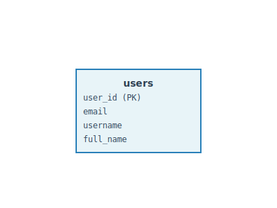

# users

## Description

ユーザーマスタ

## Columns

| Name | Type | Default | Nullable | Extra Definition | Children | Parents | Comment |
| ---- | ---- | ------- | -------- | ---------------- | -------- | ------- | ------- |
| user_id | int |  | false | auto_increment |  |  | ユーザーID |
| email | varchar(255) |  | false |  |  |  | メールアドレス |
| username | varchar(100) |  | false |  |  |  | ユーザー名 |
| password_hash | varchar(255) |  | false |  |  |  | パスワードハッシュ |
| full_name | varchar(200) |  | true |  |  |  | 氏名 |
| status | varchar(20) | 'active' | false |  |  |  | ステータス(active/inactive/suspended) |
| created_at | timestamp | CURRENT_TIMESTAMP | false |  |  |  | 作成日時 |
| updated_at | timestamp | CURRENT_TIMESTAMP | false | on update CURRENT_TIMESTAMP |  |  | 更新日時 |

## Constraints

| Name | Type | Definition |
| ---- | ---- | ---------- |
| PRIMARY | PRIMARY KEY | PRIMARY KEY (user_id) |
| uk_users_email | UNIQUE | UNIQUE KEY uk_users_email (email) |

## Indexes

| Name | Definition |
| ---- | ---------- |
| idx_users_username | KEY idx_users_username (username) USING BTREE |
| PRIMARY | PRIMARY KEY (user_id) USING BTREE |
| uk_users_email | UNIQUE KEY uk_users_email (email) USING BTREE |

## Relations

---

> Generated by [tbls](https://github.com/k1LoW/tbls)
